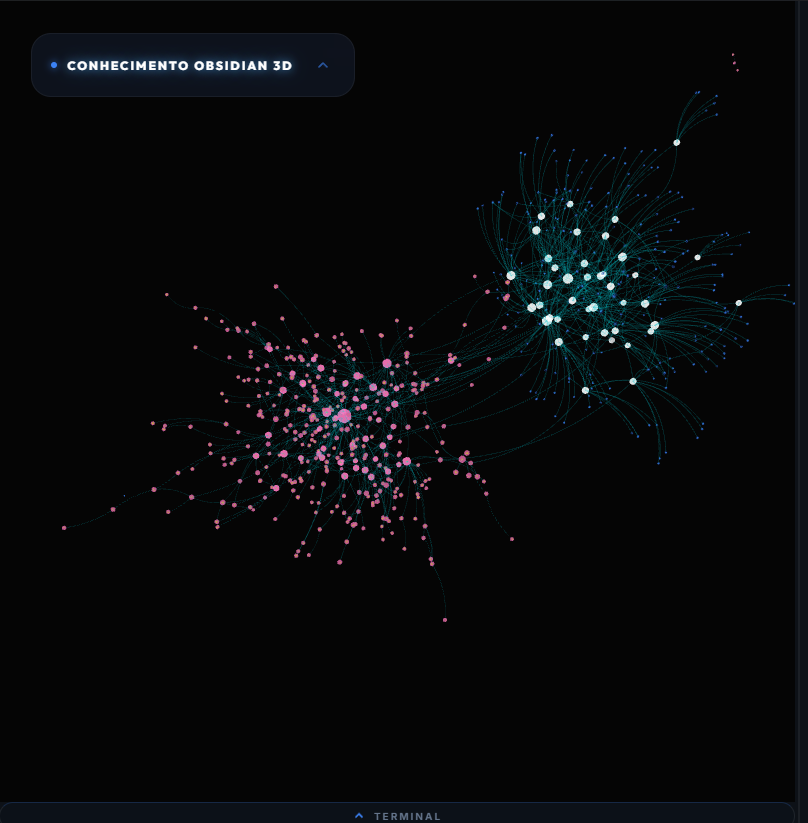
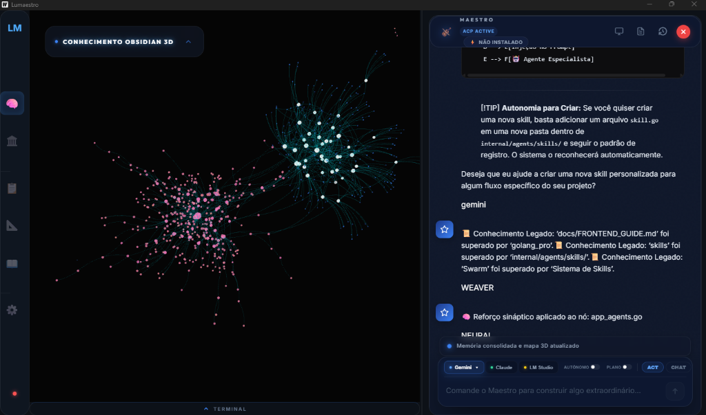
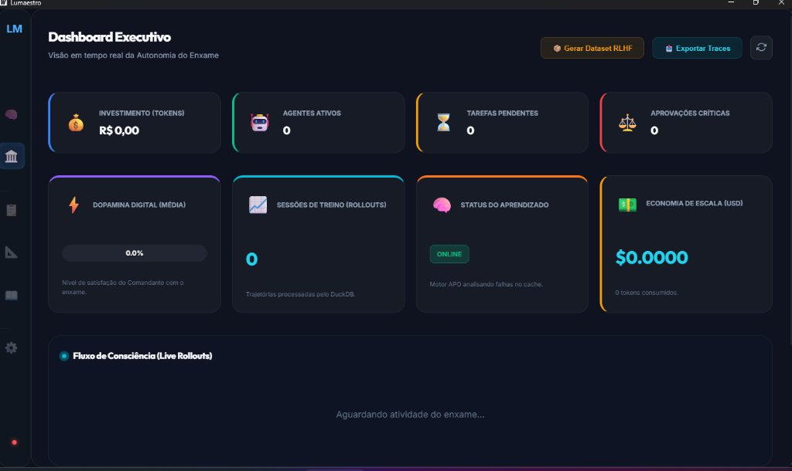
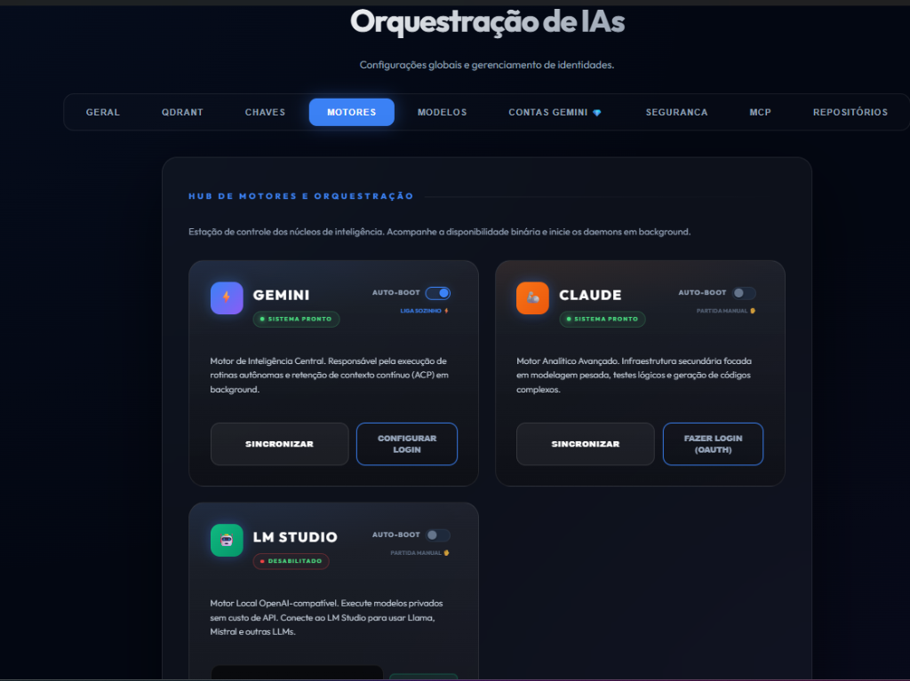
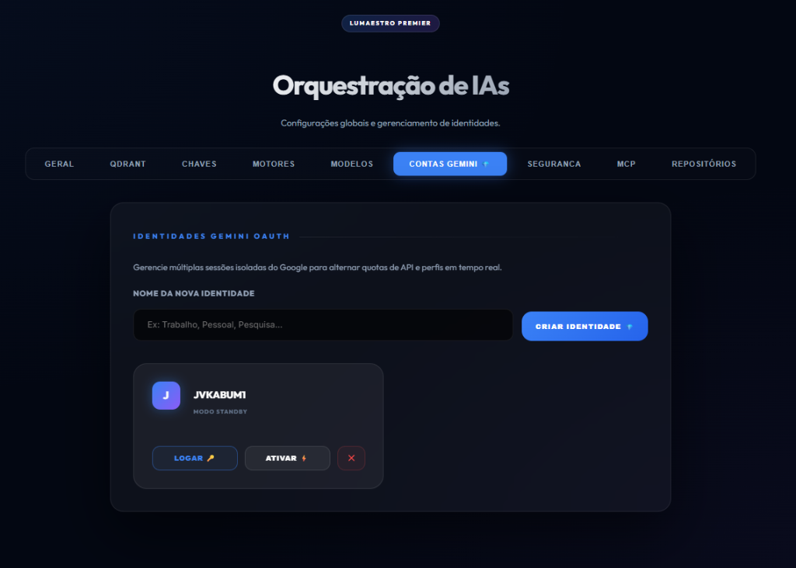
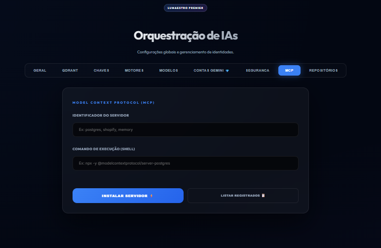
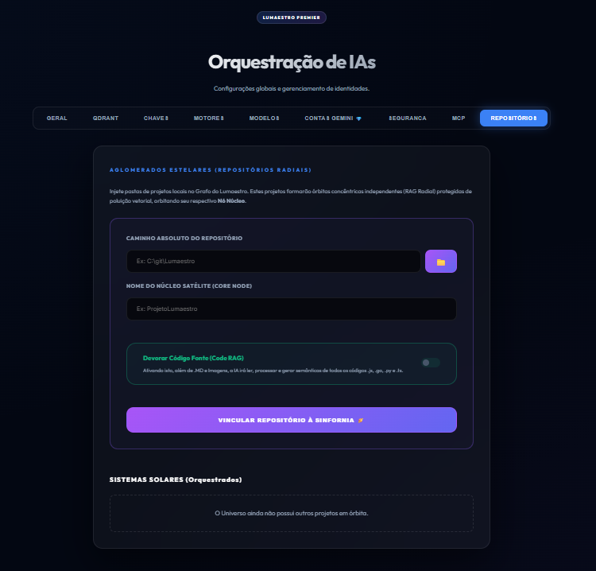

# Lumaestro: Advanced Cognitive Engine & Graph-RAG Orchestrator ⚡🤖🧬🏆

[](https://github.com/lumaestro)
[](https://github.com/lumaestro)
[](./build.ps1)



O **Lumaestro** não é apenas um chatbot; é um **Motor Cognitivo (Cognitive Engine)** projetado para transformar o conhecimento fragmentado do seu Obsidian em um ecossistema autônomo de alta performance. Utilizando uma arquitetura de orquestração **Swarm**, ele conecta agentes de elite (Gemini, Claude) a um grafo de conhecimento 3D dinâmico.

---

## 🌌 Visão Geral: O Cérebro do Enxame

O sistema opera em três camadas de consciência digital integradas:

1.  **Graph-RAG Hyper-Navigator**: Exploração profunda de conhecimento em N-Hops. O Lumaestro tece conexões semânticas entre suas notas, imagens e documentos, permitindo que a IA navegue pelo seu cérebro digital como um sistema nervoso.
2.  **Lightning Engine (Powered by DuckDB)**: Análise reflexiva e analítica de alto desempenho. O uso do **DuckDB v1.1.3** permite que o enxame processe trilhas de pensamento e métricas de grafo em milissegundos, agindo como a memória de curto prazo ultrarrápida da IA.
3.  **Córtex Autônomo ACP**: Orquestração via protocolo **JSON-RPC 2.0**. Os agentes operam em um ambiente seguro (Subagents), podendo executar ferramentas, ler arquivos e evoluir prompts através de **Beam Search** metacognitivo.

---

## 🚀 Funcionalidades de Elite

### ⚡ Lightning Reflexivity
O motor analítico detecta padrões no seu grafo de conhecimento e propõe otimizações de prompts em tempo real. O sistema aprende quais conexões são mais relevantes para as suas perguntas ("O Eficiente", "O Criativo", "O Rigoroso").

### 🕸️ Knowledge Weaving
Visualização 3D nativa (D3.js) que exibe a saúde do seu grafo. Com algoritmos de **PageRank** e **Community Detection**, você identifica instantaneamente os gargalos e os centros de gravidade do seu conhecimento.



### 🛡️ Auditoria Lógica (Validator)
Um sistema de "Juiz Neural" (`AgentValidator`) que escania o banco de dados em busca de contradições lógicas e garante que a evolução do seu enxame seja matematicamente estável.

---

## 🕹️ Controle & Telemetria: O Painel de Comando

O Lumaestro oferece uma visão transparente e granular sobre a operação da sua IA:

### 📊 Dashboard Executivo
Monitore em tempo real o investimento em tokens, a economia de escala e o "Fluxo de Consciência" (Live Rollouts) do enxame. Saiba exatamente o que seus agentes estão aprendendo agora.



### ⚙️ Orquestração Avançada
Configure o seu ecossistema com precisão industrial através do Hub de IA:
- **Gestão de Motores**: Alterne entre Gemini, Claude e LLMs locais (LM Studio) com um clique.
- **Identidades Isoladas**: Gerencie múltiplas contas Gemini para alternar quotas de API e perfis de pesquisa.
- **Ecossistema MCP**: Integre ferramentas externas (Postgres, Shopify, Google Search) via **Model Context Protocol**.
- **Aglomerados Estelares**: Injete repositórios de código locais como "Nós Núcleo" para expansão radial do conhecimento.

| Hub de Motores | Gestão de Identidades |
| :--- | :--- |
|  |  |

| Protocolo MCP | Repositórios Radiais (Star Clusters) |
| :--- | :--- |
|  |  |

> [!TIP]
> Use o **Code RAG** (Devorar Código Fonte) nos Aglomerados Estelares para que a IA processe arquivos .js, .go, .py e .ts, injetando lógica de programação real no seu grafo de conhecimento.

---

## 🛠️ Stack Tecnológica de Ponta

*   **Core**: Go (Golang 1.24) + Wails v2 (High-Performance Bridge)
*   **Analytics**: DuckDB (Columnar OLAP) — Estabilizado com linkagem dinâmica CGO.
*   **Vectorial**: Qdrant Cloud (Embeddings via Gemini API).
*   **Graph**: Visualização Fractal e 3D Knowledge Search.
*   **Automation**: Scripts PowerShell customizados para build e deploy.

---

## 🏗️ Como Rodar (Desenvolvimento & Produção)

O ambiente de build foi simplificado para ser "Plug and Play":

### 1. Modo de Desenvolvimento (Hot Reload)
Esqueça comandos longos. Use o atalho automatizado que já carrega as tags de correção do DuckDB:
```powershell
.\dev
```

### 2. Build de Produção (Release)
Para gerar o executável final (`Lumaestro.exe`) com todas as DLLs empacotadas:
```powershell
.\build
```
*(O executável será gerado em `build/bin/` junto com a `duckdb.dll` oficial).*

---

## 📚 Documentação e Governança
Acesse o nosso **[Elite Knowledge Hub](./docs/INDEX.md)** ou explore o **[Índice de Arquivos](./docs/DOCS_INDEX.md)**:

### 🏁 Iniciação Rápida
- [Guia de Uso (Manual de Bordo)](./docs/walkthrough.md)
- [Checklist de Tarefas (Missões Ativas)](./docs/tasks.md)
- [Plano de Implementação (Roadmap)](./docs/IMPLEMENTATION_PLAN.md)

### 🏛️ Deep Dive (Arquitetura e Agentes)
- [Arquitetura Neural (3D Graph)](./docs/architecture/NEURAL_BRAIN.md)
- [Sinfonia de Agentes (Manual ACP)](./docs/guide/AGENTS_GUIDE.md)
- [Córtex Central (Lumaestro Core)](./docs/architecture/LUMAESTRO_CORE.md)
- [Matriz de Soberania (Gap Analysis)](./docs/GAP_ANALYSIS.md)

---
**Lumaestro: Evoluindo a autonomia, um rastro de cada vez.** 🐹⚙️⚡🤖🧬🏆🦾📂🧪
