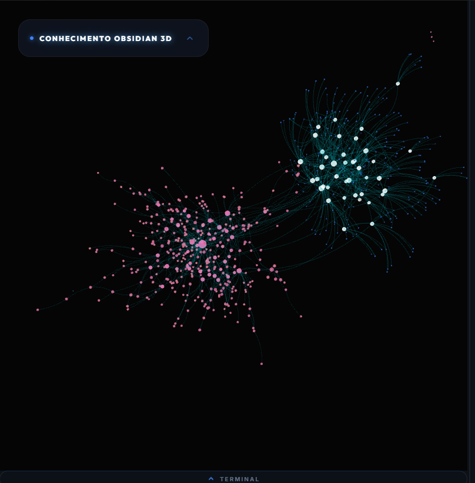
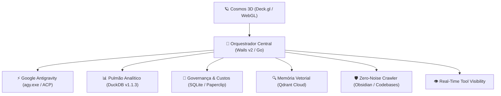

# Lumaestro: Cognitive Operating System (COS) & Autonomous AI Orchestrator

[](https://golang.org)
[](https://wails.io)
[](https://duckdb.org)
[](https://deck.gl)
[](https://github.com/jvkabum/Lumaestro)
[](https://github.com/jvkabum/Lumaestro/releases)



O **Lumaestro** é um **Sistema Operacional Cognitivo (COS)** e **Orquestrador Soberano de IA** projetado para unificar o conhecimento pessoal (Obsidian vaults), bases de código de software (repositórios locais) e agentes autônomos de elite em um universo tridimensional dinâmico e navegável.

Alimentado pelo motor **Google Antigravity (`agy.exe`)**, pelo protocolo **Agent Client Protocol (ACP)** e por um pipeline analítico híbrido (**DuckDB + SQLite + Qdrant**), o Lumaestro transforma arquivos estáticos em uma constelação inteligente viva capaz de raciocinar, programar, auto-otimizar e cooperar com você em tempo real.

---

## 🌌 Pilares da Arquitetura


```mermaid
graph TD
    A["🪐 Cosmos 3D (Deck.gl / WebGL)"] --> B["🧠 Orquestrador Central (Wails v2 / Go)"]
    B --> C["⚡ Google Antigravity (agy.exe / ACP)"]
    B --> D["📊 Pulmão Analítico (DuckDB v1.1.3)"]
    B --> E["🏢 Governança & Custos (SQLite / Paperclip)"]
    B --> F["🔍 Memória Vetorial (Qdrant Cloud)"]
    B --> G["🛡️ Zero-Noise Crawler (Obsidian / Codebases)"]
    B --> H["👁️ Real-Time Tool Visibility"]
```

### 1. 🪐 Motor Cósmico 3D (Deck.gl & WebGL)
- **Hierarquia Celestial Fiel**: Pastas e repositórios orbitam como **Galáxias** e **Sistemas Solares**, arquivos como **Planetas** e blocos lógicos como **Luas**.
- **Fótons Neurais Animados**: Shaders acelerados por GPU exibem o tráfego de dados e sinapses semânticas em tempo real.
- **Modos de Conexão Inteligentes**: Alternância rápida entre visão completa de arestas, conexões de órbita física, sinapses semânticas ou foco exclusivo na vizinhança imediata.
- **Piloto Cinemático de Câmera**: Botão **🎯 Recapturar Foco (`zoomToFit`)** recalibra a câmera automaticamente após qualquer salto ou expansão dimensional.

### 2. ⚡ Integração Nativa com Google Antigravity (`agy.exe`)
- **Protocolo ACP Assíncrono**: Comunicação via JSON-RPC 2.0 streaming com streaming instantâneo de pensamentos e respostas (`stream-json`).
- **Subagentes de Elite**: Suporte a delegação paralela com subagentes especializados (`self`, `research`) e gerenciamento de tarefas em segundo plano.
- **Modelos de Raciocínio Geração 3**: Acesso direto a modelos avançados de pensamento (Gemini 2.5 Pro/Flash Thinking, Claude Sonnet 3.7 Thinking).
- **Modos de Execução**: Alternância instantânea entre `default` (autônomo), `accept-edits` (confirmação guiada) e `plan` (planejamento prévio obrigatório).

### 3. 👁️ Visibilidade em Tempo Real de Ferramentas
- **Rastreamento Inteligente de Ações**: O Lumaestro extrai e exibe em tempo real o que a IA está fazendo — qual arquivo está lendo, editando, buscando ou qual comando está executando.
- **Card Flutuante Enriquecido**: O indicador de atividade no chat exibe o nome da ferramenta, a ação humanizada com emoji contextual e um badge do arquivo alvo.
- **Terminal de Processamento Detalhado**: Logs com ícones e caminhos relativos ao projeto:
  - `📖 Lendo: internal/agents/acp/handler.go`
  - `✏️ Editando: frontend/src/components/ChatLog.vue`
  - `🔍 Buscando "currentStatus" em frontend/src`
  - `💻 Executando: go test ./internal/agents/acp`
  - `📁 Listando pasta: internal/agents`
  - `🌐 Pesquisando web: "deck.gl ScatterplotLayer"`
- **Deduplicação Inteligente**: Eventos `ACTIVE`/`DONE` são deduplicados para evitar flooding no terminal — apenas a primeira ocorrência de cada ferramenta é exibida.
- **Suporte a 15+ Ferramentas**: `view_file`, `replace_file_content`, `write_to_file`, `grep_search`, `find_by_name`, `list_dir`, `run_command`, `search_web`, `read_url_content`, `delete_file`, `move_file`, `invoke_subagent` e mais.

### 4. 📜 Sinfonias, Sessões e Bifurcação (`/fork`)
- **Isolamento Estrito por Órbita**: Cada projeto ou workspace possui seu próprio histórico de conversas e estado, sem vazamento de contexto entre projetos.
- **Restauração Automática Completa**: Reabrir uma Sinfonia carrega instantaneamente todo o histórico de mensagens, raciocínio e ferramentas executadas diretamente do transcript.
- **Bifurcação de Pensamento (`/fork`)**: Duplique qualquer linha de raciocínio a partir de qualquer ponto para testar hipóteses alternativas sem perder a conversa original.
- **Nomeação Inteligente (`/rename`)**: Títulos de sessões gerados contextualmente por IA ou renomeados manualmente pelo operador.

### 5. 🧭 Co-Steering Review & Governança de Artefatos
- **Revisão Humano-no-Loop**: Interface para inspeção de planos de implementação e relatórios gerados pelos agentes antes da execução em código de produção.
- **Comentários em Nível de Linha**: Anote instruções cirúrgicas diretamente no código ou no plano Markdown para que a IA ajuste a rota com precisão.
- **Diagramas Mermaid Interativos**: Renderização nativa de arquiteturas, fluxogramas e linhas do tempo dentro do chat e dos modais de artefato.

### 6. 🛡️ Zero-Noise Crawler & Blindagem de Pastas
- **IsIgnoredPath Universal**: Algoritmo estrito que impede sumariamente a entrada de diretórios indesejados no grafo e na memória vetorial.
- **Bloqueio Total**: `node_modules`, pastas `node`, `dist`, `build`, `bin`, `out`, `target`, `vendor`, `.git`, `.next`, `.turbo`, `.vscode`, `.lumaestro` e arquivos temporários são ignorados com `filepath.SkipDir` no primeiro contato, garantindo indexação ultrarrápida e zero nós fantasmas.

### 7. 🔒 Fine-Grained Permissions & Zero-Trust (CPI)
- **Controle Cirúrgico de Acesso**: Permissões declaradas no formato `action(target)` (ex: `read_file(internal/*)`, `run_command(go test)`).
- **Sincronização em Tempo Real**: Altere permissões na aba de Segurança das Configurações ou responda a pedidos em tempo real — as configurações sincronizam imediatamente com o `settings.json` do Antigravity.

---

## 🕹️ Comandos de Barra (Slash Commands) & Ergonomia

O terminal do Lumaestro inclui comandos rápidos de alta produtividade:

| Comando | Descrição |
| :--- | :--- |
| `/find <termo>` | Busca ultraveloz no código-fonte do workspace ativo (respeitando pastas ignoradas) |
| `/diff` | Exibe as alterações ativas do workspace (`git diff`) em visualizador integrado |
| `/fork [título]` | Cria uma bifurcação (branch) da Sinfonia ativa para explorar novos caminhos |
| `/rename <nome>` | Renomeia a Sinfonia atual com feedback imediato no histórico |
| `/agents` | Lista e inspeciona os subagentes e especialistas disponíveis no ecossistema |
| `/skills` | Cataloga todas as habilidades e ferramentas nativas do Antigravity |
| `/mcp` | Inspeciona conexões e servidores do Model Context Protocol ativos |
| `/clear` | Limpa o histórico visual do chat mantendo o contexto íntegro |

> **Atalhos de Teclado**:
> - `Ctrl + K`: Abre a paleta de navegação e atalhos rápidos.
> - `Alt + J`: Salto de foco para o painel de comando.

---

## 🛠️ Stack Tecnológica

| Camada | Tecnologias |
| :--- | :--- |
| **Backend Core** | Go 1.24, Wails v2, CGO |
| **Frontend UI** | Vue 3, Vite, Pinia, TailwindCSS, Heroicons, KaTeX |
| **Visualização 3D** | Deck.gl, WebGL Shaders, D3 Force (Física Quântica em WebWorker) |
| **Motor de IA** | Google Antigravity CLI (`agy.exe`), Protocolo ACP (JSON-RPC 2.0) |
| **Pulmão Analítico** | DuckDB v1.1.3 (OLAP em memória com linkagem CGO) |
| **Bancos de Dados** | SQLite (Paperclip Mode para governança e tarefas), Qdrant Cloud (Vetorial) |
| **Segurança** | CPI Validator (Zero-Trust Sandbox), Fine-Grained Permissions Engine |

---

## 🏗️ Como Rodar (Desenvolvimento & Produção)

### 1. Pré-requisitos
- **Go**: 1.24 ou superior
- **Node.js**: 18 ou superior
- **Wails CLI**: `go install github.com/wailsapp/wails/v2/cmd/wails@latest`
- **Google Antigravity CLI**: `agy.exe` acessível no PATH do sistema

### 2. Modo de Desenvolvimento (Hot Reload)
Inicia o backend em Go, linka as DLLs nativas do DuckDB e abre o DevServer Vite com suporte a hot reload:

```powershell
.\dev
```

### 3. Build de Produção (Release)
Gera o binário compilado e otimizado com todas as dependências embutidas em `build/bin/`:

```powershell
.\build
```

### 4. Lançar uma Release
O script automatizado cria a tag Git, compila o binário de produção e gera o pacote `.zip` portátil:

```powershell
.\release v1.0.0
```

O pacote final (`Lumaestro-v1.0.0-windows-amd64.zip`) inclui:
- `Lumaestro.exe` — Executável principal
- `duckdb.dll` — Motor analítico nativo
- `README.md` e `LICENSE.md`

---

## 📚 Documentação & Guias Arquiteturais

Explore a documentação aprofundada nos diretórios oficiais:

- **[Índice Geral de Documentação](./docs/INDEX.md)**: Mapa mestre de todos os guias e relatórios.
- **[Governança do Cosmos](./docs/architecture/COSMOS_GOVERNANCE.md)**: Filosofia da hierarquia celestial e órbitas.
- **[Motor Gráfico 3D](./docs/architecture/RENDER_ENGINE_3D.md)**: Shaders Deck.gl, física em Worker e câmera cinematográfica.
- **[Protocolo de Ponte ACP](./docs/ACP_AGENT_BRIDGE.md)**: Arquitetura de integração com o Antigravity CLI.
- **[Motor Analítico DuckDB](./docs/architecture/DUCKDB_ENGINE.md)**: Consultas em milissegundos e persistência de topologia.
- **[Protocolo CPI (Zero-Trust)](./docs/CPI_PROTOCOL.md)**: Validação de segurança proativa e proteção do sistema de arquivos.
- **[Gênese dos Nós](./docs/NODE_GENESIS.md)**: Ciclo de vida, metadados e gravidade dos nós do grafo.

---

**Lumaestro: Soberania Cognitiva, Autonomia e Conhecimento Vivo.** 🌌⚡🧠🪐✨
