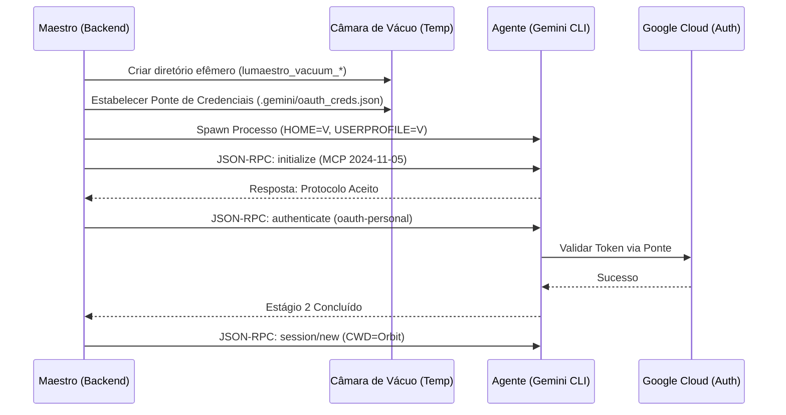

# 🐹 Ponte de Agentes ACP: A Câmara de Vácuo

> [!ABSTRACT]
> Motor de execução isolada que estabelece um canal JSON-RPC seguro entre o Lumaestro e agentes externos, garantindo Soberania Total via isolamento de filesystem (Vácuo) e Ponte de Credenciais.

## 🌌 Visão Geral

A **Ponte ACP (Agent Control Protocol)** é o cordão umbilical que conecta o Córtex do Lumaestro aos motores de raciocínio de elite (Gemini, Claude, LM Studio). Para garantir que a IA não tenha acesso a dados sensíveis do hospedeiro, cada agente é lançado dentro de uma **Câmara de Vácuo**: um diretório temporário efêmero onde o agente é "cego" ao resto do sistema, a menos que uma Órbita Ativa seja explicitamente vinculada.

## 🕸️ Fluxo de Inicialização e Soberania

O diagrama abaixo detalha o processo de "Aperto de Mão" (Handshake) e a injeção de perímetros de segurança.



## 🧠 Componentes Técnicos

### Injeção de Soberania Total (Go)
O Maestro força o agente a reconhecer apenas o ambiente isolado através da manipulação de variáveis de ambiente de sistema.

```go
// Excerto de internal/agents/acp/session.go
func (e *ACPExecutor) StartSession(...) {
    // 🔒 SOBERANIA TOTAL: Força o agente a enxergar apenas a home autorizada
    cmd.Env = append(cmd.Env, "GEMINI_CLI_HOME=" + sessionHome)
    cmd.Env = append(cmd.Env, "HOME=" + sessionHome)
    cmd.Env = append(cmd.Env, "USERPROFILE=" + sessionHome)
    
    // ...
}
```

### O Protocolo de Vácuo
Quando nenhuma órbita está ativa, o Lumaestro cria um diretório vazio. O agente, operando em "Modo Cego", não consegue ler o código-fonte do usuário, protegendo a Propriedade Intelectual.

## 🛡️ Dicas para o Comandante

- **Hard Stop**: Se o agente tentar realizar uma ação fora da Órbita, o sistema de arquivos retornará "Acesso Negado" por design.
- **Ponte de Credenciais**: O Lumaestro transfere automaticamente suas chaves de autenticação para a Câmara de Vácuo, evitando que você precise fazer login novamente a cada sessão.
- **Diagnóstico de Stderr**: O monitor de ouvido biônico captura qualquer erro HTTP (429, 500) ou falha de autenticação e reporta imediatamente no Log de Chat.

## 🔗 Documentos Relacionados

- [[CONTEXT_SOVEREIGNTY]]
- [[RAG_ENGINE_V25]]
- [[DOCS_INDEX]]
