# 🛡️ Soberania de Contexto: O Escudo de Órbita

> [!ABSTRACT]
> Protocolo de segurança de nível militar que garante o isolamento absoluto de dados entre projetos, tornando o Lumaestro "cego" a qualquer informação fora da Órbita Ativa selecionada pelo Comandante.

## 🌌 Visão Geral

A **Soberania de Contexto** é o pilar de governança de dados do Lumaestro. Ela impede o "crosstalk" (contaminação cruzada) entre diferentes bases de conhecimento, garantindo que as sinapses da IA e o Radar Neural operem exclusivamente dentro do perímetro do projeto vinculado. Sem uma Órbita Ativa, o sistema entra em **Modo Cego**, protegendo a integridade intelectual do ecossistema.

## 🕸️ Fluxo de Blindagem e Dados

O diagrama abaixo ilustra como o filtro de órbita intercepta todas as consultas aos motores analíticos e vetoriais.

```mermaid
graph TD
    C["Comandante"]
    A["Hub Central (App)"]
    D["DuckDB (Fast Path)"]
    Q["Qdrant (Deep RAG)"]
    G["Graph Engine (RAM)"]

    C -->|Pergunta| A
    A -->|Filtro: orbit_path| D
    A -->|Filtro: orbit_path| Q
    A -->|Filtro: orbit_path| G
    
    style A fill:#2d333b,stroke:#6d5dfc
    style D fill:#2d333b,stroke:#6d5dfc
    style Q fill:#2d333b,stroke:#6d5dfc
    style G fill:#2d333b,stroke:#6d5dfc
```



## 🧠 Componentes Técnicos

### Interface de Busca Soberana (DuckDB)
O motor analítico agora exige a prova de órbita para liberar qualquer fragmento de informação.

```go
// SearchNodesByKeyword no DuckDBStore
func (s *DuckDBStore) SearchNodesByKeyword(keyword string, workspacePath string, limit int) ([]map[string]interface{}, error) {
    // A query SQL agora possui o cadeado de segurança 'workspace_path = ?'
    query := `
        SELECT id, name, type, (%s) as relevance
        FROM graph_nodes
        WHERE workspace_path = ? AND relevance > 0
        ORDER BY relevance DESC
        LIMIT ?
    `
    // ...
}
```

## 🎮 Dicas para o Comandante

- **Modo Cego Ativado**: Se o Lumaestro parecer "esquecido", verifique se você vinculou uma órbita. Sem um projeto ativo, ele não lerá nenhum arquivo por segurança.
- **Limpeza de Órbita**: Ao trocar de projeto, o sistema executa um `graph:clear` automático. Isso purga o Córtex em RAM para que a nova sinfonia comece do zero.
- **Radar Relâmpago**: O Radar (Fast Path) é o primeiro a ser filtrado. Ele é o sensor de proximidade que identifica alvos legítimos dentro do seu workspace.

## 🔗 Documentos Relacionados

- [[DOCS_INDEX]]
- [[RAG_ENGINE_V25]]
- [[GEAR_NAVIGATION]]
- [[LIGHTNING_STORE]]
