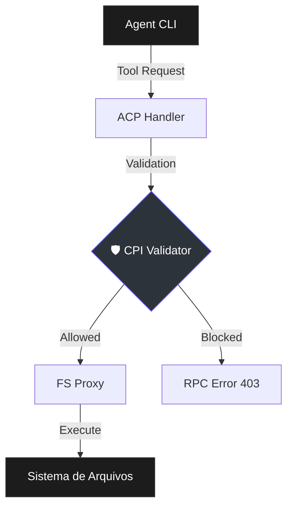

# 🛡️ Protocolo de Isolamento de Consciência (CPI)

> [!ABSTRACT]
> O CPI é o mecanismo de contenção de segurança de nível 1 do Lumaestro, projetado para restringir a "consciência" e a capacidade de atuação dos agentes a uma única órbita autorizada (o diretório do projeto).

## 🐹 Visão Geral

O sistema CPI (Consciousness Protocol Isolation) atua como um firewall cognitivo e operacional. Ele garante que, independentemente da autonomia concedida ao agente, sua capacidade de ler, escrever ou executar comandos nunca escape dos limites do Workspace definido.

## 🕸️ Arquitetura de Isolamento

O CPI está integrado no núcleo do **ACP Executor** e é injetado em todos os pontos de contato com o sistema operacional.

## 🔐 Regras Fundamentais (Hard Stops)

1. **Órbita Ativa**: Definida no boot da sessão (normalmente o `CWD` do projeto).
2. **Whitelist Absoluta**: Qualquer caminho fora da órbita é considerado inexistente.
3. **Bloqueio de Traversal**: Tentativas de usar `..`, `~` ou caminhos absolutos do sistema (ex: `C:\Windows`, `/etc`) resultam em interrupção imediata.
4. **Sanitização de Comandos**: Argumentos de comandos são inspecionados para evitar escapes via strings de caminho.

## 🛠️ Implementação Técnica

O validador reside em `internal/agents/acp/cpi.go` e é invocado por:
- `handler.go`: Validação proativa antes de qualquer review.
- `fs_proxy.go`: Validação final antes da execução no SO.
- `prompt_builder.go`: Injeção de diretrizes de isolamento no System Prompt.

> [!IMPORTANT]
> O CPI tem precedência sobre a configuração `FullMachineAccess`. Mesmo que a segurança global esteja aberta, um agente operando sob CPI está confinado à sua órbita.

## 🧠 Dicas para o Comandante

- Se um agente reportar que não encontra um arquivo que você sabe que existe, verifique se o arquivo está dentro da pasta do projeto.
- O modo **YOLO (Autônomo)** respeita integralmente o CPI. A IA pode agir sozinha, mas nunca fora da gaiola.

## 🔗 Documentos Relacionados
- [[ACP_AGENT_BRIDGE]]
- [[DOCS_INDEX]]
