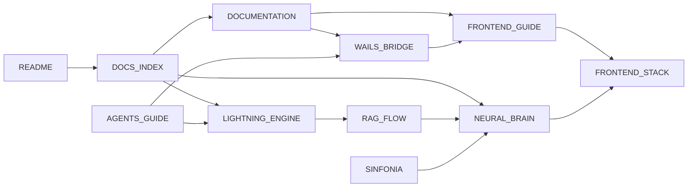

# 📚 Lumaestro: Índice de Documentação 🐹⚙️⚡🕸️🧠🏎️🤖💰🏁🛡️🧪

> Navegue por toda a inteligência documentada do Lumaestro. Cada arquivo abaixo é um nó no grafo de conhecimento do projeto.

---

## 🗺️ Mapa de Documentos

```
                    ┌─────────────┐
                    │  README.md  │ ← Porta de Entrada
                    └──────┬──────┘
                           │
                    ┌──────┴──────┐
                    │ DOCS_INDEX  │ ← Você está aqui
                    └──────┬──────┘
           ┌───────────────┼───────────────┐
           │               │               │
    ┌──────┴──────┐ ┌──────┴──────┐ ┌──────┴──────┐
    │  BACKEND    │ │  FRONTEND   │ │ INTELIGÊNCIA│
    └──────┬──────┘ └──────┬──────┘ └──────┬──────┘
           │               │               │
   ┌───────┼────┐      ┌───┘         ┌─────┼─────┐
   │       │    │      │             │     │     │
WAILS  AGENTS  RAG  FRONTEND    NEURAL LIGHTNING SINFONIA
BRIDGE GUIDE  FLOW  STACK       BRAIN  ENGINE
```

---

## 📖 Backend & Infraestrutura

| Documento | Descrição | Links Relacionados |
|---|---|---|
| [DOCUMENTATION.md](./DOCUMENTATION.md) | Visão geral da arquitetura, instalação e setup | [WAILS_BRIDGE](./WAILS_BRIDGE.md), [FRONTEND_STACK](./FRONTEND_STACK.md) |
| [LUMAESTRO_CORE.md](./LUMAESTRO_CORE.md) | Fundamentos técnicos do orquestrador | [DOCUMENTATION](./DOCUMENTATION.md), [RAG_FLOW](./RAG_FLOW.md) |
| [WAILS_BRIDGE.md](./WAILS_BRIDGE.md) | Ponte Go ↔ Vue.js (Bindings & Eventos) | [DOCUMENTATION](./DOCUMENTATION.md), [FRONTEND_STACK](./FRONTEND_STACK.md) |
| [AGENTS_GUIDE.md](./AGENTS_GUIDE.md) | Arquitetura ACP e controle de agentes | [LIGHTNING_ENGINE](./LIGHTNING_ENGINE.md), [WAILS_BRIDGE](./WAILS_BRIDGE.md) |

## 🎨 Frontend & Visualização

| Documento | Descrição | Links Relacionados |
|---|---|---|
| [FRONTEND_GUIDE.md](./FRONTEND_GUIDE.md) | **Guia Mestre de UI, Componentes e Wails Bridge** | [WAILS_BRIDGE](./WAILS_BRIDGE.md), [FRONTEND_STACK](./FRONTEND_STACK.md) |
| [FRONTEND_STACK.md](./FRONTEND_STACK.md) | Vue 3, D3.js, Xterm.js, Vite | [WAILS_BRIDGE](./WAILS_BRIDGE.md), [NEURAL_BRAIN](./NEURAL_BRAIN.md) |
| [NEURAL_BRAIN.md](./NEURAL_BRAIN.md) | Dashboard 3D, PageRank, X-Ray, Recon | [RAG_FLOW](./RAG_FLOW.md), [LIGHTNING_ENGINE](./LIGHTNING_ENGINE.md) |

## 🧠 Inteligência & Aprendizado

| Documento | Descrição | Links Relacionados |
|---|---|---|
| [RAG_FLOW.md](./RAG_FLOW.md) | Crawler → Embeddings → Qdrant → Chat | [NEURAL_BRAIN](./NEURAL_BRAIN.md), [DOCUMENTATION](./DOCUMENTATION.md) |
| [MODEL_PROVIDER_MATRIX.md](./MODEL_PROVIDER_MATRIX.md) | Matriz de dependências Gemini e plano de troca por Claude/LM Studio | [RAG_FLOW](./RAG_FLOW.md), [LIGHTNING_ENGINE](./LIGHTNING_ENGINE.md) |
| [LIGHTNING_ENGINE.md](./LIGHTNING_ENGINE.md) | DuckDB, APO Beam Search, RLHF, Custos | [RAG_FLOW](./RAG_FLOW.md), [AGENTS_GUIDE](./AGENTS_GUIDE.md) |
| [GEMINI.md](./GEMINI.md) | Configuração de comunicação e idioma | [AGENTS_GUIDE](./AGENTS_GUIDE.md) |

## 📜 Histórico

| Documento | Descrição | Links Relacionados |
|---|---|---|
| [SINFONIA.md](./SINFONIA.md) | Marcos evolutivos do projeto | [NEURAL_BRAIN](./NEURAL_BRAIN.md), [DOCUMENTATION](./DOCUMENTATION.md) |

---

## 🔗 Grafo de Dependências



---
**Lumaestro: Conhecimento conectado, documentação viva. 🐹⚙️⚡🕸️🧠🏎️🤖💰🏁🛡️🧪**
