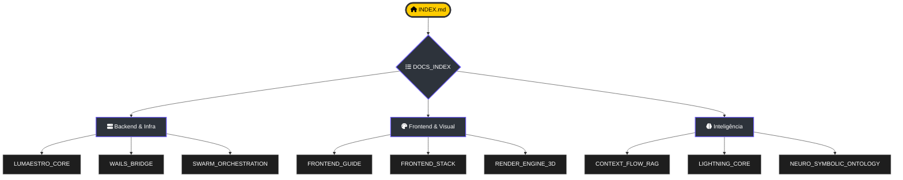

# 📚 Lumaestro: Índice de Documentação 🐹⚙️⚡🕸️🧠🏎️🤖💰🏁🛡️🧪

> Navegue por toda a inteligência documentada do Lumaestro. Cada arquivo abaixo é um nó no grafo de conhecimento do projeto, agora organizados por setores de especialização.

---

## 🗺️ Mapa de Documentos

---

## 🏛️ 1. Raiz (Portais de Entrada)

| Documento | Descrição |
| :--- | :--- |
| [INDEX.md](./INDEX.md) | O Hub de Conhecimento de Elite. |
| [DOCUMENTATION.md](./DOCUMENTATION.md) | Guia mestre de arquitetura global. |
| [GAP_ANALYSIS.md](./GAP_ANALYSIS.md) | Matriz de paridade Gemini CLI vs Lumaestro. |
| [IMPLEMENTATION_PLAN.md](./IMPLEMENTATION_PLAN.md) | Plano de missões e metas ativas. |
| [walkthrough.md](./walkthrough.md) | Jornada de iniciação do Comandante. |
| [tasks.md](./tasks.md) | Painel de controle de missões (Mission Control). |
| [SINFONIA.md](./SINFONIA.md) | Crônicas e marcos evolutivos do projeto. |

---

## 🏗️ 2. Arquitetura (`/architecture`)

| Documento | Descrição |
| :--- | :--- |
| [LUMAESTRO_CORE.md](./architecture/LUMAESTRO_CORE.md) | O Córtex Central e orquestrador Go. |
| [LIGHTNING_CORE.md](./architecture/LIGHTNING_CORE.md) | Motor de auto-evolução (APO & Regression). |
| [CONTEXT_FLOW_RAG.md](./architecture/CONTEXT_FLOW_RAG.md) | Fluxo celestial de RAG e Contexto. |
| [DATABASE_SCHEMA.md](./architecture/DATABASE_SCHEMA.md) | Pulmão Duplo (SQLite/DuckDB). |
| [SWARM_ORCHESTRATION.md](./architecture/SWARM_ORCHESTRATION.md) | Governança de Enxame e Protocolos de Handoff. |
| [DUCKDB_ENGINE.md](./architecture/DUCKDB_ENGINE.md) | Motor de análise colunar e telemetria. |
| [FRONTEND_STACK.md](./architecture/FRONTEND_STACK.md) | Tecnologias e padrões de UI. |
| [RENDER_ENGINE_3D.md](./architecture/RENDER_ENGINE_3D.md) | Motor Deck.gl e visualização de grafos. |
| [WAILS_BRIDGE.md](./architecture/WAILS_BRIDGE.md) | Ponte RPC entre Go e Frontend. |
| [SKILLS_SYSTEM.md](./architecture/SKILLS_SYSTEM.md) | Arquitetura do motor de habilidades. |

---

## 🧠 3. Funcionalidades (`/features`)

| Documento | Descrição |
| :--- | :--- |
| [ACP_MODE.md](./features/ACP_MODE.md) | Protocolo de Comunicação de Agente (Identity). |
| [PROVENANCE_AND_AUDIT.md](./features/PROVENANCE_AND_AUDIT.md) | Linhagem de dados e soberania. |
| [NEURO_SYMBOLIC_ONTOLOGY.md](./features/NEURO_SYMBOLIC_ONTOLOGY.md) | O Truth Engine e extração de triplas. |
| [SEMANTIC_NAVIGATOR.md](./features/SEMANTIC_NAVIGATOR.md) | Trajetórias de navegação no grafo. |

---

## 📖 4. Guias e Manuais (`/guide`)

| Documento | Descrição |
| :--- | :--- |
| [DEVELOPER_GUIDE.md](./guide/DEVELOPER_GUIDE.md) | Manual de engenharia e setup. |
| [FINE_TUNING_RLHF.md](./guide/FINE_TUNING_RLHF.md) | Curadoria de inteligência e treino. |
| [SKILLS_DEVELOPMENT.md](./guide/SKILLS_DEVELOPMENT.md) | Como criar e injetar novas habilidades. |
| [CONFLICT_RESOLUTION.md](./guide/CONFLICT_RESOLUTION.md) | Resolução de conflitos semânticos. |
| [AGENTS_GUIDE.md](./guide/AGENTS_GUIDE.md) | Manual de uso do enxame de agentes. |
| [FRONTEND_GUIDE.md](./guide/FRONTEND_GUIDE.md) | Padrões de design e componentes Vue. |
| [GEMINI.md](./guide/GEMINI.md) | Guia de identidade e configuração de IA. |
| [NODE_GENESIS.md](./guide/NODE_GENESIS.md) | Manual de criação e evolução de nós. |

---

## 📊 5. Relatórios (`/reports`)

| Documento | Descrição |
| :--- | :--- |
| [BUG_REPORT_EXECUTIVE_SUMMARY.md](./reports/BUG_REPORT_EXECUTIVE_SUMMARY.md) | Análise de falhas críticas passadas. |
| [README_PLAN_LEGACY.md](./reports/README_PLAN_LEGACY.md) | Histórico de planos de implementação antigos. |

---

[[INDEX|⬅️ Voltar ao Hub Central]]

---
**Lumaestro: Conhecimento conectado, documentação viva. 🐹⚙️💎**
