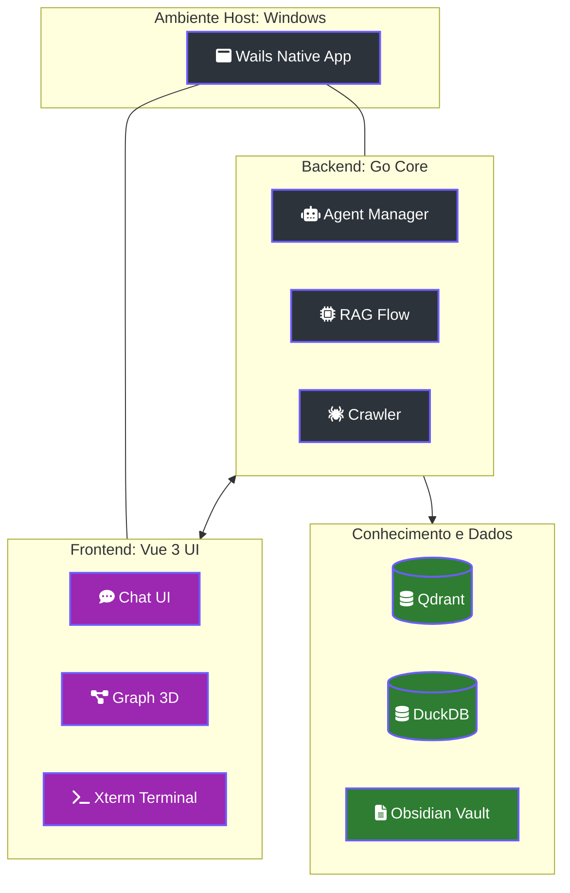

# 🏛️ Lumaestro: O Córtex Central de Documentação

> [!ABSTRACT]
> O **Lumaestro** é um orquestrador de inteligência avançado que funde seu repositório local de conhecimento (Obsidian) com agentes de IA de última geração. Através de uma interface imersiva e uma ponte de sistema nativa, ele transforma dados estáticos em uma rede neural operante e autônoma.

## 🏗️ Visão Geral da Arquitetura Global

O sistema é construído sobre o framework **Wails**, permitindo uma simbiose perfeita entre a performance bruta do Go e a reatividade fluida do Vue.js 3.

---

## 🚀 Componentes Críticos do Sistema

### 1. Backend (Go Core)
Organizado por responsabilidades em `internal/`:
- **Agents**: Gerenciamento de sub-processos interativos (ConPTY no Windows).
- **RAG Flow**: Motor de busca semântica e injeção de contexto dinâmico.
- **Crawler**: Indexação contínua de arquivos locais via hash-check.

### 2. Frontend (Vue.js 3 / Vite)
Interface imersiva com estética de vidro (*Glassmorphism*):
- **Graph 3D**: Renderização acelerada por GPU da ontologia do sistema.
- **Terminal Maestro**: Terminal ANSI completo via xterm.js conectado via WebSockets/Wails.
- **Neural Chat**: Interação fluida com o conhecimento injetado.

### 3. Camada de Persistência
- **Qdrant**: Banco de dados vetorial para busca semântica ultra-rápida.
- **DuckDB**: Motor analítico para telemetria de tokens e grafos dePageRank.

---

## 🛠️ Guia de Decolagem Rápida

1.  **Infraestrutura**: `docker-compose up -d` (Qdrant).
2.  **Frontend**: `cd frontend && npm install`.
3.  **Desenvolvimento**: `wails dev` (Ativa Hot-Reload total).
4.  **Produção**: `wails build` (Gera executável nativo otimizado).

---

## 🔗 Navegação de Documentos

- [[INDEX]] — Portal central de conhecimento de elite.
- [[DOCS_INDEX]] — Índice técnico de arquivos.
- [[NODE_GENESIS]] — O ponto de partida da criação.
- [[LUMAESTRO_CORE]] — Detalhes internos do motor Go.

---
**Lumaestro: Onde o conhecimento local encontra a inteligência infinita. 🏛️📖💎**
