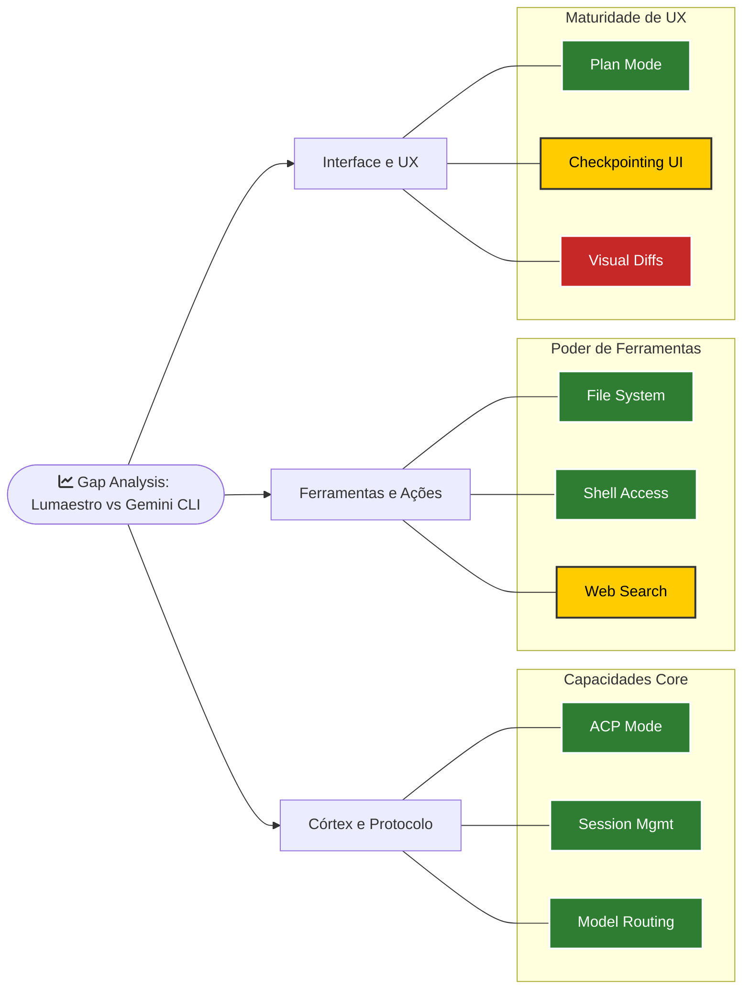

# 📈 Matriz de Soberania Tecnológica (Gap Analysis)

> [!ABSTRACT]
> Este documento é o registro mestre de paridade funcional entre o Lumaestro Cognitive Engine e o Gemini CLI v0.37. Ele detalha a soberania técnica alcançada (~90% de cobertura) e mapeia os gaps necessários para a dominância total do ecossistema.

## 📊 Mapa de Maturidade de Funcionalidades

Abaixo, a representação visual das capacidades core e os horizontes de evolução.

---

## 🏛️ Resumo Executivo

| Categoria | Qtd | Status |
| :--- | :--- | :--- |
| ✅ **Implementado** | 24 | Maturidade Industrial |
| ⚠️ **Parcial** | 4 | Em Otimização |
| 🔴 **Gap Crítico (Alta)** | 0 | Estabilidade Garantida |
| 🟡 **Gap Médio** | 7 | Próximos Saltos |
| ⚪ **Não Aplicável** | 6 | Despriorizado |

**Cobertura Real Verificada: ~90%**

---

## 🗺️ Matriz de Funcionalidades (Técnica)

| # | Funcionalidade | Doc Oficial | Lumaestro | Status |
| :--- | :--- | :--- | :--- | :--- |
| 1 | ACP Mode (JSON-RPC / IPC) | [acp-mode](https://geminicli.com/docs/cli/acp-mode/) | `executor.go`, `handler.go`, `rpc_listener.go` | ✅ Pronto |
| 2 | Session Management | [session-management](https://geminicli.com/docs/cli/tutorials/session-management/) | `session.go` + auto-restore | ✅ Pronto |
| 3 | Authentication (OAuth + API Key) | [authentication](https://geminicli.com/docs/get-started/authentication/) | `session.go` (OAuth silent + API Key pool) | ✅ Pronto |
| 4 | Model Selection (`--model`, env var) | [model](https://geminicli.com/docs/cli/model/) | `executor.go` (flag `--model`) | ✅ Pronto |
| 5 | YOLO Mode (Auto-approve) | [configuration](https://geminicli.com/docs/reference/configuration/) | `executor.go` (`--yolo`) | ✅ Pronto |
| 6 | File System Tools | [file-system](https://geminicli.com/docs/tools/file-system) | `fs_proxy.go` (Read/Write/Delete/Move) | ✅ Pronto |
| 7 | Shell Commands (`run_shell_command`) | [shell](https://geminicli.com/docs/cli/tutorials/shell-commands/) | `handler.go` + `fs_proxy.go` RunCommand | ✅ Pronto |
| 8 | Memory / `save_memory` | [memory](https://geminicli.com/docs/tools/memory) | RAG via `ConsolidateChatKnowledge` + Qdrant | ⚠️ Parcial |
| 9 | GEMINI.md (Project Context) | [gemini-md](https://geminicli.com/docs/cli/gemini-md/) | CLI lê automaticamente + `Read/WriteGeminiConfig` | ✅ Pronto |
| 10 | Web Search (`google_web_search`) | [web-search](https://geminicli.com/docs/tools/web-search) | Nativo via CLI, sem UI específica | ⚠️ Parcial |
| 11 | Web Fetch (`web_fetch`) | [web-fetch](https://geminicli.com/docs/tools/web-fetch) | Nativo via CLI | ⚠️ Parcial |
| 12 | Telemetry / Stats (`/stats`) | [telemetry](https://geminicli.com/docs/cli/telemetry/) | `telemetry.go` + dashboard frontend | ✅ Pronto |
| 13 | Model Routing (Fallback) | [model-routing](https://geminicli.com/docs/cli/model-routing/) | `executor.go` rotação de chaves + fallback | ✅ Pronto |
| 14 | Token Caching | [token-caching](https://geminicli.com/docs/cli/token-caching/) | `TotalCacheTokens` tracking + Dash UI | ✅ Pronto |
| 15 | Checkpointing | [checkpointing](https://geminicli.com/docs/cli/checkpointing/) | `SessionInfo` struct + `.gemini/history/` | ⚠️ Parcial |
| 16 | Plan Mode | [plan-mode](https://geminicli.com/docs/cli/plan-mode/) | Flag `PlanMode` + `PlanView.vue` | ✅ Pronto |
| 17 | Model Steering 🔬 | [model-steering](https://geminicli.com/docs/cli/model-steering/) | `SteeringChan` + Monitor de sessão | ✅ Pronto |
| 18 | Subagents | [subagents](https://geminicli.com/docs/core/subagents/) | `SpawnSubagent` + `SubagentPanel.vue` | ✅ Pronto |
| 19 | Remote Subagents | [remote-agents](https://geminicli.com/docs/core/remote-agents/) | Sem implementação | 🟡 |
| 20 | Hooks (Pre/Post Tool) | [hooks](https://geminicli.com/docs/hooks/) | `hooks.go` implementado com pipeline global | ✅ Pronto |
| 21 | Agent Skills | [skills](https://geminicli.com/docs/cli/skills/) | **524+ skills** em `internal/agents/skills/` | ✅ Pronto |
| 22 | Extensions | [extensions](https://geminicli.com/docs/extensions/) | Sem implementação | 🟡 |
| 23 | MCP Servers | [mcp-server](https://geminicli.com/docs/tools/mcp-server/) | Sem implementação | 🟡 |
| 24 | Custom Commands | [custom-commands](https://geminicli.com/docs/cli/custom-commands/) | Tools nativas, falta suporte a markdown | 🟡 |
| 25 | Rewind | [rewind](https://geminicli.com/docs/cli/rewind/) | Sem implementação | 🟡 |
| 26 | Sandboxing | [sandbox](https://geminicli.com/docs/cli/sandbox/) | Sem implementação | 🟡 |
| 27 | Notifications 🔬 | [notifications](https://geminicli.com/docs/cli/notifications/) | Sem implementação | 🟡 |
| 28 | Headless Mode | [headless](https://geminicli.com/docs/cli/headless/) | Sem implementação | 🟡 |
| 29 | Settings UI (`/settings`) | [settings](https://geminicli.com/docs/cli/settings/) | `Settings.vue` com **50KB** de UI completa | ✅ Pronto |
| 30 | `.geminiignore` | [gemini-ignore](https://geminicli.com/docs/cli/gemini-ignore/) | Sem gerenciamento via UI | 🟡 |
| 31 | Themes | [themes](https://geminicli.com/docs/cli/themes/) | UI premium com dark mode nativo | ✅ Pronto |
| 32 | Keyboard Shortcuts | [keyboard-shortcuts](https://geminicli.com/docs/reference/keyboard-shortcuts/) | Atalhos básicos no Vue | ⚠️ Parcial |
| 33 | System Prompt Override | [system-prompt](https://geminicli.com/docs/cli/system-prompt/) | `prompt_builder.go` (4 perfis) | ✅ Pronto |
| 34 | Enterprise Config | [enterprise](https://geminicli.com/docs/cli/enterprise/) | N/A | ⚪ |
| 35 | Policy Engine | [policy-engine](https://geminicli.com/docs/reference/policy-engine/) | Substituído por `fs_proxy.go` | ⚪ |
| 36 | Git Worktrees 🔬 | [git-worktrees](https://geminicli.com/docs/cli/git-worktrees/) | N/A | ⚪ |
| 37 | Memory Import (Memport) | [memport](https://geminicli.com/docs/reference/memport/) | RAG próprio substitui | ⚪ |
| 38 | Trusted Folders | [trusted-folders](https://geminicli.com/docs/cli/trusted-folders/) | Desktop app SecurityConfig | ⚪ |
| 39 | Resiliência (429/500) | N/A | `executor.go` (Rotação + Auto-retry) | ✅ Pronto |
| 40 | Histórico Persistente | Nativo Gemini | `session.go` + SQLite | ✅ Pronto |
| 41 | Multi-agente (Swarm) | Não oficial | `app_swarm.go` + `orchestrator.go` | ✅ Pronto |
| 42 | Grafo 3D / RAG Visual | Não oficial | `app_graph.go` + `GraphVisualizer.vue` | ✅ Pronto |

---

## 🛠️ Inventário de Ferramentas (Tools)

| Categoria | Ferramenta | ACP? | Lumaestro Renderiza? | Status |
| :--- | :--- | :--- | :--- | :--- |
| **Shell** | `run_shell_command` | ✅ | ✅ `AgentTerminal.vue` | ✅ Pronto |
| **File System** | `read_file` / `read_many` | ✅ | ✅ `handler.go` + `fs_proxy.go` | ✅ Pronto |
| | `write_file` | ✅ | ✅ `ReviewBlock.vue` | ✅ Pronto |
| | `replace` | ✅ | ⚠️ Sem diff visual | ⚠️ Parcial |
| | `list_directory` / `glob` | ✅ | ⚠️ Sem tree view | ⚠️ Parcial |
| | `grep_search` | ✅ | ⚠️ Funciona via CLI | ⚠️ Parcial |
| **Web** | `google_web_search` | ✅ | ⚠️ Sem card de resultados | ⚠️ Parcial |
| | `web_fetch` | ✅ | ⚠️ Sem preview visual | ⚠️ Parcial |
| **Interaction** | `ask_user` | ✅ | ✅ `ReviewBlock.vue` | ✅ Pronto |
| | `write_todos` | ✅ | ❌ Sem painel de TODOs | 🟡 |
| **Memory** | `save_memory` | ✅ | ⚠️ Via Qdrant RAG | ⚠️ Parcial |
| | `get_internal_docs` | ✅ | ⚠️ Via Obsidian RAG | ⚠️ Parcial |
| **Planning** | `enter_plan_mode` | ✅ | ✅ Toggle visual lilás | ✅ Pronto |
| **System** | `complete_task` | ✅ | ✅ executeNativeTool | ✅ Pronto |

---

## 🔎 Detalhamento de Funcionalidades Críticas

### 1. Plan Mode (Modo de Planejamento) ✅
**Status**: Implementado com paridade visual e técnica total.
- **Funcionalidade**: Modo read-only que bloqueia ferramentas de escrita.
- **Lumaestro**: Injeção de `--approval-mode=plan`, flag `PlanMode` no backend e UI dedicada.

### 2. Subagents (Multi-agentes) ⚠️
**Impacto**: Delegação de tarefas paralelas e especialização.
- **Gemini CLI**: Suporta subagentes isolados.
- **Lumaestro**: Implementado via **Swarm** (`app_swarm.go`). Os agentes (Coder/Planner/Reviewer/DocMaster) compartilham a mesma instância ACP. Falta suporte para processos separados para isolamento total.

### 3. Checkpointing (Git Snapshots) ⚠️
**Impacto**: Safety net para todas as modificações de arquivo.
- **Status**: Backend gerencia `SessionInfo` e o CLI cria históricos em `.gemini/history/`.
- **🔴 Gap**: Falta a **Timeline Visual** no frontend e o botão de **Restore** com preview de diff.

---

## 🗄️ Inventário do Codebase Verificado

### Backend: `internal/agents/acp/` (13 arquivos)
| Arquivo | Função Crítica |
| :--- | :--- |
| `executor.go` | Rotação de chaves, review system |
| `handler.go` | Processamento de ndJSON e RPC |
| `session.go` | Ciclo de vida de sessão + auto-restore |
| `types.go` | Structs: ACPExecutor, ACPSession, SessionInfo |
| `orchestrator.go` | Roteamento inteligente multi-agente |
| `prompt_builder.go` | Perfis: Coder, Planner, Reviewer, DocMaster |
| `fs_proxy.go` | Segurança granular e permissões |

### Backend: `internal/agents/skills/` (524+ Skills)
- **Development (184)**: golang_pro, fastapi_pro, react_patterns.
- **General (340)**: deep_research, plan_writing, debugging.

---

## 🚀 Roadmap Sugerido

1.  **Fase de Checkpointing UI**: Timeline visual de snapshots git para restauração.
2.  **Fase de Visual Diffs**: Renderização de `replace` com comparação visual.
3.  **Fase de Web Cards**: Visualização rica para buscas web e fetch.
4.  **Fase MCP**: Suporte ao Model Context Protocol para ferramentas externas.

---

## 🔗 Documentos Relacionados

- [[IMPLEMENTATION_PLAN]] — Cronograma tático de execução.
- [[LUMAESTRO_CORE]] — Arquitetura do Hub central.
- [[DOCS_INDEX]] — Índice central de documentação.

---
**Lumaestro: Transparência radical. Evolução constante. 📈🧭💎**
