# 🏗️ Plano de Implementação (A Grande Obra)

> [!ABSTRACT]
> O Plano de Implementação detalha a trajetória técnica para transformar o Lumaestro no motor cognitivo mais avançado do ecossistema. Ele divide o desenvolvimento em fases lógicas, desde a fundação da infraestrutura até a soberania total de IA.

## 📈 Roteiro de Construção Técnica

```mermaid
flowchart LR
    %% Estilos
    classDef complete fill:#2e7d32,stroke:#fff,stroke-width:2px,color:#fff
    classDef active fill:#6d5dfc,stroke:#fff,stroke-width:2px,color:#fff
    classDef planned fill:#455a64,stroke:#fff,stroke-dasharray: 5 5,color:#fff

    subgraph Phase1 [Fase 1: Fundação]
        F1[Core Bridge]
        F2[RAG Engine]
    end

    subgraph Phase2 [Fase 2: Imersão]
        I1[Graph 3D v2]
        I2[ACP Protocol]
    end

    subgraph Phase3 [Fase 3: Visual Engineering]
        V1[Neural Brain]
        V2[Elite Docs]
    end

    subgraph Phase4 [Fase 4: Expansão]
        E1[MCP Support]
        E2[Full Offline]
    end

    %% Fluxo
    F1 --> F2
    F2 --> I1
    I1 --> I2
    I2 --> V1
    V1 --> V2
    V2 --> E1
    E1 --> E2

    %% Status
    class F1,F2,I1,I2,V1 complete
    class V2 active
    class E1,E2 planned
```

---

## 🔬 Detalhamento das Fases

### Fase 1: Fundação (Concluída) ✅
Foco na estabilidade do backend em Go e na criação da ponte de comunicação com o frontend. Implementação do motor de busca vetorial (Qdrant).

### Fase 2: Imersão (Concluída) ✅
Criação do motor de renderização 3D para o grafo de conhecimento e ativação do **Protocolo ACP** para execução de comandos seguros.

### Fase 3: Visual Engineering (Em Andamento) ⚡
Refatoração completa da documentação para o padrão **Visual Engineering v2** e ativação do **Neural Brain Dashboard** para monitoramento de métricas de PageRank e saúde do sistema.

### Fase 4: Expansão (Planejada) 🔭
Suporte a servidores MCP (Model Context Protocol) e otimização total para execução offline (LM Studio), garantindo soberania total de dados.

---

## 🛠️ Tecnologias Críticas

- **Backend**: Go (Wails) para orquestração de sistema.
- **Frontend**: Vue 3 + Deck.gl para visualização imersiva.
- **Dados**: DuckDB (Analítico) + SQLite (Transacional).
- **Vetor**: Qdrant para memória semântica profunda.

---

## 🔗 Documentos Relacionados

- [[GAP_ANALYSIS]] — O que falta para completarmos as fases.
- [[SINFONIA]] — O registro histórico do que já foi feito.
- [[DOCS_INDEX]] — Índice central de documentação.

---
**Lumaestro: Engenharia de Elite. Visão de Futuro. 🏗️🚀💎**
