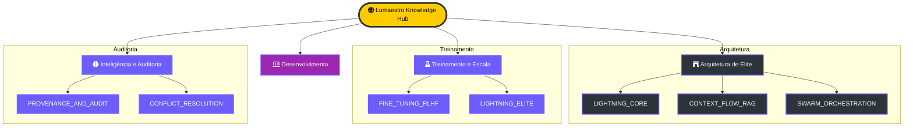

# 📚 Lumaestro Elite Knowledge Hub

> [!ABSTRACT]
> Este portal é o ponto de ancoragem central para todo o ecossistema de documentação técnica, arquitetural e de treinamento do enxame Lumaestro. Cada arquivo aqui listado é um neurônio ativo na base de conhecimento do sistema.

## 🗺️ Mapa da Galáxia de Conhecimento

Abaixo, a estrutura hierárquica que organiza a sabedoria técnica do projeto.

---

## 🏛️ 1. Arquitetura de Elite (Lightning Core)
- **[[architecture/LIGHTNING_CORE|LIGHTNING_CORE]]**: Loop APO, Beam Search e Regressão Gold. ⚡
- **[[architecture/CONTEXT_FLOW_RAG|CONTEXT_FLOW_RAG]]**: Motor N-Hop e a metáfora de Galáxias, Planetas e Luas. 🌌
- **[[architecture/SWARM_ORCHESTRATION|SWARM_ORCHESTRATION]]**: Governança corporativa, delegação e Hard Stop financeiro. 🐝
- **[[architecture/DATABASE_SCHEMA|DATABASE_SCHEMA]]**: Estrutura de persistência e memória de longo prazo (DuckDB). 🗄️
- **[[architecture/LUMAESTRO_CORE|LUMAESTRO_CORE]]**: O Hub central Go. 🏛️

## 🧪 2. Treinamento e Escala (RLHF)
- **[[guide/FINE_TUNING_RLHF|FINE_TUNING_RLHF]]**: Como usar os dados do enxame para treinar novos modelos. 📂
- **[[guide/LIGHTNING_ELITE|LIGHTNING_ELITE]]**: Manual completo do painel de controle industrial. 📊

## 🔎 3. Inteligência e Auditoria
- **[[features/PROVENANCE_AND_AUDIT|PROVENANCE_AND_AUDIT]]**: Linhagem de dados e traces visuais multimodal. 👁️
- **[[guide/CONFLICT_RESOLUTION|CONFLICT_RESOLUTION]]**: Manual do HUD de Saúde e Verdade Situacional. 🛡️
- **[[features/NEURO_SYMBOLIC_ONTOLOGY|NEURO_SYMBOLIC_ONTOLOGY]]**: O Truth Engine e triplas semânticas. 🔍

## 💻 4. Guia de Desenvolvimento
- **[[guide/DEVELOPER_GUIDE|DEVELOPER_GUIDE]]**: Setup rápido e estrutura do projeto. ⚙️
- **[[guide/SKILLS_DEVELOPMENT|SKILLS_DEVELOPMENT]]**: Como injetar novas habilidades nos agentes. 🛠️
- **[[design/VISUAL_TRAJECTORIES|VISUAL_TRAJECTORIES]]**: Estética de vidro e micro-animações de raciocínio. 💅

---

> [!IMPORTANT]
> **Base de Grounding**: Todos os arquivos deste hub são indexados em tempo real pelo Crawler, garantindo que o Lumaestro tenha consciência total de sua própria arquitetura durante as interações.

---

[[DOCS_INDEX|Ir para o Índice de Arquivos ➡️]]

---
**Lumaestro Knowledge Hub: A consciência documentada da evolução. 🐹⚙️💎**
