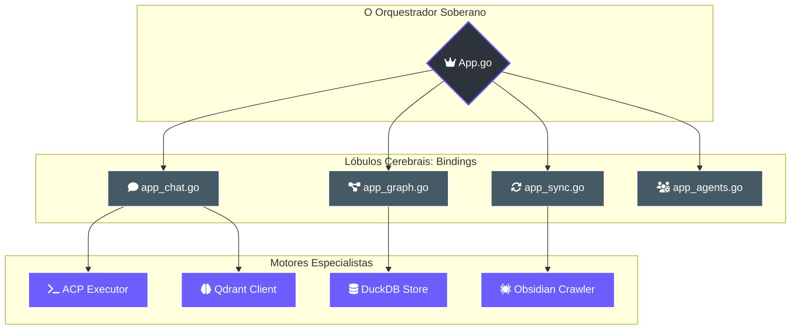
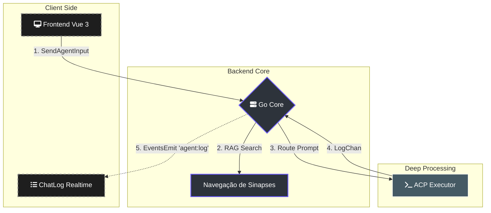

---
tags:
  - backend
  - core
  - wails
  - orchestration
  - golang
---

# 🏛️ Guia do Núcleo Backend (Lumaestro Core)

> [!ABSTRACT] Visão Geral
> A pasta internal/core é o **Córtex Primário** do Lumaestro. É aqui que reside a estrutura App, que serve como o Hub Central para todos os serviços (RAG, Agentes, Lightning, Crawler). Este módulo é responsável por exportar as funções Go para o Frontend via **Wails Bindings**.

---

## 🏗️ Arquitetura Modular (Hub-and-Spoke)

O Core do Lumaestro utiliza um design onde a instância App centraliza as referências de todos os sub-sistemas, garantindo que a comunicação entre eles seja fluida e segura.

---

## 🚀 Componentes Principais

### 1. pp.go: O Grande Orquestrador
Este arquivo define a struct App e gerencia o **Ciclo de Vida** do sistema.
- **Startup(ctx)**: Inicializa os drivers, sincroniza o PATH e dispara a sequência de boot assíncrona.
- **ootSequence()**: Uma rotina de 1:1 com o monólito original que garante que todos os serviços (Qdrant, Embeddings, DuckDB) subam na ordem correta, emitindo eventos de diagnóstico para o Frontend.
- **injectContexts()**: Garante que o contexto do Wails (.ctx) seja propagado para todos os serviços de RAG e Chat.

### 2. pp_chat.go: O Motor de Sinfonia
Responsável pela inteligência conversacional e integração com a base de conhecimento.
- **SendAgentInput**: O ponto de entrada para mensagens do usuário. Ele realiza a **Navegação de Sinapses** (RAG expandido via grafo) antes de rotear o comando para o executor ACP.
- **ResolveConflict**: A lógica de arbitragem que permite ao usuário decidir entre informações contraditórias detectadas pela IA no grafo de conhecimento.
- **ConsolidateChatKnowledge**: O "Sono REM" do Maestro, onde diálogos recentes são transformados em memórias permanentes (nós rosa) no Qdrant.

### 3. pp_sync.go & pp_graph.go
- **Sincronização**: Gerencia a varredura do Vault do Obsidian e a vetorização de arquivos.
- **Visualização**: Exporta os dados de PageRank e conexões para o **GraphVisualizer.vue**.

---

## 📡 Fluxo de Eventos (Event-Driven)

O Core utiliza extensivamente o barramento de eventos do Wails para comunicação assíncrona (não-bloqueante).

---

## 🛠️ Detalhes de Implementação Críticos

### 🔒 Trava de Inicialização (muInit)
No pp.go, utilizamos um sync.Mutex para evitar que recarregamentos de interface (HMR) tentem inicializar os serviços de IA múltiplas vezes, o que causaria vazamentos de memória e conflitos de porta.

### 🛡️ Detector de Rogue Files
A função checkRogueMainFiles() escaneia o projeto no startup para encontrar outros arquivos package main que possam quebrar o processo de build do Wails, exibindo um alerta visual em ASCII no console.

---

## 🔗 Documentos Relacionados
- [[FRONTEND_GUIDE]]: Como o Vue 3 consome os métodos desta pasta.
- [[ACP_MODE]]: O protocolo de execução chamado pelo pp_chat.go.
- [[NEURAL_BRAIN]]: Como os dados de pp_graph.go são usados para IA.

---
**Lumaestro Knowledge Base: A arquitetura do cérebro digital.** 🐹⚙️⚡🤖💰🏁📄🧪
