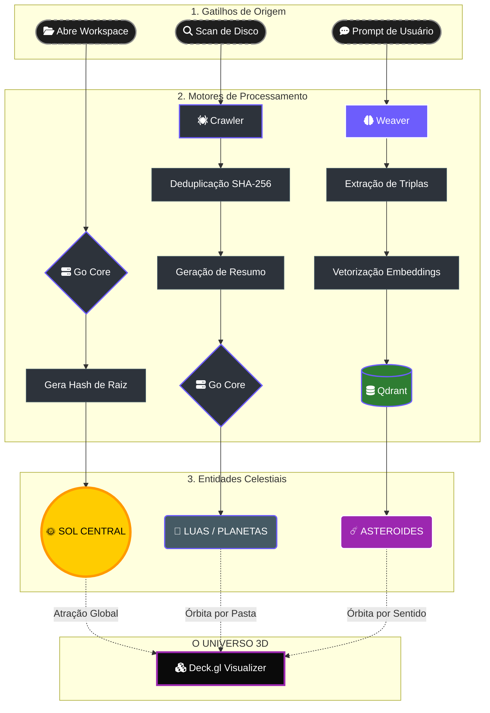
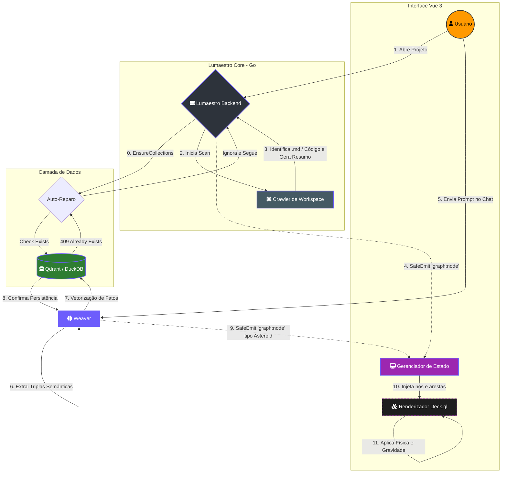

# 🧬 Gênese de Nós e Neurônios 🪐

> [!ABSTRACT]
> Este documento detalha os processos bio-digitais de nascimento e propagação de matéria no Grafo do Lumaestro. Aqui definimos como arquivos mortos se tornam neurônios vivos e como conversas efêmeras se cristalizam em sinapses permanentes.

## 🧠 Visão Geral da Matéria

No ecossistema Lumaestro, um **Nó** não é apenas um registro de banco de dados; ele é uma entidade celestial com gravidade, massa e propósito. O sistema opera em três planos de existência para a criação de matéria:

### 1. 📂 O Plano Estrutural (O Crawler)
Esta é a materialização do seu trabalho físico no disco rígido.
- **Gatilho:** Ciclo de `Scan` automático ou manual do Workspace.
- **Processo:** O motor percorre o sistema de arquivos, gera um hash SHA-256 único por caminho absoluto e extrai metadados locais (headers, funções, resumos).
- **Identidade Visual:** **Luas (Moons)** ou **Planetas**. Possuem "Órbita Física", ficando presos magneticamente às suas pastas de origem.

### 🧠 2. O Plano Cognitivo (O Knowledge Weaver)
Criação de conhecimento a partir da inteligência pura e extração semântica.
- **Gatilho:** Interações via Chat. A IA identifica afirmações de alto valor.
- **Processo:** O `Weaver` extrai triplas semânticas e as vetoriza (Embeddings). Não dependem de arquivos físicos pré-existentes.
- **Identidade Visual:** **Asteroides** ou **Neurônios Flutuantes**. Possuem "Órbita Semântica", aproximando-se de outros nós por afinidade de sentido, não por localização de pasta.

### 🌞 3. O Plano Primordial (O Galaxy Core)
O ponto de ancoragem de toda a galáxia do projeto.
- **Gatilho:** Inicialização do Workspace Ativo.
- **Processo:** Cálculo da raiz do projeto e atribuição de massa crítica (`100.0`). Serve como o ponto 0,0,0 da bússola gravitacional.
- **Identidade Visual:** **Sol Central (Sun)**. O maior nó do sistema, responsável por impedir a dispersão da matéria no vácuo 3D.

---

### 📊 Tabela Comparativa de Gênese

| Característica | **Crawler (Arquivo)** | **Weaver (Memória)** | **Core (Âncora)** |
| :--- | :--- | :--- | :--- |
| **Representação** | Lua / Planeta | Asteroide / Neurônio | Sol / Núcleo |
| **Origem** | Disco Rígido (Realidade) | Conversa (Conhecimento) | Configuração (Estrutura) |
| **Atração** | Por Pasta (Hierárquica) | Por Sentido (Semântica) | Global (Centro) |
| **Propósito** | Localizar Código/Notas | Raciocínio da IA | Organização da Galáxia |

---

## 🕸️ Fluxo de Dados: Ciclo de Vida da Informação

Para compreender a gênese de nós, dividimos a visualização em duas camadas: a **Lógica** (o que acontece na mente do usuário) e a **Técnica** (o que acontece na infraestrutura).

### A. Visão Conceitual (A Trindade da Matéria)
Este fluxo demonstra como as três fontes de matéria alimentam o Universo 3D através de suas respectivas esteiras de processamento.



---

### B. Visão de Engenharia (Detalhado)
Este fluxo detalha a comunicação entre subpastas, o protocolo de eventos e as barreiras de proteção.



---

## 🛡️ Componentes Técnicos

### Proteção de Infraestrutura (Auto-Reparo)

Para evitar falhas fatais durante o boot (especialmente em ambientes de alta concorrência ou reloads de HMR), o Lumaestro utiliza uma política de **Idempotência de Coleção**.

> [!IMPORTANT]
> Se o motor tentar criar a coleção `obsidian_knowledge` e o Qdrant retornar um erro `409 (Conflict)`, o sistema identifica isso como um sinal de que a infraestrutura já está pronta e ignora o erro, permitindo que o scan continue sem interrupções.

```go
if err := c.Qdrant.CreateCollection(name, dimension); err != nil {
    // 🛡️ Idempotência: Se outra goroutine já criou a coleção (409), ignorar
    if strings.Contains(err.Error(), "already exists") {
        fmt.Printf("[Crawler] ✅ Coleção '%s' pronta (via Auto-Reparo).\n", name)
        continue
    }
    return fmt.Errorf("falha ao criar coleção: %w", err)
}
```
### Interface de Emissão (Sinapse Backend → Frontend)
Todos os nós, independente da origem, devem respeitar o contrato de emissão `SafeEmit` para garantir que o Frontend não sofra com race conditions.

```go
// Exemplo de nascimento de um nó via Crawler
utils.SafeEmit(c.ctx, "graph:node", map[string]interface{}{
    "id":             nodeID,
    "name":           nodeName,
    "document-type":  "chunk",
    "celestial-type": "moon", // Arquivos são luas orbitando pastas
    "mass":           5.0,
    "summary":        fileSummary,
})
```

### Vetorização de Memórias (Weaver)
Quando o `KnowledgeWeaver` identifica um novo fato, ele o integra ao Cérebro Vetorial (Qdrant).

```js
// Lógica de Tecelagem (Simulação)
const fact = "Lumaestro usa Go no Backend";
const vector = await embedder.generate(fact);
qdrant.upsert("knowledge_graph", { id: hash(fact), vector, payload: { subject: "Lumaestro", ... } });
```

---

## 🐹 Dicas para o Comandante

> [!TIP]
> **Massa Gravitacional:** Pastas raiz têm massa `50.0` (Sistemas Solares), enquanto arquivos individuais têm massa `5.0`. Se o seu grafo estiver muito disperso, aumente a força de repulsão (F6) para o Modo Supernova.

> [!IMPORTANT]
> **Regra de Ouro:** O sistema nunca cria o mesmo nó duas vezes. O ID é sempre derivado de um hash SHA-256 do caminho absoluto do arquivo ou do conteúdo do fato semântico. Isso evita a "Esquizofrenia de Dados".

---

## 🔗 Documentos Relacionados

- [[APP_BOOT]]: O despertar dos serviços.
- [[RAG_ARCHITECTURE]]: Como o cérebro processa a matéria criada.
- [[DOCS_INDEX]]: Índice estelar da documentação.
