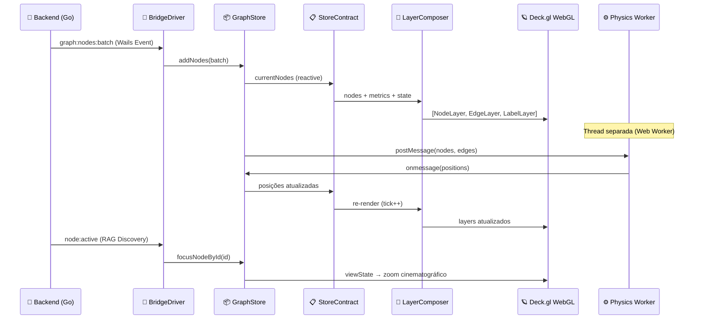

# 🎨🕸️ Motor de Renderização 3D — O Olho do Comandante

> [!ABSTRACT]
> O Motor de Renderização 3D é a retina do Lumaestro. Ele transforma dados brutos de grafos (nós, arestas, métricas) em uma nebulosa interativa tridimensional onde cada esfera é um neurônio de conhecimento, e cada fio dourado é uma sinapse entre ideias. Sem ele, o Comandante navegaria às cegas.

---

## 🏗️ Visão Geral da Arquitetura

O motor é construído em camadas modulares que se comunicam através de um contrato de dados (`StoreContract`) e um ciclo de animação orquestrado (`AnimationClock`). Cada camada tem uma responsabilidade única e pode ser substituída sem afetar as demais.

```
┌─────────────────────────────────────────────────┐
│                  useDeckRender.js                │ ← Orquestrador Principal
├───────────┬──────────────┬──────────────────────┤
│ StoreContract │ LayerComposer │ InteractionPilot │
│ (Dados)       │ (Visual)      │ (Gestos)         │
├───────────┴──────────────┴──────────────────────┤
│               AnimationClock                     │ ← 60fps Loop
├──────────────────┬──────────────────────────────┤
│   BridgeDriver   │         EventBridge           │
│  (Wails Events)  │     (Physics Worker)           │
└──────────────────┴──────────────────────────────┘
```

---

## 🧬 Fluxo de Dados (Da Sinapse ao Pixel)



---

## 🪐 Componentes Técnicos

### 1. NeuralNodeLayer — Esferas 3D Falsas (Impostors)

O componente mais visualmente impactante do sistema. Em vez de renderizar geometria 3D real (milhares de polígonos por esfera), ele usa um **truque de shader GLSL** que projeta uma esfera falsa em cada ponto 2D do `ScatterplotLayer`.

```javascript
// Fragmento do shader GLSL injetado no Deck.gl
'fs:DECKGL_FILTER_COLOR': `
    vec2 coord = geometry.uv;           // UV vai de -1.0 a 1.0
    float radiusSq = dot(coord, coord);
    if (radiusSq > 1.0) discard;        // Descarta pixels fora do círculo
    
    // Reconstrói a normal 3D via Pitágoras: X² + Y² + Z² = R²
    float z = sqrt(1.0 - radiusSq);
    vec3 normal = normalize(vec3(coord.x, coord.y, z));
    
    // Iluminação: Ambiente + Difusa + Especular
    vec3 lightDir = normalize(vec3(-0.6, -0.8, 1.2));
    float diff = max(dot(normal, lightDir), 0.0);
    float spec = pow(max(dot(normal, halfVector), 0.0), 32.0);
    
    color.rgb = color.rgb * (0.35 + diff * 0.75) + spec * 0.5;
`
```

> [!TIP]
> **Custo Real**: Cada nó usa apenas **2 triângulos** (um quad 2D), mas parece uma esfera 3D completa. Com 5000 nós, isso economiza ~60 milhões de vértices comparado com esferas reais de 24 segmentos.

### 2. Hierarquia Celestial (Escalonamento Visual)

Os nós não são todos iguais. O sistema atribui uma "classe celestial" baseada na estrutura do vault:

| Classe | Massa Visual | Cor | Significado |
|--------|-------------|-----|-------------|
| `galaxy-core` | 60.0 | Ouro | Raiz do Vault/Projeto |
| `solar-system-core` | 30.0 | Laranja | Pasta principal |
| `planet` | 15.0 | Azul claro | Sub-pasta |
| `moon` | 4.0 | Comunidade | Nota/Arquivo |
| `asteroid` | 1.5 | Cinza | Memória de chat |

### 3. Efeito de Descoberta (Zoom Cinematográfico)

Quando o RAG identifica um nó relevante durante uma conversa, o `BridgeDriver` orquestra um zoom suave com sistema de cancelamento:

```javascript
// Token de cancelamento para evitar zooms conflitantes
let discoveryAbort = null;

window.runtime.EventsOn("node:active", (nodeId) => {
    if (discoveryAbort) discoveryAbort.cancelled = true; // Cancela zoom anterior
    const abortToken = { cancelled: false };
    discoveryAbort = abortToken;
    
    // Retry com backoff: 8 tentativas × 1200ms crescente
    const tryFocus = (attempt = 1) => {
        if (abortToken.cancelled) return;
        const node = store.graphInstance?.focusNodeById(cleanId);
        if (!node && attempt < 8) {
            setTimeout(() => tryFocus(attempt + 1), attempt * 1200);
        }
    };
    setTimeout(() => tryFocus(), 500);
});
```

> [!WARNING]
> **Race Condition Protegida**: Sem o `discoveryAbort`, duas buscas RAG rápidas causariam a câmera "pingar" entre dois nós. O token de cancelamento garante que apenas o último alvo receba o foco.

### 4. Motor de Física (Web Worker)

A simulação de forças roda em uma **thread separada** via Web Worker para não bloquear a UI:

- **Força Magnética**: Repulsão entre nós para evitar sobreposição
- **Força Radial**: Organiza por comunidade Louvain em órbitas concêntricas
- **Força de Contorno**: Impede que nós escapem do volume visível
- **Repulsão Z**: Garante distribuição tridimensional (evita achatamento)

---

## 💡 Dicas para o Comandante

> [!TIP]
> **Performance**: Se o grafo ficar lento com mais de 3000 nós, ative o "Modo Esqueleto" (`GetSkeletalGraph`) que exibe apenas as arestas vitais (MST — Minimum Spanning Tree), reduzindo a carga de renderização em até 80%.

> [!IMPORTANT]
> **Persistência de Layout**: As posições dos nós são salvas automaticamente no DuckDB e no cache de topologia (`.lumaestro/topology.json`). Se você deletar este arquivo, o grafo perderá o layout e precisará recalcular as posições via simulação de física.

---

## 🔗 Documentos Relacionados

- [[NEURAL_BRAIN]] — Dashboard 3D, PageRank e auditoria de grafo
- [[LIGHTNING_ENGINE]] — DuckDB e persistência analítica
- [[FRONTEND_STACK]] — Pilha tecnológica Vue 3 + Deck.gl
- [[WAILS_BRIDGE]] — Ponte de eventos Go ↔ JavaScript
- [[DOCS_INDEX]] — Índice central de documentação
