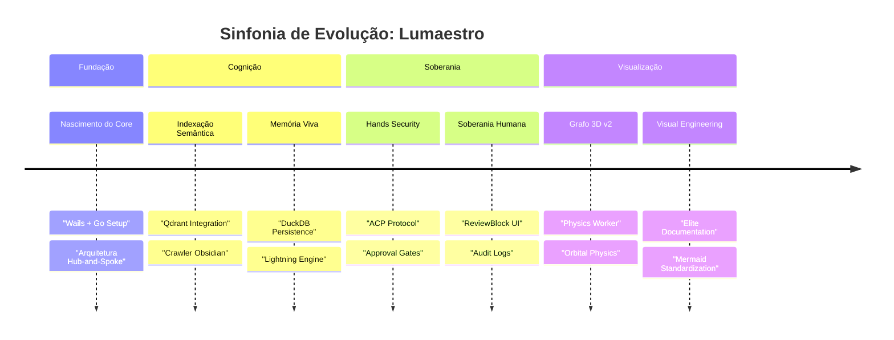

# 🎼 Sinfonia de Evolução (Project Roadmap)

> [!ABSTRACT]
> O Lumaestro não é um software estático; é um organismo digital em constante evolução. Este documento registra os marcos históricos e a trajetória tecnológica que transformaram uma ideia em um orquestrador de inteligência de elite.

## 📈 Linha do Tempo de Evolução

---

## 🚩 Marcos Alcançados (v15.0 Quantum Elite)

### 1. Mãos do Maestro (Março/2026)
- **Capacidade Operacional**: Liberamos permissões totais de escrita, criação de arquivos e execução de comandos via terminal.
- **Protocolo ACP**: Implementação do sistema de aprovação humana em tempo real para ações críticas.

### 2. Cérebro Digital e Grafo-RAG
- **Conhecimento Conectado**: Integração profunda entre o Obsidian e o chat via Qdrant (Vetores) e DuckDB (Grafos).
- **Rede Neural Viva**: Otimização do motor de renderização 3D com física orbital e PageRank em tempo real.

### 3. Legado Escrito (Visual Engineering)
- **Standardization**: Refatoração completa da documentação técnica seguindo o DNA Lumaestro de Engenharia Visual.

---

## 🔭 Visão de Futuro

- **Orquestração Multimodal Nativa**: Processamento direto de diagramas e fluxogramas via visão computacional.
- **Ecossistema de Skills**: Marketplace local de especialidades para agentes.
- **Soberania Total**: Interface de voz criptografada e latência sub-100ms em modelos locais.

---

## 🔗 Documentos Relacionados

- [[LUMAESTRO_CORE]] — O fundamento técnico de tudo.
- [[NEURAL_BRAIN]] — A visualização do estado atual da sinfonia.
- [[DOCS_INDEX]] — Índice central de documentação.

---
**Lumaestro: A evolução nunca dorme. 🎼🚀💎**
