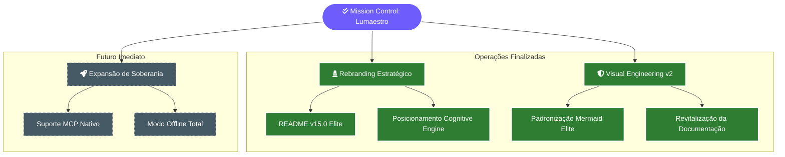

# 📋 Painel de Missões (Mission Control)

> [!ABSTRACT]
> O Mission Control é o registro de todas as operações táticas realizadas no ecossistema Lumaestro. Ele serve para monitorar o progresso das missões concluídas e mapear os próximos saltos tecnológicos em direção à soberania total.

## 📊 Status de Operação do Enxame

Abaixo, a árvore de missões e seu estado atual de execução.

---

## ✅ Missões Concluídas

- **[x] Rebranding Estratégico**: Transformação do posicionamento de mercado para *Cognitive Engine*.
- **[x] Vitrine Técnica**: README v15.0 Quantum Elite finalizado e aplicado.
- **[x] Visual Engineering v2**: Padronização de 22+ documentos com Mermaid de Elite.
- **[x] Guia do Comandante**: Criação do Walkthrough e Jornada de Iniciação.

---

## 🚀 Próximas Missões (Roadmap)

- **[ ] Suporte MCP**: Integrar servidores Model Context Protocol para expansão de ferramentas.
- **[ ] Modo Offline Total**: Otimizar o RAG e o Chat para uso exclusivo com LM Studio/Llama local.
- **[ ] Timeline de Checkpoints**: Implementar a UI visual para restauração de versões do workspace.

---

## 🔗 Documentos Relacionados

- [[GAP_ANALYSIS]] — Detalhamento técnico do que ainda falta.
- [[SINFONIA]] — Histórico cronológico das missões.
- [[DOCS_INDEX]] — Índice central de documentação.

---
**Lumaestro: Missão dada é missão cumprida. 📋✅💎**
