# 🚶‍♂️ Guia de Experiência do Comandante (Walkthrough)

> [!ABSTRACT]
> Este guia detalha a jornada desde o primeiro contato com o binário do Lumaestro até a orquestração completa de enxames de agentes. Siga estes passos para dominar seu novo Córtex Cognitivo.

## 🗺️ Jornada de Iniciação e Maestria

Abaixo, os marcos fundamentais para configurar e operar o sistema com máxima eficiência.

```mermaid
flowchart LR
    %% Estilos
    classDef start fill:#ffcc00,stroke:#333,stroke-width:4px,color:#000
    classDef step fill:#2d333b,stroke:#6d5dfc,stroke-width:2px,color:#fff
    classDef finish fill:#2e7d32,stroke:#fff,stroke-width:2px,color:#fff

    BEGIN([fa:fa-play Início])
    
    subgraph Onboarding [Jornada de Iniciação]
        direction LR
        S1[fa:fa-download Clone & Setup]
        S2[fa:fa-cogs Config chaves API]
        S3[fa:fa-spider Scan de Workspace]
    end

    subgraph Operation [Operação de Elite]
        direction LR
        O1[fa:fa-comment Neural Chat]
        O2[fa:fa-project-diagram Graph Navigation]
        O3[fa:fa-terminal Agent Handoff]
    end

    END([fa:fa-check-double Maestria Alcançada])

    %% Fluxo
    BEGIN --> S1 --> S2 --> S3
    S3 --> O1 --> O2 --> O3
    O3 --> END

    %% Estilos
    class BEGIN start
    class S1,S2,S3,O1,O2,O3 step
    class END finish
```

---

## 🛠️ Passo 1: Preparação do Terreno (Onboarding)

1.  **Clone e Dependências**: Baixe o repositório e execute `npm install` na pasta frontend.
2.  **Configuração de API**: No painel de `Settings`, insira suas chaves do Gemini, Anthropic ou OpenAI.
3.  **Ancoragem de Workspace**: Aponte para sua pasta de notas (Obsidian) ou código-fonte. O Crawler iniciará a indexação vetorial instantaneamente.

## 📡 Passo 2: Operação de Elite (Cores)

1.  **Neural Chat**: Interaja com seu conhecimento. O sistema recuperará o contexto automaticamente (Graph-RAG).
2.  **Navegação Orbital**: Use o Grafo 3D para visualizar conexões que você nunca percebeu. Clique em nós para focar a câmera e extrair insights.
3.  **Handoff de Agentes**: Delegue tarefas complexas para o enxame. Monitore a execução via terminal interativo.

---

## 💎 Dicas para o Maestro

- **Modo X-Ray**: No visualizador de grafos, aumente o threshold de relevância para limpar o ruído e focar apenas no "ouro semântico".
- **Hard Stop**: Mantenha sempre um olho no dashboard financeiro para garantir que a orquestração de sub-agentes esteja dentro do orçamento de tokens.

---

## 🔗 Documentos Relacionados

- [[DOCUMENTATION]] — A visão técnica completa.
- [[AGENTS_GUIDE]] — Como extrair o máximo de cada agente.
- [[DOCS_INDEX]] — Índice central de documentação.

---
**Lumaestro: Evoluindo a autonomia, um rastro de cada vez. 🐹🚀💎**
