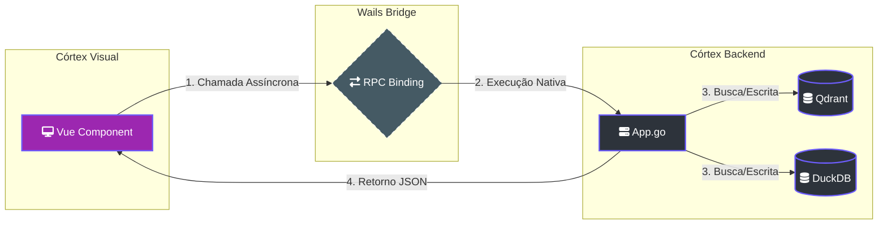

# 🔌 API Backend: A Ponte do Maestro

> [!ABSTRACT]
> Este documento é a referência técnica definitiva das chamadas RPC (`app.go`) que conectam a interface Vue.js ao cérebro Go. Estas funções permitem a orquestração de dados, segurança e auditoria do enxame em tempo real.

## 🏗️ Orquestração de Chamadas RPC

Abaixo, o fluxo de dados entre a interface reativa e a execução nativa de sistema.

---

## 🔎 Proveniência e Auditoria

### `GetNodeDetails(name string)`
- **Descrição**: Recupera o payload completo do Qdrant para um nó específico.
- **Retorno**: Objeto JSON contendo `path`, `content`, `observed_at` e `status`.
- **Finalidade**: Alimentar a Sidebar de Auditoria no HUD 3D.

### `OpenFileInEditor(path string)`
- **Descrição**: Comando de soberania que abre o arquivo original no sistema operacional (Obsidian, VSCode ou Reader).
- **Parâmetro**: Caminho absoluto (`path`).

---

## 🛡️ Integridade e Verdade Situacional

### `AnalyzeGraphHealth()`
- **Descrição**: Varre a base de conhecimento em busca de anomalias semânticas (PageRank incoerente) e calcula a densidade de conexões.
- **Retorno**: Estatísticas de saúde (Density, Conflicts Count, Orphan Nodes).

### `ResolveConflict(decision, subject, predicate, newValue, sessionID)`
- **Descrição**: Aplica a decisão de verdade soberana do usuário.
- **Lógica**: Se a decisão for "new", o fato antigo é rotulado como `status: legacy` e a nova informação torna-se a verdade ativa na rede neural.

---

## 🔗 Documentos Relacionados

- [[WAILS_BRIDGE]] — Protocolo técnico de transporte.
- [[NEURAL_BRAIN]] — Visualização dos dados recuperados por estas APIs.
- [[DOCS_INDEX]] — Índice central de documentação.

---
**Lumaestro API: Performance nativa. Flexibilidade digital. 🔌💎⚙️**
