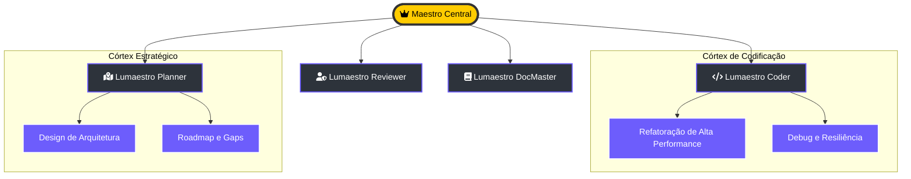

# 🤖 Catálogo de Agentes do Enxame

> [!ABSTRACT]
> O Lumaestro opera através de um enxame de agentes especializados, cada um com um "Córtex de Contexto" otimizado para tarefas específicas. Sob a batuta do Maestro Central, estes agentes colaboram para executar o plano primordial com precisão e velocidade.

## 🏗️ Hierarquia de Comando e Especialização

Abaixo, a estrutura de papéis que compõe o ecossistema de inteligência do Lumaestro.

---

## 🎭 Perfis de Operação

### 1. 🛠️ Lumaestro Coder
- **Objetivo**: Implementação técnica de alta fidelidade.
- **Skills**: Go, JavaScript, SQL, Rust, e otimização de algoritmos.
- **DNA**: Focado em código limpo, testes unitários e performance.

### 2. 🗺️ Lumaestro Planner
- **Objetivo**: Visão macro e orquestração de tarefas.
- **Skills**: Análise de gaps, planejamento de sprints e arquitetura sistêmica.
- **DNA**: Antecipa bloqueios e define a estratégia de execução.

### 3. 🛡️ Lumaestro Reviewer
- **Objetivo**: Segurança e qualidade (Soberania ACP).
- **Skills**: Auditoria de código, detecção de vulnerabilidades e conformidade.
- **DNA**: O portão final antes da execução em produção.

### 4. 📚 Lumaestro DocMaster
- **Objetivo**: Visual Engineering e Documentação.
- **Skills**: Markdown, Mermaid.js, Documentação técnica e Visualização de dados.
- **DNA**: Garante que o conhecimento do sistema seja eterno e compreensível.

---

## 🔗 Documentos Relacionados

- [[MULTI_AGENT_SYSTEM]] — Como o enxame se comunica.
- [[AGENTS_GUIDE]] — Guia de operação dos agentes.
- [[SKILLS_SYSTEM]] — Como expandir as habilidades dos agentes.
- [[DOCS_INDEX]] — Índice central de documentação.

---
**Lumaestro: Muitos agentes. Uma só vontade. 🤖🦾💎**
