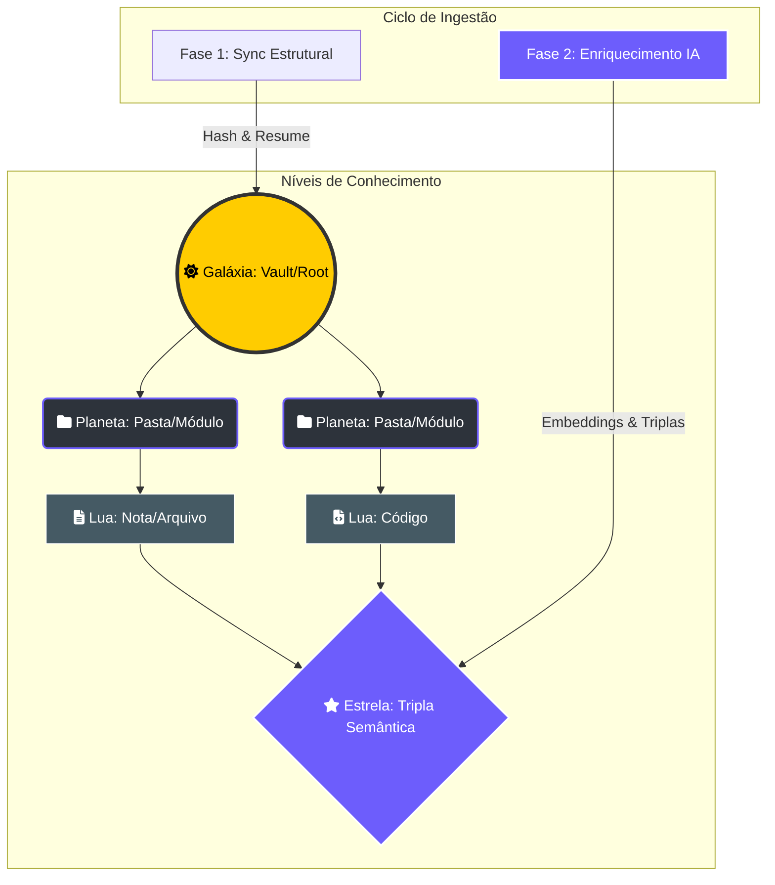

# 🌌 Fluxo de Contexto RAG: O Cosmos Cognitivo

> [!ABSTRACT]
> O motor RAG do Lumaestro utiliza uma metáfora espacial (Cosmos Model) para organizar o conhecimento. Ele transcende a busca vetorial simples ao integrar uma arquitetura de grafos N-Hop, permitindo que a IA navegue por conexões semânticas e estruturais como um explorador intergalático.

## 🛰️ Arquitetura Celestial (The Cosmos Model)

O conhecimento é organizado em camadas de densidade e relevância, representadas visualmente no Grafo 3D.

---

## ⚡ O Ciclo de Ingestão de Matéria

### Fase 1: Sincronização Estrutural (Zero-Cost)
O Crawler monitora o sistema de arquivos em tempo real, emitindo eventos de topologia sem custo de IA.
- **Deduplicação SHA-256**: Garante que apenas alterações reais disparem re-indexação.
- **Resumo Estático**: Extração rápida de metadados, títulos e assinaturas de código (Go/JS/Python).

### Fase 2: Enriquecimento Cognitivo (IA)
Para elementos novos ou modificados, o enxame realiza o processamento profundo:
- **Extração de Triplas**: Conversão de texto bruto em conhecimento estruturado (Sujeito → Predicado → Objeto).
- **Processamento Multimodal**: OCR e análise visual de imagens e PDFs.
- **Vetorização**: Geração de embeddings de alta dimensionalidade (3072D) no **Qdrant**.

---

## 🔍 Motor de Busca N-Hop (Deep Retrieval)

Diferente de RAGs tradicionais, o Lumaestro utiliza uma abordagem tridimensional:
1.  **Busca Vetorial**: Recuperação por similaridade semântica pura.
2.  **Exploração de Adjacência**: Puxa nós vizinhos via links estruturais (`[[ ]]`), enriquecendo o contexto com informações relacionadas mas não necessariamente similares em texto.
3.  **Neural Re-Ranking**: O Agente Reflector valida e filtra o contexto final para eliminar ruído antes da injeção no Prompt.

---

## 🔗 Documentos Relacionados

- [[NEURAL_BRAIN]] — Visualização imersiva do Cosmos Cognitivo.
- [[DATABASE_SCHEMA]] — Como os metadados são persistidos.
- [[SEMANTIC_NAVIGATOR]] — O GPS que opera este motor.
- [[DOCS_INDEX]] — Índice central de documentação.

---
**Lumaestro: Explore sua própria galáxia de conhecimento. 🌌🧠✨**
