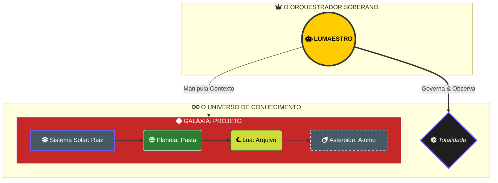

# 🌌 Cosmos Flow: O Modelo de Soberania do Conhecimento

> [!ABSTRACT]
> O Lumaestro opera sob o **Modelo Cosmos**, onde a informação não é apenas um dado, mas matéria celestial organizada por gravidade semântica. Nesta arquitetura, o **Lumaestro é o Orquestrador Soberano**, uma entidade externa que governa, observa e manipula o Universo de Conhecimento sem fazer parte dele.

## 🏛️ A Hierarquia do Universo Digital

Abaixo, a representação visual da separação entre a **Vontade do Orquestrador** e a **Matéria do Conhecimento**.

---

## 🛰️ Camadas de Consciência Celestial

### 1. O Orquestrador (Lumaestro)
A "Vontade Superior" que reside fora do universo de dados. Ele dita as leis da física (algoritmos de busca), controla o tempo (telemetria) e decide qual galáxia deve ser iluminada para o Comandante.

### 2. A Galáxia (Workspace)
A unidade suprema de isolamento. Cada projeto é uma Galáxia completa, garantindo que o contexto de um universo não colida com outro.

### 3. O Sistema Solar (Módulos Principais)
Grandes divisões lógicas (pastas de primeiro nível) que funcionam como âncoras gravitacionais para os temas do projeto.

### 4. O Planeta (Organização)
Subpastas e categorias que agrupam a massa crítica de informação.

### 5. A Lua (Entidade de Informação)
O arquivo individual. É a interface onde o conhecimento reside de forma legível.

### 6. O Asteroide (Átomo Semântico)
Triplas semânticas e chunks de texto. Pequenos fragmentos que flutuam no vácuo entre arquivos, permitindo conexões que desafiam a estrutura física das pastas.

---

## 📈 Fluxo de Gravidade Semântica (RAG)

Quando uma pergunta é feita, o Orquestrador Lumaestro:
1.  **Sente a Perturbação**: O prompt gera uma onda gravitacional no universo.
2.  **Identifica a Galáxia**: Localiza o workspace correto.
3.  **Atrai a Matéria**: "Puxa" as Luas e Asteroides mais relevantes para o centro da visualização.
4.  **Sintetiza a Luz**: O LLM consome essa matéria celestial e devolve a resposta clara para o Comandante.

---

## 🔗 Documentos Relacionados

- [[architecture/LUMAESTRO_CORE|LUMAESTRO_CORE]] — O motor interno do Orquestrador.
- [[features/NEURO_SYMBOLIC_ONTOLOGY|NEURO_SYMBOLIC_ONTOLOGY]] — Como os Asteroides são minerados.
- [[architecture/RENDER_ENGINE_3D|RENDER_ENGINE_3D]] — A física visual deste universo.
- [[DOCS_INDEX]] — Índice central.

---
**Lumaestro: Orquestrando o Infinito. Governança Soberana. 🏛️⚡🌌💎**
