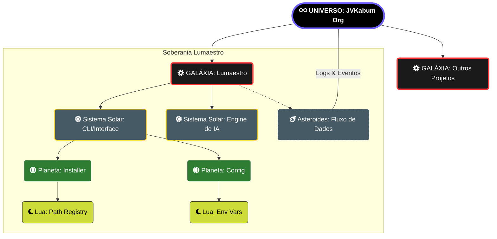

# 🌌 Cosmos Governance: A Ontologia do Império Digital

> [!ABSTRACT]
> O Modelo Cosmos é o framework ontológico que rege a organização de tudo o que existe sob a égide da **JVKabum Org**. Ele define a hierarquia técnica e existencial, garantindo que o Lumaestro opere com soberania absoluta sobre seus domínios de dados.

## 🛰️ Mapa de Hierarquia Celestial (Visual Engineering)

---

## 🧱 Detalhamento por Nível (O Código é a Matéria)

### 🌌 Universo (The Root / Ecosystem)
O vácuo digital onde as leis da física (Go Runtime, GitHub Actions) são imutáveis. É o ecossistema **JVKabum**, a infraestrutura que sustenta a existência de todas as galáxias. Sem o Universo, não há tempo nem espaço para a execução.

### 🌀 Galáxia (Projeto / Repositório)
O **Lumaestro** é uma galáxia inteira. Um sistema completo, com massa crítica e gravidade própria, focado em integrar inteligência ao terminal. Cada repositório no GitHub é uma galáxia independente; colisões são evitadas pelo isolamento de contexto.

### ☀️ Sistema Solar (Módulo / Feature)
As grandes áreas funcionais. O **Sistema CLI** é o Sol que ilumina a interface; o **Sistema de Integração Gemini** é o motor que processa a luz da inteligência. Se um Sol apaga, todos os planetas em sua órbita mergulham no erro.

### 🌍 Planeta (Entidade Principal / Serviço)
Os pilares estáveis. O **Planeta Installer** garante a aterrissagem segura no S.O. do usuário. O **Planeta API Client** é onde as requisições para os modelos Pro e Flash ganham forma física.

### 🌙 Lua (Sub-recurso / Dependência)
Elementos que orbitam um planeta. Uma **Lua de Permissões** não faz sentido flutuando sozinha no espaço; ela precisa da gravidade de um **Planeta Installer** para exercer sua função.

### ☄️ Asteroide (Eventos / Dados Efêmeros)
A matéria volátil. Logs de erro, payloads JSON e eventos de teclado. São pequenos, numerosos e cruzam o sistema em alta velocidade, alimentando a telemetria do Orquestrador.

---

## 🛡️ Dicas para o Comandante

> [!IMPORTANT]
> **Soberania de Contexto**: Nunca permita que uma Lua escape da órbita de seu Planeta original sem uma ponte de gravidade (Interface/API) devidamente documentada.

> [!TIP]
> **Asteroides de Desempenho**: Monitore o fluxo de asteroides (logs). Um excesso de asteroides de erro pode indicar o colapso de um Sistema Solar próximo.

---

## 🔗 Documentos Relacionados

- [[architecture/CONTEXT_FLOW_RAG]] — O fluxo de gravidade semântica.
- [[architecture/LIGHTNING_CORE]] — O motor que sustenta o Universo.
- [[DOCS_INDEX]] — O mapa estelar completo.

---
**Lumaestro: Orquestrando o Infinito. Governança Soberana. 🏛️⚡🌌💎**
