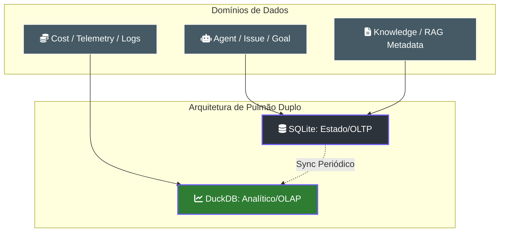

# 🗄️ Esquema de Dados: O Pulmão de Conhecimento

> [!ABSTRACT]
> O Lumaestro utiliza uma arquitetura de "Pulmão Duplo" para garantir performance e soberania. O **SQLite** gerencia o estado transacional e a topologia do enxame (OLTP), enquanto o **DuckDB** processa volumes massivos de telemetria analítica e custos (OLAP) com eficiência colunar.

## 🏗️ Arquitetura de Pulmão Duplo

Abaixo, a representação da separação de responsabilidades entre os motores de persistência.

---

## 🗺️ Mapa de Entidades Principais (ERD)

### 1. Núcleo de Operação (Agents & Swarm)
Gerencia a identidade e a saúde dos agentes.
- **Agent**: UUID, Role, Status (active, paused, idle), Budget Control.
- **Issue / Goal**: Hierarquia de trabalho do enxame (Objetivos Estratégicos → Tarefas Táticas).

### 2. Telemetria e Finanças (Lightning Engine)
Processado via DuckDB para relatórios instantâneos.
- **CostEvent**: Detalhamento de tokens por modelo (Gemini/Claude) e custo em centavos.
- **ActivityLog**: Rastreabilidade total (Quem, Onde, Quando e Por que).

### 3. Memória e Conhecimento (RAG Meta)
- **Document / Revision**: Histórico de alterações e metadados das notas indexadas.
- **Fact / Triple**: Conhecimento estruturado extraído via IA (S-P-O).

---

## 🛠️ Detalhes de Implementação

- **Engine**: GORM (Object-Relational Mapping) em Go.
- **Identificadores**: Uso mandatório de **UUID** para todas as entidades, garantindo integridade em operações distribuídas e sync entre instâncias.
- **JSON Binding**: Wrappers customizados para tipos `Time`, garantindo compatibilidade com o Wails v2.

---

## 🔗 Documentos Relacionados

- [[DUCKDB_ENGINE]] — Mergulho profundo no motor analítico.
- [[LUMAESTRO_CORE]] — Como o backend gerencia as conexões de DB.
- [[SWARM_ORCHESTRATION]] — Como os agentes utilizam estas tabelas para colaboração.
- [[DOCS_INDEX]] — Índice central de documentação.

---
**Lumaestro: Dados estruturados para uma inteligência fluida. 🗄️📊✨**
