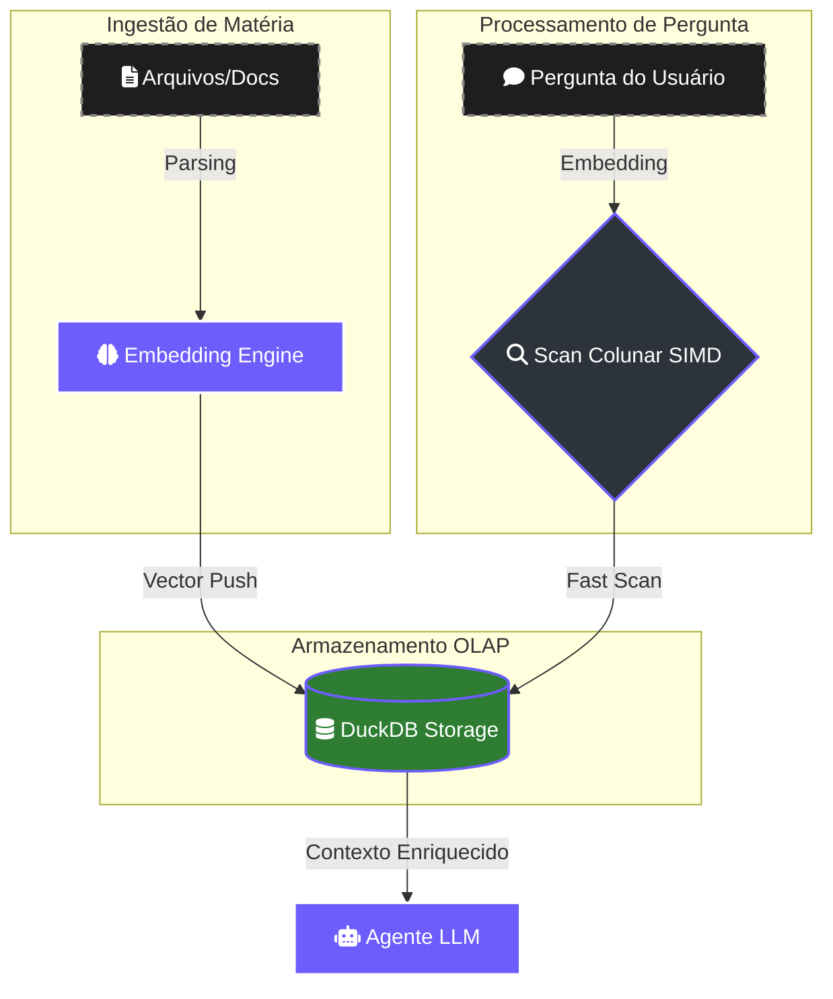
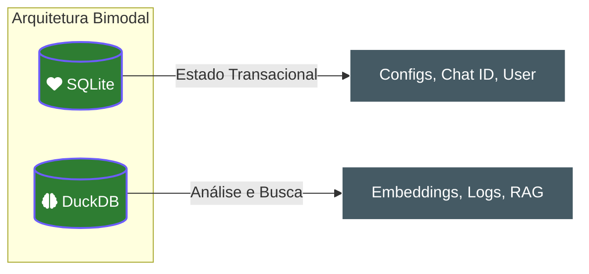

# 🦆 DuckDB: O Cérebro Analítico do Lumaestro

No ecossistema Lumaestro, o [[DUCKDB_ENGINE]] atua como a camada **OLAP (Online Analytical Processing)**. Enquanto o [[SQLITE_ENGINE]] cuida da memória de curto prazo (configurações e chat), o DuckDB é responsável pela inteligência pesada e busca vetorial.

> [!TIP]
> O DuckDB é um banco de dados **orientado a colunas**. Isso significa que, para tarefas analíticas (como calcular o custo total de tokens ou buscar vetores de similaridade), ele é até 100x mais rápido que bancos tradicionais como o SQLite.

---

## 🏗️ Fluxo de Dados e Integração

O DuckDB processa os dados de forma vetorial, utilizando instruções de CPU modernas (SIMD) para varrer colunas inteiras de uma vez.

---

## 🛠️ Rastreamento de Código (Code Paths)

A implementação do DuckDB no Lumaestro está concentrada nos seguintes pontos:

1.  **Driver e Interface**: 
    - Arquivo: internal\lightning\store_duckdb.go
    - Função: Gerencia a conexão através da duckdb.dll (localizada em deps\duckdb\).
2.  **Inicialização do RAG**:
    - Arquivo: internal\core\app_init_rag.go
    - Papel: Prepara as tabelas de extensões vetoriais para o [[CONTEXT_FLOW_RAG]].

---

## ⚖️ Dualidade: DuckDB vs SQLite

No Lumaestro, usamos uma arquitetura bimodal para garantir performance e segurança.

### Por que não usar apenas um?
- **SQLite** é excelente para garantir que seus dados não sejam corrompidos em escritas rápidas (ACID).
- **DuckDB** é imbatível para ler gigabytes de logs ou buscar o "sentido" de um texto através de matemática vetorial.

---

## 💻 Operação em Windows

Para desenvolvedores que desejam interagir diretamente com o "cérebro" analítico via PowerShell:

`powershell
# Inspecionar a contagem de documentos indexados
.\bin\duckdb .lumaestro\lightning.ddb "SELECT source, count(*) FROM documents GROUP BY ALL;"
`

---
[[INDEX|⬅️ Voltar ao Índice]] | [[SQLITE_ENGINE|Entender a Memória Transacional ➡️]]
