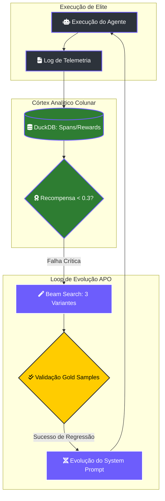

# ⚡ Lightning Core: O Motor de Auto-Evolução

> [!ABSTRACT]
> O **Lightning Core** é o cérebro evolutivo do Lumaestro. Inspirado em arquiteturas de escala industrial, ele utiliza um motor de **Automatic Prompt Optimization (APO)** e telemetria colunar para aprender com falhas, gerar variantes estratégicas e garantir que a inteligência do enxame nunca regrida.

## 🏗️ O Loop de Inteligência Assistida (APO)

O sistema opera em um ciclo contínuo de execução, reflexão e aprimoramento, onde cada "erro" é combustível para a próxima versão do sistema.

---

## 🗄️ 1. Consciência Colunar (DuckDB OLAP)

Diferente de sistemas que utilizam logs de texto bruto, o Lumaestro processa sua telemetria via **DuckDB**, permitindo análises analíticas de alta performance em tempo real:
- **Tabela `spans`**: Rastreabilidade total (OTEL compatible) de cada rastro de pensamento e execução.
- **Tabela `rewards`**: "Dopamina Digital" que mapeia o sucesso ou falha semântica do enxame.
- **Tabela `gold_samples`**: O repositório de benchmark imutável ("Verdade Absoluta") usado para validar novas inteligências.

---

## 🧪 2. Motor de Regressão Gold

Toda nova variante de prompt ou lógica proposta pelo motor APO deve provar seu valor antes de ser integrada à "Personalidade Ativa" do sistema.
- **Métrica de Estabilidade**: `Accuracy = (Hits / Total Gold Samples) * 100`.
- **Validação Cruzada**: A nova variante é testada contra todos os sucessos históricos para garantir que uma melhoria em um ponto não cause a quebra de funcionalidades que já estavam estáveis.

---

## 🔗 Documentos Relacionados

- [[LIGHTNING_ELITE]] — Manual de operação industrial do painel Lightning.
- [[LUMAESTRO_CORE]] — Como o backend orquestra a telemetria.
- [[DATABASE_SCHEMA]] — Detalhes das tabelas analíticas no DuckDB.
- [[DOCS_INDEX]] — Índice central de documentação.

---
**Lumaestro Architecture: Performance industrial. Autonomia absoluta. ⚡⚙️💎**
