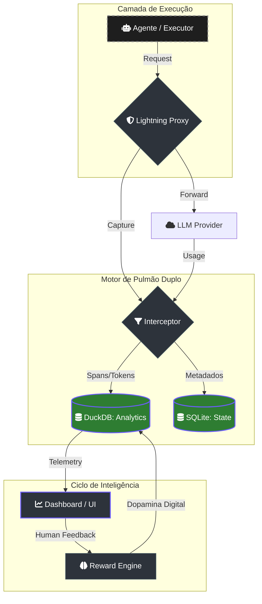
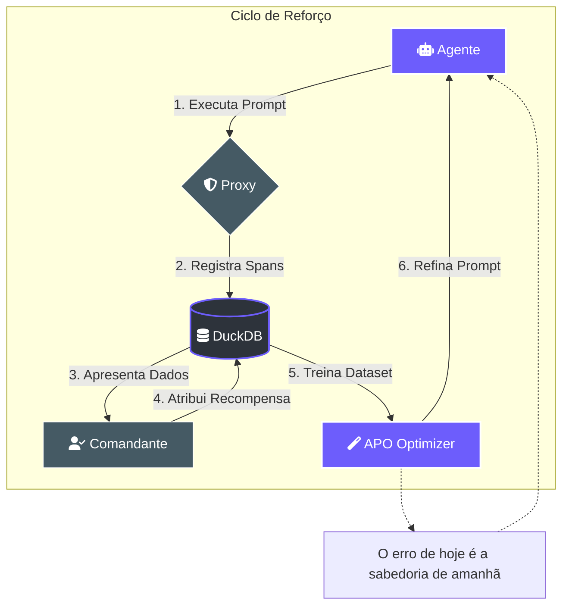

# ⚡ Lumaestro-Lightning: O Cérebro Analítico Nativo 🐹⚙️💰📈

Este documento descreve o motor de aprendizado por reforço e telemetria analítica do Lumaestro, portado e otimizado a partir do framework **Agent-Lightning** (Microsoft). Ele atua como a camada de observabilidade e inteligência econômica do enxame.

## 🏛️ Arquitetura de "Pulmão Duplo"

O Lumaestro utiliza uma infraestrutura de dados híbrida para garantir integridade e performance:

1.  **SQLite (O Coração)**: Gerencia o estado transacional, governança de agentes, tarefas e segredos. (OLTP)
2.  **DuckDB (O Cérebro Analítico)**: Um banco de dados colunar embutido que processa telemetria massiva, rastros de pensamento (Spans) e cálculos financeiros em tempo real. (OLAP)

> [!TIP]
> **Por que DuckDB?** Enquanto o SQLite é excelente para escritas rápidas de estado, o DuckDB permite realizar agregações complexas (ex: "Qual a média de custo por token nos últimos 1000 rollouts?") em milissegundos, sem travar a UI.

### 📊 Fluxo de Dados e Telemetria



---

## 🚀 Componentes do Motor

### 1. Interceptor Proxy ([proxy.go](../../internal/lightning/proxy.go))
Um interceptor HTTP nativo que atua como um túnel entre os agentes e os provedores de IA (Gemini/OpenAI).
- **Telemetria Automática**: Captura cada requisição e resposta sem necessidade de alterar o código do agente.
- **Rastreamento de Custos**: Extrai automaticamente o bloco `usage` das respostas para registrar o consumo de tokens.

### 2. Motor de Recompensas ([reward_engine.go](../../internal/lightning/reward_engine.go))
Implementa o sistema de "Dopamina Digital" do enxame.
- **Feedback Humano**: Cada aprovação ou rejeição no Dashboard emite uma recompensa (+1.0 ou -1.0).
- **Aprendizado por Reforço**: Os scores são persistidos no [store_duckdb.go](../../internal/lightning/store_duckdb.go) para análise de trajetórias de sucesso.

### 3. Otimizador APO ([optimization.go](../../internal/lightning/optimization.go))
Motor de **Automatic Prompt Optimization (APO)**.
- **Análise de Falhas**: Examina rollouts com recompensas negativas para identificar padrões de erro.
- **Refinamento**: Sugere melhorias no System Prompt baseadas no histórico de aprendizado.

---

## 💰 Consciência Financeira (Cost Tuning)

O sistema monitora o investimento em inteligência em tempo real:
- **Tabela de Custos**: Baseado nas tarifas do Gemini 1.5 Flash ($0.15/1M in, $0.60/1M out).
- **KPIs no Dashboard**: Exibe o custo total acumulado (USD) e a eficiência por rollout através do componente [SwarmDashboard.vue](../../frontend/src/components/SwarmDashboard.vue).

### 🔄 Ciclo de Reforço (Digital Dopamine)



---

## 🛠️ Como Operar

### Ativação
O motor Lightning é iniciado automaticamente no boot do aplicativo se habilitado nas configurações ([config.go](../../internal/config/config.go)).
- **Porta Padrão**: `8001` (Proxy).
- **Arquivo de Dados**: `.lumaestro/analytics.db`.

### Emitindo Recompensas Manuais
Você pode emitir recompensas programaticamente ou via interface:
```go
// Exemplo de emissão manual de recompensa no backend
re := lightning.NewRewardEngine(lStore)
re.EmitReward(rolloutID, attemptID, 1.0, "manual_feedback", nil)
```

---

> [!IMPORTANT]
> **Mente Colmeia:** O conhecimento aprendido é destilado pelo motor e pode ser sincronizado com o **Obsidian Vault** (RAG), garantindo que as lições de um agente sirvam para todo o enxame.

**Lumaestro: Inteligência que aprende. Economia que escala. 🐹⚡🤖💰**

---

## 🔗 Documentos Relacionados
- [[INDEX|Índice Geral]]: Hub central de documentação.
- [[NEURAL_BRAIN|NEURAL_BRAIN]]: Grafos, PageRank e Auditoria.
- [[RAG_FLOW|RAG_FLOW]]: Pipeline de busca vetorial.
- [[API/BACKEND_METHODS|BACKEND_METHODS]]: Referência técnica dos bindings Wails.
