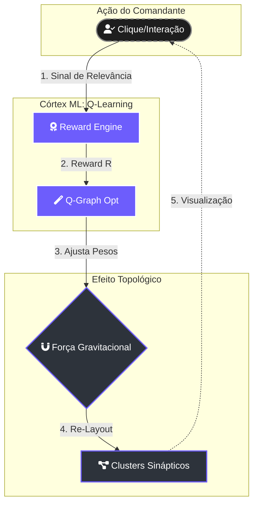

# 🧠 Lightning: Córtex de Aprendizado por Reforço

> [!ABSTRACT]
> O motor **Lightning Reinforcement Learning** é o responsável pela adaptação contínua da topologia do grafo. Ele utiliza um sistema de "Dopamina Digital" (Reward Engine) para aprender quais conexões são vitais para o Comandante, ajustando as forças físicas e a hierarquia semântica em tempo real.

## 🔄 Ciclo de Feedback Operacional (Q-Learning)

Abaixo, a representação do loop de otimização que transforma cliques em inteligência topográfica.

---

## 🔬 Modelos e Algoritmos Ativos

### 1. Nexus-Orchestrator (Gemma 4 8B)
Atua na **Gênese Semântica**, decidindo quais nós devem ser ancorados como "Sóis" ou "Luas" baseando-se na densidade de informação extraída durante o crawl.

### 2. Q-Graph Opt (Custom Optimizer)
Ajusta dinamicamente os pesos de arestas (`weights`) baseando-se em:
- **Frequência de Travessia**: Caminhos mais percorridos pelo navegador semântico são fortalecidos.
- **Relevância RAG**: Documentos que frequentemente servem de contexto para respostas bem-sucedidas ganham maior atração gravitacional.

---

## 🛰️ Sincronização de Matéria Dinâmica

As arestas do grafo não são fios estáticos; elas são **sinapses pulsantes**. Cada `graph:edge` emitido pelo backend Go contribui para o calor sináptico:
- **Clusters Gravitacionais**: Documentos centrais (Hubs) atraem notas relacionadas, criando vizinhanças de conhecimento.
- **Micro-Orbital**: Documentos granulares orbitam núcleos complexos, permitindo uma navegação "Zoom-In" do geral para o específico.

---

## 🔗 Documentos Relacionados

- [[NEURAL_BRAIN]] — Visualização dos clusters e PageRank.
- [[LIGHTNING_ENGINE]] — O motor DuckDB que sustenta estes cálculos.
- [[SEMANTIC_NAVIGATOR]] — Como o navegador utiliza estes pesos para busca.
- [[DOCS_INDEX]] — Índice central de documentação.

---
**Lumaestro: Inteligência que se adapta ao seu pensamento. 🧠⚡💎**
