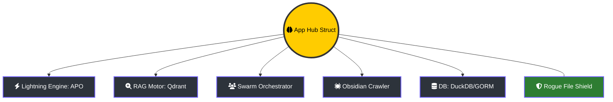

# 🏛️ Lumaestro Core: O Córtex Central

> [!ABSTRACT]
> O arquivo `internal/core/app.go` é o coração pulsante do Lumaestro. Ele implementa a struct `App`, que funciona como o **Hub Central** (Orquestrador Soberano) de todos os serviços, garantindo a sincronia perfeita entre o hardware, a inteligência e a interface.

## 🏗️ Estrutura Hub-and-Spoke

O Lumaestro segue uma arquitetura onde o Hub centraliza a comunicação entre módulos especialistas, permitindo que cada rastro de informação seja auditado e roteado corretamente.

---

## 🚀 Ciclo de Vida do Orquestrador (Lifecycle)

### 1. Sequência de Decolagem (BootSequence)
Ao iniciar, o Hub executa uma rotina de ancoragem rigorosa:
- **Config**: Carrega e valida o `config.json` e chaves de API.
- **Conexões**: Estabelece túneis com Qdrant (Vetores) e DuckDB (Telemetria).
- **Despertar**: Acorda os Agentes em modo AutoStart e inicializa o **APOWorker** para otimização contínua em background.

### 2. Ponte de Comando (Wails Bridge)
O Hub é o único portão de comunicação com o Frontend Vue 3:
- **Events**: Emite eventos assíncronos como `agent:log`, `boot:stage` e `graph:update`.
- **Bindings**: Expõe as funcionalidades nativas (`ScanVault`, `StartAgentSession`) para a interface de controle.

### 3. Escudo de Integridade (Rogue File Shield)
O Hub possui mecanismos de defesa ativos que detectam e ignoram arquivos `main` órfãos em subpastas, prevenindo conflitos durante o hot-reload do Wails e mantendo a estabilidade do processo de build.

---

## 🔗 Documentos Relacionados

- [[BACKEND_METHODS]] — Lista de todos os métodos exportados pelo Hub.
- [[LIGHTNING_CORE]] — Detalhes do motor de otimização conectado ao Hub.
- [[WAILS_BRIDGE]] — Como os dados viajam do Hub para o Vue.
- [[DOCS_INDEX]] — Índice central de documentação.

---
**Lumaestro Architecture: O Hub Soberano. Inteligência Centralizada. 🏛️🐹💎**
