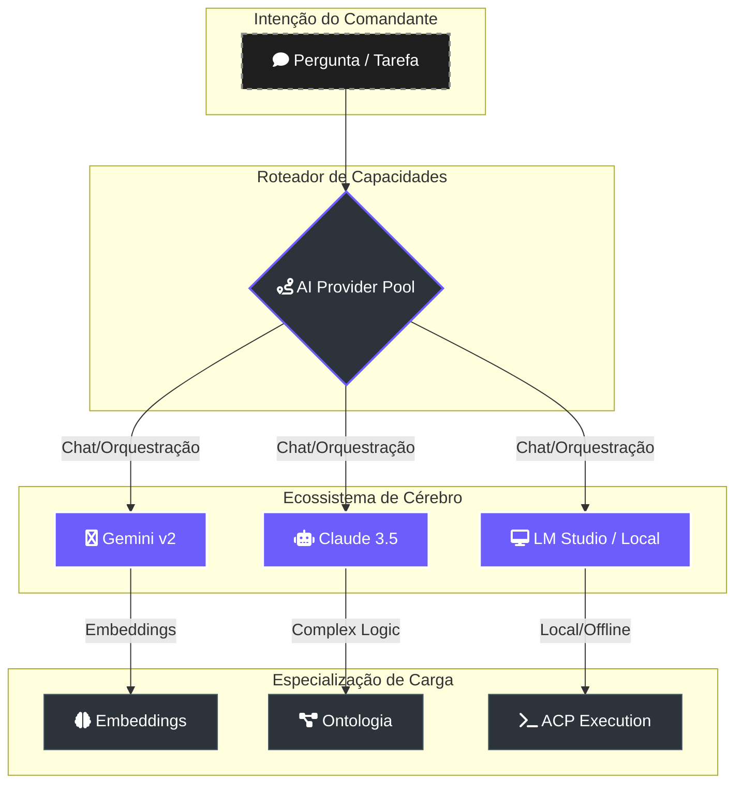

# 🧠 Matriz de Provedores de Modelo (AI Matrix)

> [!ABSTRACT]
> O Lumaestro é agnóstico a modelos de linguagem. Ele opera através de um **Pool de Provedores** que permite alternar dinamicamente entre Gemini, Claude e modelos locais (LM Studio), garantindo que cada tarefa seja executada pelo "cérebro" mais eficiente para aquela carga de trabalho.

## 🏗️ Arquitetura de Roteamento de Capacidades

O sistema não escolhe apenas um modelo; ele orquestra capacidades baseadas em latência, custo e especialização.

---

## 📊 Matriz de Dependências e Substituição

| Área | Função | Dependência Atual | Status de Migração | Alternativa Recomendada |
| :--- | :--- | :--- | :--- | :--- |
| **RAG** | Embeddings | Gemini Embedding v2 | **Dependente** | Local OpenAI / BGE |
| **Ontologia** | Extração Semântica | Gemini Flash 1.5 | **Parcial** | Claude 3.5 Sonnet |
| **Chat** | Orquestração | Provedor Pool | **Agnóstico** | Gemini / Claude / LM Studio |
| **ACP** | Execução de Código | Provedor Pool | **Agnóstico** | LM Studio (Offline) |

---

## 🚀 Plano de Evolução (Migração)

1.  **Desacoplamento de Embeddings**: Introduzir uma camada de abstração para permitir que o Qdrant use dimensões diferentes de outros provedores (OpenAI/Local).
2.  **Roteamento por Capacidade**: Definir tags como `multimodal`, `long-context` ou `reasoning` para que o Maestro escolha o provedor automaticamente.
3.  **Modo Offline Total**: Priorizar o uso de LM Studio para todas as tarefas de processamento de arquivos sensíveis, eliminando a dependência de nuvem.

---

## 🔗 Documentos Relacionados

- [[AGENTS_GUIDE]] — Como os agentes usam este pool para executar tarefas.
- [[RAG_FLOW]] — A dependência de modelos de embedding.
- [[LIGHTNING_ENGINE]] — Otimização de custos baseada na escolha do modelo.
- [[DOCS_INDEX]] — Índice central de documentação.

---
**Lumaestro: Inteligência Híbrida. Soberania Local. 🧠🤖🛡️**
