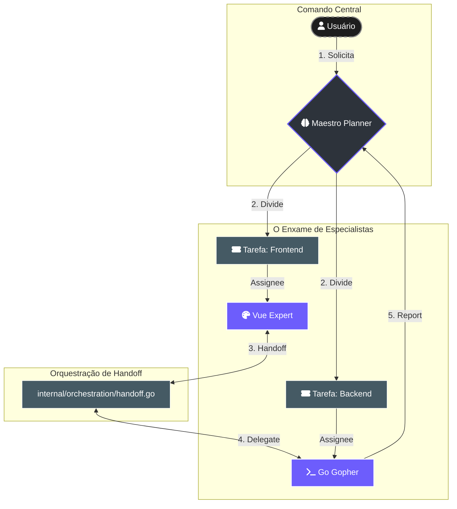
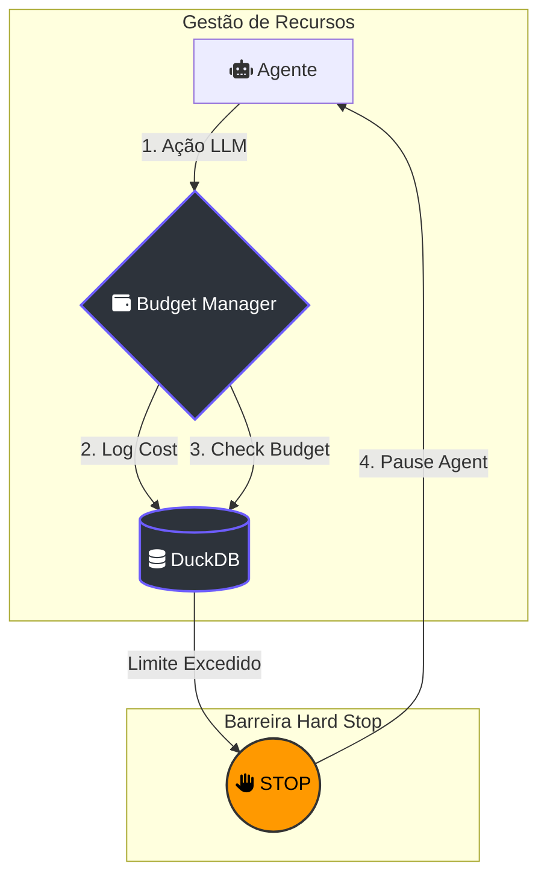

---
tags:
  - architecture
  - multi-agent
  - swarm
  - orchestration
  - lumaestro
---

# 🐝 Sistema de Multi-Agentes (Swarm Orchestration)

> [!ABSTRACT] Visão Geral
> No Lumaestro, os agentes não trabalham isolados. Eles operam em um ecossistema de **Enxame (Swarm)**, onde tarefas complexas são quebradas em sub-tarefas e delegadas dinamicamente. Este sistema é inspirado em metodologias de governança corporativa e gerenciamento de tickets (como Agile e Linear).

---

## 🏗️ A Arquitetura do Enxame

O funcionamento multi-agente baseia-se em três pilares: **Delegação (Handoff)**, **Governança de Custos (Budget)** e **Auditoria Persistente**.

### 1. O Mecanismo de Handoff (Delegação)
Diferente de uma simples chamada de função, a delegação no Lumaestro cria uma nova entidade no banco de dados chamada `Issue` (ou Ticket). Quando o **Agente A** percebe que uma subtarefa foge de sua especialidade, ele utiliza o `DelegateTask`.

### 2. Governança e "Hard Stop" Financeiro
Para evitar gastos desenfreados com APIs de LLM, cada agente possui um "orçamento mensal". Se o limite for atingido, o sistema impõe um **Hard Stop**, pausando o agente imediatamente.

---

## 🧩 Componentes do Código

### Delegação de Tarefas (`internal/orchestration/handoff.go`)
A função `DelegateTask` é a interface principal para a colaboração entre agentes. Ela vincula uma sub-tarefa a um `ParentID`, permitindo o rastreio da árvore de decisão.

### Controle de Orçamento (`internal/orchestration/budget.go`)
Gerencia o `SpentMonthlyCents`. Cada chamada de modelo (Gemini, Claude, etc.) emite um evento de custo que é processado em tempo real.

### Estados do Agente (`internal/db/schema.go`)
Os agentes transitam entre estados que definem sua disponibilidade:
- `idle`: Aguardando tarefas.
- `running`: Executando uma `Issue`.
- `paused`: Interrompido por segurança (ACP) ou falta de orçamento.

---

## 🕵️ Auditoria e Transparência

Toda interação multi-agente gera uma trilha de evidências:
1.  **ActivityLog:** "O Agente X delegou a tarefa Y para o Agente Z".
2.  **IssueComment:** Justificativas textuais sobre o porquê da delegação.
3.  **Timeline Visual:** No frontend, você vê o progresso da "conversa" entre as IAs.

---

## 💡 Dicas para o Comandante

> [!TIP]
> **Especialização é Chave:** No Lumaestro, é melhor ter 3 agentes pequenos e especialistas (ex: CSS-Expert, SQL-Expert, Doc-Master) do que um único agente gigante. Isso reduz o custo de tokens e aumenta a precisão das respostas.

> [!WARNING]
> **Loop de Delegação:** Evite criar dependências circulares onde o Agente A delega para B, que delega de volta para A sem progresso. O Maestro Planner deve ser usado para quebrar esses loops.

---
[[AGENTS_GUIDE|⬅️ Guia de Agentes]] | [[INDEX|Voltar ao Índice]]
