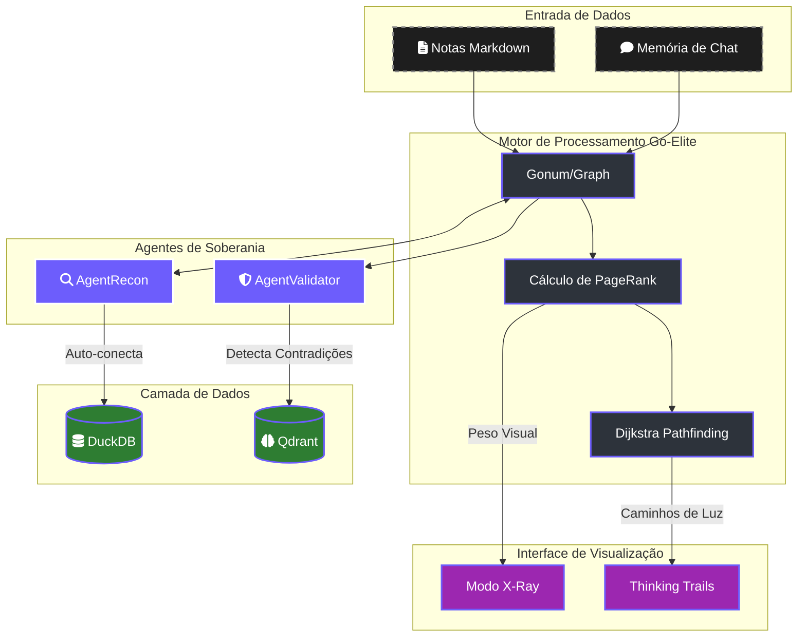

# 🧠 Lumaestro: O Manifesto do Cérebro Neural (V22)

> [!ABSTRACT]
> O Lumaestro não é apenas um software de RAG; é um organismo de inteligência relacional projetado para transformar o seu conhecimento estático em um **Cérebro Ativo** e navegável.

## 🕸️ Arquitetura do Sistema Nervoso

Abaixo, o mapa de orquestração entre o processamento matemático de grafos e os agentes de inteligência.

---

## 🏎️ 1. O Motor de Grafos Nativo (Go-Elite)
Implementamos uma arquitetura "Zero-Dependencies" em RAM para processamento relacional de milissegundos.

- **Tecnologia**: Combinação de `Gonum/graph` (para matemática pesada) e `YourBasic` (para navegação BFS/DFS ultrarrápida).
- **PageRank (Autoridade)**: Cada nota possui um peso de importância. Quanto mais conexões (links) uma ideia tem, mais "autoridade" ela exerce no ecossistema.
- **Dijkstra (Caminho mais Curto)**: O sistema calcula a trilha lógica mais eficiente entre dois conceitos, permitindo que a IA fundamente suas respostas em evidências interconectadas.

## 🪐 2. O Dashboard Nervoso (Visualização 3D)
O mapa de conhecimento não é estático; ele é um campo de força dinâmico.

- **Topografia de PageRank**: Notas com alta autoridade aparecem **maiores e mais brilhantes**. Você enxerga seus "Sóis de Conhecimento" de longe.
- **Thinking Trails**: Quando a IA formula uma resposta, o grafo emite pulsos de luz (efeito neon) nos nós percorridos, tornando o raciocínio auditável e visual.
- **Diferenciação Multimodal**:
    - 📕 **Vermelho (PDFs)**: Documentos densos.
    - 🖼️ **Esmeralda (Imagens)**: Evidências visuais.
    - 🧠 **Rosa (Memória)**: Interações de chat.
    - ⚙️ **Platina (Sistema)**: Instruções core.

## ⚖️ 3. O Agente Validador (Auditoria Lógica)
Introduzimos o primeiro nível de **Conformidade de Verdade** assistida por IA.

- **Detecção de Contradições**: O `AgentValidator` escaneia o grafo em tempo real buscando predicados opostos (ex: "X define Y" vs "X refuta Y").
- **Alertas de Conflito**: Notas contraditórias ganham uma aura vermelha instável, pedindo a intervenção do Comandante.
- **Predicados Semânticos**: As conexões entre notas carregam rótulos (ex: *"mentions"*, *"refutes"*, *"belongs to"*), permitindo uma análise lógica profunda, não apenas léxica.

## 💬 4. Memória Episódica (Chat-to-Graph)
A conversa com a IA agora é imortalizada no mapa.

- **Brain Trails**: Cada mensagem de chat gera um nó de `memory` temporário em RAM e DuckDB.
- **Context Linkage**: Estes nós de memória conectam-se automaticamente às notas que o sistema utilizou para responder, permitindo ver visualmente o "fluxo de preocupação" do usuário sobre a base de conhecimento.

---
**Lumaestro: Da Informação à Sabedoria Relacional. 🐹⚙️⚡🕸️🧠🏎️🤖💰🏁🛡️🧪**

---

## 🕵️‍♂️ 5. O Agente Recon (Soberania Pró-Ativa — V23)
O Lumaestro não espera mais que você conecte ideias manualmente. Ele **caça** as conexões perdidas.

- **Descoberta Híbrida**: O `AgentRecon` cruza a similaridade vetorial (Qdrant/Embeddings) com a topologia real do grafo. Se duas notas são 95%+ similares mas NÃO possuem um link `[[wiki-link]]`, o sistema:
    - **Auto-conecta** (Alta confiança > 0.95): Injeta automaticamente no grafo e no DuckDB.
    - **Propõe** (Confiança média > 0.8): Envia uma sugestão visual ao Comandante via evento `agent:proposal`.
- **Emissão de Eventos**: Propostas são enviadas ao frontend para decisão humana, mantendo o Comandante no controle final.

## 🩻 6. Modo X-Ray (Filtro Gravitacional — V23)
Quando o seu Obsidian cresce, o Dashboard fica "denso". O Modo X-Ray resolve isso.

- **Slider de PageRank**: Um controle deslizante que filtra nós em tempo real por autoridade (PageRank). Ao subir o slider, apenas os **Hubs de Poder** (notas mais importantes) permanecem visíveis, eliminando o ruído visual instantaneamente.
- **Filtragem Reativa**: O watcher Vue reprocessa o `getGraphData()` a cada mudança do slider, garantindo resposta imediata sem refresh manual.

## 🧹 7. Poda Neural (Pruning — V23)
Memórias antigas e nós sem relevância são podados automaticamente.

- **Critério por PageRank**: Nós do tipo `memory` (Chat) e `unknown` (pontas soltas) com autoridade abaixo do threshold definido pelo slider são removidos permanentemente do grafo (RAM + Gonum).
- **Proteção de Soberania**: Notas Markdown (`source`) e nós de Sistema (`system`) NUNCA são podados, independente do threshold. Só Chat e nós órfãos são elegíveis.
- **Sincronização Visual**: Após a poda, o `SyncAllNodes()` é chamado automaticamente para atualizar o Dashboard 3D.

---

## 🛠️ Stack Industrial
- **Backend**: Go (Wails) com lógica concorrente (sync.RWMutex).
- **Analytic DB**: DuckDB (Persistência absoluta de grafos).
- **Vector DB**: Qdrant (Intuição semântica).
- **Frontend**: Vue + Three.js + D3.js (Renderização vetorial 3D).

---
**Lumaestro: Da Informação à Sabedoria Relacional. 🐹⚙️⚡🕸️🧠🏎️🤖💰🏁🛡️🧪**

---

## 📚 Documentos Relacionados
- [📖 Índice Geral](./DOCS_INDEX.md) — Hub central de documentação
- [🔄 RAG_FLOW](./RAG_FLOW.md) — Pipeline de busca vetorial (Crawler → Qdrant)
- [⚡ LIGHTNING_ENGINE](./LIGHTNING_ENGINE.md) — Aprendizado por reforço e DuckDB
- [🎨 FRONTEND_STACK](./FRONTEND_STACK.md) — Vue 3, D3.js e Xterm.js
- [🔗 WAILS_BRIDGE](./WAILS_BRIDGE.md) — Ponte Go ↔ Frontend
- [🤖 AGENTS_GUIDE](./AGENTS_GUIDE.md) — Protocolo ACP e agentes
