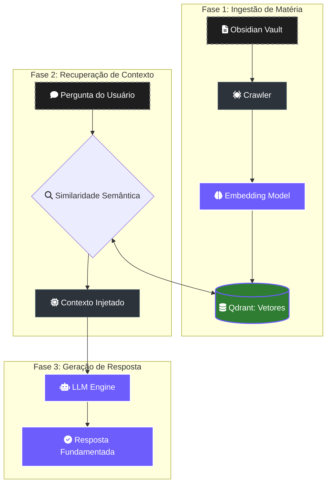

# 🧠 RAG Flow: A Jornada da Matéria Cognitiva

> [!ABSTRACT]
> O sistema de **Retrieval-Augmented Generation (RAG)** do Lumaestro é o que diferencia o projeto de um simples chatbot. Ele transforma seu repositório local (Obsidian/Código) em um "Córtex Neural" vivo, onde a IA fundamenta cada resposta em dados reais e atualizados do seu workspace.

## 🏗️ Pipeline de Inteligência

A transformação do dado bruto em sabedoria ocorre em três fases distintas e orquestradas.

---

## 🔬 Detalhes das Fases

### 1. Ingestão (Knowledge Weaving)
O **Crawler** monitora mudanças no sistema de arquivos em tempo real. Cada nota modificada é fragmentada (chunking) e enviada para o modelo de **Embeddings** do Gemini, que gera uma representação vetorial matemática da ideia.

### 2. Recuperação (Semantic Search)
Quando o usuário faz uma pergunta, o sistema não busca por palavras-chave (como o Google antigo), mas por **sentido**. O Qdrant retorna os fragmentos de conhecimento que têm a maior similaridade matemática com a intenção do usuário.

### 3. Geração (Grounded Response)
O contexto recuperado é injetado no prompt do sistema como uma "verdade absoluta". A LLM então sintetiza a resposta, citando fontes e garantindo que não haja alucinações.

---

## 🛠️ Tecnologias Utilizadas

- **Qdrant**: Banco de dados vetorial de alta performance para armazenamento de embeddings.
- **Gemini Embeddings**: Modelo de última geração para tradução de texto em vetores.
- **DuckDB**: Utilizado para metadados e busca textual rápida (Fuzzy Search).

---

## 🔗 Documentos Relacionados

- [[SEMANTIC_NAVIGATOR]] — Como o GPS semântico navega por estas fases.
- [[CODE_RAG_GUIDE]] — Guia específico para RAG aplicado a código fonte.
- [[NEURAL_BRAIN]] — Visualização 3D do conhecimento indexado.
- [[DOCS_INDEX]] — Índice central de documentação.

---
**Lumaestro: Sua realidade. Inteligência artificial. 🧠🕸️✨**
