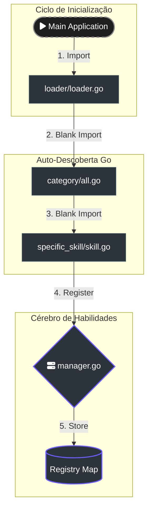
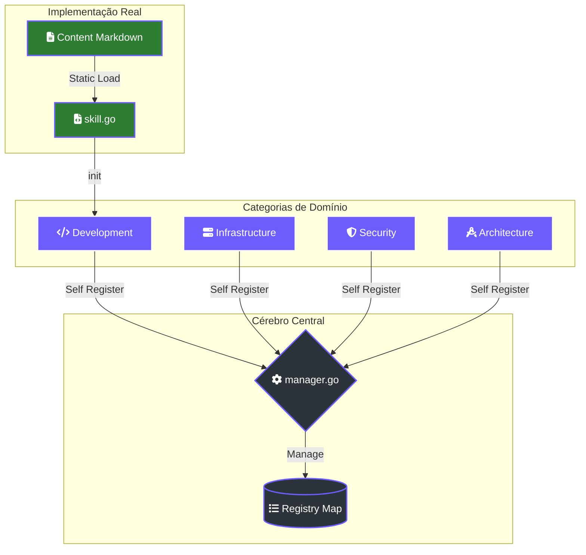

# 🧠 Sistema de Skills do Lumaestro

O sistema de **Skills** é o coração da inteligência especializada do Lumaestro. Em vez de depender de um único prompt monolítico, o sistema utiliza uma arquitetura modular de **Expertise Injetável**, onde habilidades específicas são carregadas dinamicamente conforme a necessidade da tarefa.

## 📌 Visão Geral

Uma Skill no Lumaestro não é apenas um arquivo de texto; é um pacote Go auto-registrável que contém diretrizes de persona, capacidades técnicas e restrições de uso.

> [!TIP]
> O objetivo das skills é reduzir a alucinação e aumentar a precisão técnica, fornecendo ao agente o "estado da arte" de uma tecnologia ou domínio específico.

---

## 🏗️ Arquitetura Técnica

O sistema reside em internal/agents/skills/ e opera sob três pilares:

### 1. O Registro Central (`manager.go`)
Responsável por manter o mapa global de habilidades em memória e fornecer métodos de busca.

```go
    type Skill struct {
        Name        string
        Category    string
    Content     string // O prompt em Markdown/YAML
        Description string
    }
```

### 2. O Mecanismo de Auto-Registro
Utiliza o padrão `init()` do Go para registrar habilidades sem necessidade de configuração manual extensiva.



### 3. Estrutura de Pastas
As skills são organizadas hierarquicamente por domínio:

```text
internal/agents/skills/
├── manager.go        # Lógica de registro
├── loader/           # Orquestrador de carregamento
└── development/      # Categoria
    ├── all.go        # Agregador da categoria
    └── golang_pro/   # Pasta da Skill
        └── skill.go  # Definição e conteúdo
```

---

## 📊 Fluxo de Dados e Integração

O diagrama abaixo ilustra como as categorias se conectam ao sistema central.



---

## 🛠️ Anatomia de uma Skill (Conteúdo)

Cada skill possui um **Frontmatter YAML** seguido de instruções estruturadas. Isso permite que o sistema processe metadados antes mesmo de enviar o prompt ao LLM.

```markdown
---
name: nome-da-skill
description: Breve resumo da expertise
risk: [low|medium|high]
source: community/internal
date_added: '2026-02-27'
---
# Persona
Você é um especialista em...

## Quando usar
- Tarefa A
- Contexto B
    
## Capacidades
- [ ] X
- [ ] Y
```

---

## 🚀 Como Criar uma Nova Skill

Para adicionar uma habilidade ao arsenal, siga estes passos:

1. **Crie a pasta:** Em internal/agents/skills/[categoria]/[nome_da_skill].
2. **Crie o arquivo skill.go:**
    ```go
   package nome_da_skill
   import "Lumaestro/internal/agents/skills"

    func init() {
        skills.Register(skills.Skill{
           Name: "nome-unico",
           Category: "categoria",
           Content: `[Conteúdo Markdown aqui]`,
        })
    }
    ```
3. **Registre no Agregador:** Adicione o *blank import* no arquivo ll.go da categoria correspondente.
   ```go
   import _ "Lumaestro/internal/agents/skills/[categoria]/[nome_da_skill]"
   ```

> [!WARNING]
> Certifique-se de que o Name da skill seja único em todo o sistema, pois o registro é case-insensitive e sobrescreverá duplicatas.

---

## 🔗 Documentos Relacionados
- [[AGENTS_GUIDE]] - Como os agentes utilizam estas skills.
- [[LUMAESTRO_CORE]] - Visão geral do sistema.
- [[internal/agents/skills/manager.go|Código Fonte: Manager]]
