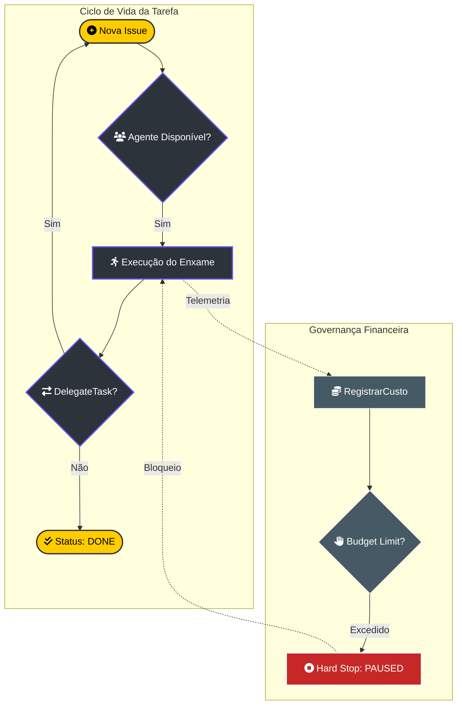

# 🐝 Orquestração do Enxame: Governança Corporativa de IA

> [!ABSTRACT]
> A orquestração no Lumaestro transcende filas de mensagens simples; ela implementa um modelo de **Governança Corporativa para Agentes**. Baseado em delegação por tickets (Agile/Linear), o enxame opera com responsabilidade financeira e trilhas de auditoria imutáveis.

## 🔄 Fluxo de Trabalho e Delegação (Handoff)

O ciclo de vida de uma tarefa no enxame é gerido por um motor de estado que garante que nenhuma instrução seja perdida.

---

## 🤝 O Mecanismo de Handoff Assíncrono

Implementado no `internal/orchestration/handoff.go`, o mecanismo de `DelegateTask` permite que um agente "passe o bastão" sem bloquear o enxame.
- **Hierarquia de Tickets**: Quando o Agente A delega para o Agente B, o sistema cria uma sub-tarefa vinculada ao `ParentID`.
- **Trilha de Auditoria**: Cada delegação gera automaticamente registros em `ActivityLog`, `CostEvent` e `IssueComment`.
- **Heartbeat Monitoring**: O sistema monitora a saúde e a atividade real-time dos agentes ativos para detectar travamentos ou loops infinitos.

---

## 💰 Governança de Custo (Hard Stop Protocol)

Diferente de chatbots tradicionais, o Lumaestro impõe limites financeiros rígidos. O protocolo **Hard Stop** protege o Comandante contra custos inesperados:
- **Budget Control**: Cada agente possui um `BudgetMonthlyCents` definido.
- **Materialização de Custo**: Após cada chamada LLM, o `RegistrarCusto` atualiza o gasto acumulado no DuckDB.
- **Auto-Suspensão**: Se o limite for atingido, o agente é imediatamente alterado para `Status: PAUSED`, bloqueando novas execuções até autorização manual.

---

## 🔗 Documentos Relacionados

- [[DATABASE_SCHEMA]] — Estrutura das tabelas de Issues e Agentes.
- [[AGENTS_GUIDE]] — Manual de operação individual dos agentes.
- [[LIGHTNING_ELITE]] — Como monitorar o orçamento no dashboard industrial.
- [[DOCS_INDEX]] — Índice central de documentação.

---
**Lumaestro Swarm: Inteligência orquestrada. Custos sob controle. 🐝💰🛡️**
