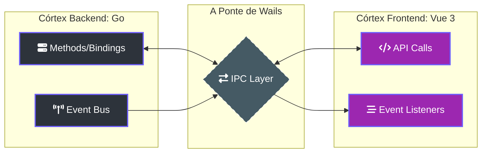

# 🌉 Wails Bridge: A Sinfonia de Dados

> [!ABSTRACT]
> O **Wails** é o framework de orquestração que une o motor de alta performance em **Go** à interface imersiva em **Vue.js**. Ele é responsável por transformar métodos de sistema em APIs de frontend e garantir que o fluxo de eventos da IA seja entregue em tempo real.

## 🏗️ Arquitetura da Ponte (IPC)

A comunicação entre o cérebro (Backend) e os olhos (Frontend) do Lumaestro ocorre através de uma camada de **Inter-Process Communication (IPC)** ultra-veloz.

---

## 🚀 Componentes da Sinfonia

### 1. Bindings de Funções (Go ↔ JS)
As funções de **IA**, **RAG** e **Gestão de Workspace** definidas em Go são exportadas automaticamente para o JavaScript. 
- **Exemplo**: `window.go.main.App.SendAgentInput(msg)` permite que o Chat dispare processos complexos de backend com uma única linha de código.

### 2. Barramento de Eventos (Real-time)
O Wails fornece um sistema de `EventsEmit` (Backend) e `EventsOn` (Frontend) que alimenta:
- **📊 Grafo 3D**: Atualização de posições de nós e sinapses sem travar a UI.
- **📟 Logs de Agente**: Transmissão bit-a-bit das respostas da IA.
- **🛡️ Alertas de Segurança**: Notificações instantâneas do protocolo ACP.

---

## 🛠️ Detalhes de Implementação

- **Wails Runtime**: Localizado no pacote `github.com/wailsapp/wails/v2/pkg/runtime`.
- **Assets**: A pasta `frontend/dist` é embutida no binário final do Go para portabilidade total.
- **Desenvolvimento**: O comando `wails dev` ativa o Hot-Reload em ambos os lados da ponte simultaneamente.

---

## 🔗 Documentos Relacionados

- [[LUMAESTRO_CORE]] — Como o App.go inicializa a ponte.
- [[FRONTEND_GUIDE]] — Como o Vue 3 consome os bindings.
- [[AGENTS_GUIDE]] — O uso da ponte para controle de terminais.
- [[DOCS_INDEX]] — Índice central de documentação.

---
**Lumaestro: Conexão Nativa. Performance Digital. 🌉🐹⚙️**
