# 🛡️ Zero-Orbit Hardening: Isolamento Hermético

> [!ABSTRACT]
> Sistema de contenção e amnésia situacional projetado para garantir que os agentes do Lumaestro operem em estado de "Mente Vazia" quando nenhuma órbita de projeto está acoplada.

## 🧠 Visão Geral

O protocolo **Zero-Orbit** resolve o dilema entre estabilidade de processo e segurança de contexto. Para evitar que o motor Gemini CLI v0.40 crashe no Windows (que exige um diretório de trabalho válido), implementamos uma arquitetura de **Decoy Sandbox** combinada com **Isolamento de Identidade**.

## 🕸️ Fluxo de Confinamento

```mermaid
graph TD
    A["Comando do Usuário (Sem Órbita)"] --> B{"Orquestrador ACP"}
    B --> C["Hangar de Identidade (.lumaestro/identities/Principal)"]
    B --> D["Diretivas de Sistema (Anti-Narcissism)"]
    
    subgraph "Identidade Blindada"
        C --> C1["Perfil .gemini (Sem DBs do Projeto)"]
    end
    
    subgraph "Isolamento Lógico"
        D --> D1["Bloqueio de FS via Prompt"]
        D --> D2["Amnésia Situacional"]
    end
    
    C1 & D1 & D2 --> E["Processo Gemini CLI (Estável e Despersonalizado)"]
    E --> F["Resposta Técnica Pura"]
    
    style C fill:#2d333b,stroke:#6d5dfc
    style D fill:#2d333b,stroke:#6d5dfc
```

## 🛠️ Componentes Técnicos

### 1. Isolamento de Identidade (Hangar)
As credenciais e o estado da IA foram migrados para subpastas dedicadas, impedindo que a IA "veja" os bancos de dados SQLite ou DuckDB do Lumaestro como parte de seu próprio perfil.

*   **Ponto de Montagem**: `.lumaestro/identities/Principal/.gemini`

### 2. Hard-Lock Anti-Narcissismo
Diretivas de prompt de nível 0 que anulam a personalidade da IA, proibindo saudações e assinaturas. Isso garante que o agente não se identifique e não tente agir como "dono" do código quando não há órbita ativa.

> [!IMPORTANT]
> (1) PROIBIDO se identificar ou assinar como "gemini".
> (2) NUNCA ofereça ajuda com "o projeto" se a órbita estiver vazia.
> (3) NÃO use saudações. Vá direto ao ponto técnico.

## 👤 Hangar de Identidades
As credenciais e o estado da IA foram migrados para subpastas dedicadas, impedindo que a IA "veja" os bancos de dados SQLite ou DuckDB do Lumaestro como parte de seu próprio perfil.

*   **Antigo**: `.lumaestro/.gemini` (Exposto ao projeto)
*   **Novo**: `.lumaestro/identities/Principal/.gemini` (Blindado)

## 🏁 Dicas para o Comandante
*   **Sincronização**: Se o motor parecer "confuso" após uma migração de hangar, clique no logotipo do Lumaestro na UI para disparar o re-login OAuth.
*   **Verificação**: Digite "ola" sem órbita. Se o agente responder sem se apresentar e sem citar o projeto, o isolamento está 100% funcional.

---
**Documentos Relacionados:**
*   [[ACP_MODE]]
*   [[SINFONIA_PROTOCOL]]
*   [[DOCS_INDEX]]
