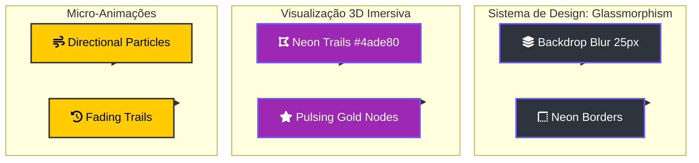

# 💅 Design UX: O Manifesto da Interface Neural

> [!ABSTRACT]
> A interface do Lumaestro não é apenas funcional; ela é uma extensão sensorial do enxame. Através de uma estética de vidro imersiva (Glassmorphism) e trajetórias visuais dinâmicas, transformamos a busca de dados em uma experiência de navegação espacial cinemática.

## 🏗️ Ecossistema de Experiência Visual

O sistema de design harmoniza a transparência da interface com a densidade informativa do Grafo 3D.

---

## 🏙️ Estética de Vidro (Glassmorphism)
Todos os painéis de controle, chat e auditoria seguem a linguagem premium do Lumaestro:
- **Transparência**: Uso de `backdrop-filter: blur(25px)` para manter o universo de conhecimento visível sob a interface de controle.
- **Bordas de Neônio**: Bordas sutis em tons de azul e roxo que sinalizam o status de atividade da IA e o "batimento" do enxame.
- **Feedback de Foco**: Nós ativos e núcleos de conhecimento pulsam em tons de ouro e platina, guiando o olhar do Comandante para as áreas de maior densidade semântica.

## 🟩 Trilhas de Raciocínio (Visual Highlighting)
Inspirado por interfaces de radar tático, o sistema mapeia os saltos de pensamento da IA no grafo em tempo real:
- **Neon Trails**: Links entre nós consultados durante o RAG brilham em **Verde Néon (#4ade80)**.
- **Micro-animações**: Partículas direcionais surgem nessas trilhas, indicando o sentido do fluxo de informação dos documentos para a memória do chat.
- **Efeito de Rastro**: O destaque persiste por 4 segundos, permitindo acompanhar a "linhagem do pensamento" sem poluir permanentemente a visualização.

---

## 🔗 Documentos Relacionados

- [[RENDER_ENGINE_3D]] — Como os shaders GLSL processam estas trilhas.
- [[FRONTEND_GUIDE]] — Convenções de CSS e componentes Vue.
- [[NEURAL_BRAIN]] — O resultado final desta estética aplicada.
- [[DOCS_INDEX]] — Índice central de documentação.

---
**Lumaestro: Design que respira inteligência. 💅🎨✨**
