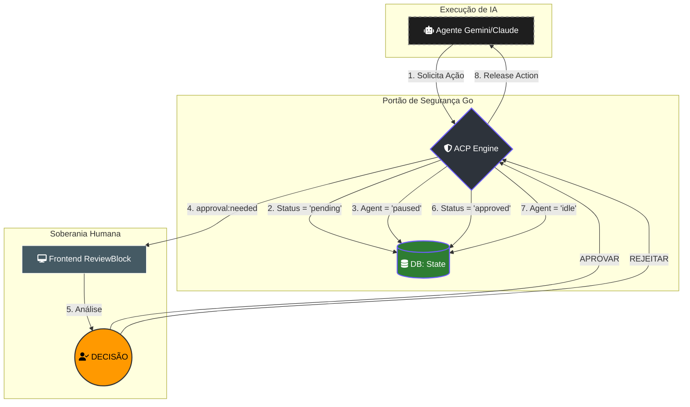
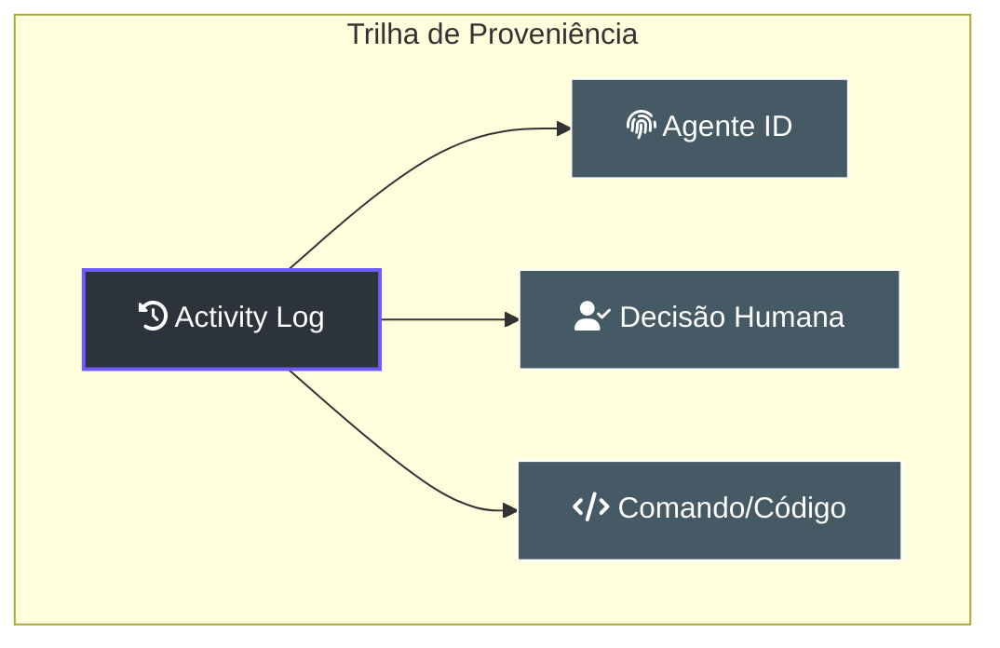

---
tags:
  - security
  - agents
  - acp
  - wails
---

# 🛡️ Guia do ACP Mode (Approval Control Protocol)

> [!ABSTRACT] Visão Geral
> O **ACP (Approval Control Protocol)** é o mecanismo de segurança central do Lumaestro. Ele atua como um "Portão Humano" (Human-in-the-Loop), interceptando comandos sensíveis ou ações de alto risco propostas pelos agentes antes que elas sejam executadas no sistema operacional ou na base de dados.

---

## 🏗️ Como Funciona o Fluxo de Aprovação

O ACP não é apenas um "sim ou não", mas uma sincronização de estado entre o Agente, o Banco de Dados e o Usuário.

### Ciclo de Vida de um Pedido ACP

1.  **Solicitação:** Um agente (ex: Gemini ou Claude) decide executar um comando (ex: 
m -rf ou git push).
2.  **Interceptação:** O internal/orchestration/approvals.go cria um registro de aprovação com status pending.
3.  **Suspensão:** O agente é imediatamente colocado em estado paused no banco de dados.
4.  **Notificação:** O backend emite um evento via Wails para o componente ReviewBlock.vue no frontend.
5.  **Decisão Humana:** O usuário revisa o payload da ação e clica em **Aprovar** ou **Rejeitar**.
6.  **Liberação:** O backend processa a decisão, altera o status do agente para idle (ou executa o comando) e registra o log de auditoria.

---

## 🧩 Componentes Técnicos

### 1. O Portão de Segurança (pprovals.go)
A função RequestApproval é o ponto de entrada. Ela encapsula o payload da ação em JSON para que o usuário possa ler exatamente o que o agente pretende fazer.

`go
// internal/orchestration/approvals.go
func RequestApproval(agentID uuid.UUID, approvalType string, payload interface{}) (uuid.UUID, error) {
    // 1. Cria o registro no DB
    // 2. Pausa o Agente automaticamente
    // 3. Registra Log de Auditoria
}
`

### 2. O Painel de Revisão (ReviewBlock.vue)
No frontend, este componente é um "Modal Persistente" que bloqueia a interação com o chat até que a decisão seja tomada. Ele exibe:
- **Origem:** Qual agente solicitou.
- **Payload:** O código ou comando bruto.
- **Risco:** Classificação do perigo (Baseado na ontologia do Maestro).

### 3. O Motor de Recompensa (Lightning Engine)
O ACP está integrado ao **Lightning Engine**. Quando você aprova uma ação, o sistema emite uma **Recompensa Positiva (+1.0)** para o Agente no DuckDB. Se você rejeita, ele recebe uma **Punição (-1.0)**. Isso ensina o agente, ao longo do tempo, quais comandos você considera aceitáveis.

---

## ⚙️ Modos de Operação

O Lumaestro suporta dois modos de aprovação, configuráveis via internal/agents/executor.go:

| Modo | Descrição | Risco |
| :--- | :--- | :--- |
| **Protected (Padrão)** | Todas as ações de escrita exigem aprovação manual. | **Mínimo** |
| **YOLO (Autonomous)** | Agentes podem executar comandos livremente. Ativado via --approval-mode=yolo. | **Alto** |

---

## 🕵️ Auditoria e Proveniência

Todas as decisões do ACP são gravadas na tabela  ctivity_logs. Isso permite que você rastreie:
- Quem pediu (Agente).
- Quem aprovou (Usuário).
- Quando aconteceu.
- Qual foi a nota/justificativa da decisão.

---

## 🔗 Documentos Relacionados
- [[FRONTEND_GUIDE]]: Como o ReviewBlock.vue é renderizado.
- [[LIGHTNING_ENGINE]]: Detalhes sobre o sistema de recompensas.
- [[AGENTS_GUIDE]]: Arquitetura de execução de agentes.
