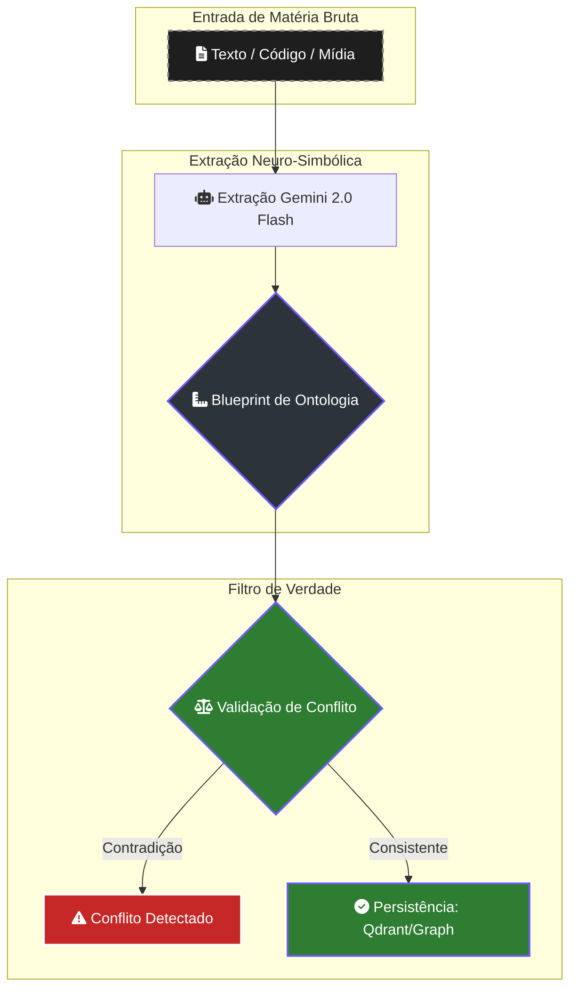

# 🔍 Ontologia Neuro-Simbólica: O Truth Engine

> [!ABSTRACT]
> A **Ontologia Neuro-Simbólica** é o filtro de soberania do Lumaestro. Em vez de confiar apenas na "intuição" estatística da IA, o sistema força a atomização do conhecimento em um esquema rígido de triplas semânticas, garantindo que cada fato no grafo seja estruturado, validável e rastreável.

## 🏗️ O Ciclo de Refino de Conhecimento

O processo de transformar texto bruto em "Verdade Situacional" segue um blueprint rigoroso definido em `internal/provider/ontology.go`.

---

## 💎 O Blueprint de Triplas Semânticas

Sempre que o Lumaestro processa uma nota ou código, ele extrai o conhecimento no formato:
**`[Sujeito] --(Predicado)--> [Objeto]`**

### Entidades (Classes Obrigatórias)
Para manter o grafo limpo e coeso, o motor utiliza categorias pré-definidas:
- `Person`, `Project`, `Task`, `Concept`, `Technology`, `Milestone`, `Bug`, `Decision`.

### Relações (Predicados Suportados)
- `is_part_of`, `works_on`, `uses`, `defines`, `explains`, `mentions`, `created`, `resolved`, `depends_on`.

---

## 🛡️ Resolução de Conflitos e Soberania

O motor implementa o protocolo `ValidateConflict` para gerenciar a entropia do conhecimento:
1.  **Deduplicação Ativa**: Se um fato novo contradiz o que já está no grafo, o sistema sinaliza a anomalia (Vermelho Alerta).
2.  **Arbitragem**: O sistema apresenta o **Fato Antigo** vs **Fato Novo**. O Comandante (ou um agente de alta confiança) decide se o novo fato é um `UPDATE` ou se a informação antiga deve ser preservada.

---

## 👁️ Multimodalidade: A Visão do Córtex
O motor de ontologia não se limita ao texto. Através do `ProcessMedia`, ele extrai triplas estruturadas diretamente de imagens e PDFs, permitindo que o RAG entenda diagramas de arquitetura, capturas de tela e documentos técnicos visuais como parte integrante da rede neural.

---

## 🔗 Documentos Relacionados

- [[NEURAL_BRAIN]] — Visualização imersiva do resultado desta ontologia.
- [[CONFLICT_RESOLUTION]] — Guia manual para arbitrar anomalias.
- [[CONTEXT_FLOW_RAG]] — Como a ontologia alimenta a busca semântica.
- [[DOCS_INDEX]] — Índice central de documentação.

---
**Lumaestro: Transformando ruído em conhecimento estruturado e soberano. 🔍🧬💎**
