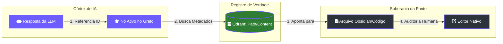

# 👁️ Proveniência e Auditoria: O Elo Inquebrável

> [!ABSTRACT]
> A **Proveniência** no Lumaestro é o mecanismo de rastreabilidade total que permite ao Comandante verificar a fonte de cada fato gerado ou armazenado. Este sistema garante que a inteligência artificial nunca se desconecte da realidade documental do seu workspace.

## 🛡️ Rastreabilidade de Linhagem (Grounding)

O Lumaestro estabelece uma conexão direta entre o pensamento da IA e a matéria bruta do conhecimento.

---

## 🔍 Interface de Auditoria Total

O sistema oferece três camadas de verificação de veracidade:

### 1. Sidebar de Proveniência
Integrada ao HUD 3D, esta lateral de vidro é ativada ao interagir com qualquer nó. Ela exibe:
- **Origem**: O caminho absoluto do arquivo.
- **Timestamp**: Quando o conhecimento foi capturado ou modificado.
- **Snippet**: O fragmento de texto exato usado para fundamentar a afirmação.

### 2. Acesso à Fonte Nativa
Através do método `OpenFileInEditor`, o usuário pode saltar da interface 3D diretamente para o arquivo original no **Obsidian**, **VSCode** ou leitor de **PDF**, eliminando qualquer atrito na validação manual.

### 3. Grounded Reasoning (Chat)
Cada resposta do chat é acompanhada por referências de nós. Ao clicar nestas referências, o grafo navega automaticamente para o nó de origem, permitindo uma inspeção visual da "vizinhança semântica" do fato.

---

## 🔗 Documentos Relacionados

- [[NEURAL_BRAIN]] — Visualização imersiva dos nós auditáveis.
- [[BACKEND_METHODS]] — Detalhes da API `GetNodeDetails`.
- [[RAG_FLOW]] — Como a linhagem é criada durante a ingestão.
- [[DOCS_INDEX]] — Índice central de documentação.

---
**Lumaestro: Inteligência transparente. Verdade inegociável. 👁️🛡️✨**
