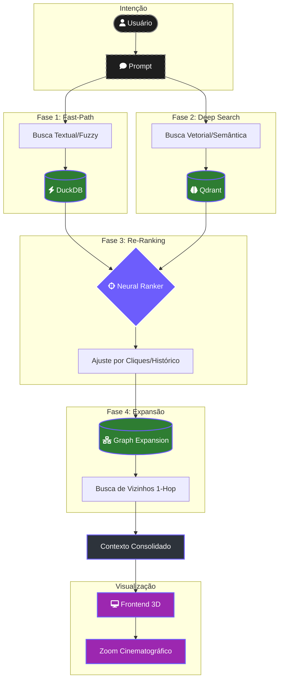

# 🧠🕸️ Navegador de Trajetória Semântica — O GPS Neural

> [!ABSTRACT]
> O Navegador de Trajetória Semântica é o sistema nervoso central de busca do Lumaestro. Ele converte uma pergunta do usuário em uma jornada através do grafo de conhecimento, combinando busca textual rápida (DuckDB), busca vetorial profunda (Qdrant) e expansão por vizinhança para montar o contexto mais rico possível antes de responder.

---

## 🏗️ Visão Geral — Onde Ele Se Encaixa

O Navegador vive entre o `ChatService` (que recebe a pergunta) e o `SearchService` (que consulta os bancos). Ele adiciona uma camada de inteligência que o `SearchService` sozinho não possui: **trajetória, filtragem e destaque visual**.

```
┌──────────────┐    ┌──────────────────┐    ┌───────────────┐
│  ChatService │───▶│ GraphNavigator   │───▶│ SearchService │
│  (Pergunta)  │    │ (Trajetória)     │    │ (Vetores)     │
└──────────────┘    └────────┬─────────┘    └───────────────┘
                             │
                    ┌────────┴─────────┐
                    │    NavStore       │
                    │   (DuckDB)       │
                    │  Fast-Path Text  │
                    └──────────────────┘
```

---

### 🧬 Pipeline de Busca Neural (4 Fases)
Abaixo, a jornada do dado desde a intenção do usuário até a composição do contexto semântico.



---

## 🧩 Componentes Técnicos

### 1. Interface NavStore (Contrato com DuckDB)

A interface `NavStore` desacopla o navegador de qualquer implementação específica de banco de dados. Hoje é o DuckDB, amanhã pode ser SQLite ou PostgreSQL sem alterar uma linha do navegador.

```go
// NavStore define a interface mínima para busca textual e vizinhança.
type NavStore interface {
    SearchNodesByKeyword(keyword string, limit int) ([]map[string]interface{}, error)
    GetNeighbors(nodeID string) ([]map[string]interface{}, error)
}
```

> [!IMPORTANT]
> **Regra Imutável**: O `NavStore` é a única porta de entrada para buscas textuais no navegador. Nunca acesse o DuckDB diretamente a partir do `GraphNavigator` — sempre use a interface. Isso garante testabilidade e permite mocks em testes unitários.

### 2. Pipeline de Busca em 4 Fases

| Fase | Motor | Latência | Função |
|------|-------|----------|--------|
| 1. Fast-Path | DuckDB | ~2ms | Busca textual exata e fuzzy por keyword |
| 2. Deep Search | Qdrant | ~50ms | Busca vetorial por similaridade semântica |
| 3. Re-Ranking | Neural Ranker | ~1ms | Ajusta scores com base em cliques do usuário |
| 4. Expansão | DuckDB | ~5ms | Vizinhos 1-hop para enriquecer o contexto |

### 3. Filtro de Stop-Words

Antes de enviar qualquer busca, o navegador remove palavras vazias que poluiriam os resultados:

```go
var stopWords = map[string]bool{
    "o": true, "a": true, "de": true, "do": true, "da": true,
    "que": true, "e": true, "em": true, "um": true, "uma": true,
    "para": true, "com": true, "não": true, "como": true,
    "the": true, "is": true, "of": true, "and": true, "to": true,
}
```

> [!TIP]
> **Evolução Futura**: Este filtro é estático. A próxima iteração pode usar TF-IDF do corpus indexado para determinar dinamicamente quais termos são informativos vs. ruído.

### 4. Integração Visual (Sinapses Ativas)

Os IDs dos nós encontrados são emitidos para o frontend como `semanticNeighborIds`. Isso permite que o motor de renderização 3D **destaque em cyan** todas as notas relevantes durante uma conversa, criando uma experiência visual de "cérebro pensando".

```javascript
// No BridgeDriver.js — Efeito de Descoberta
store.discoveryStatus = 'searching'; // Indicador visual na UI
const node = store.graphInstance?.focusNodeById(cleanId);
if (node) {
    store.discoveryStatus = 'found';
    store.selectedNode = node;  // Abre o painel de proveniência
}
```

---

## ⚡ Performance e Limites

| Métrica | Valor | Notas |
|---------|-------|-------|
| Busca textual (DuckDB) | ~2ms para 10k nós | Índice strict + loose |
| Busca vetorial (Qdrant) | ~50ms para 5k vetores | Depende da dimensão |
| Re-Ranking Neural | ~1ms | Lookup em mapa in-memory |
| Expansão 1-hop | ~5ms | JOIN simples no DuckDB |
| **Total end-to-end** | **~60ms** | Antes de enviar ao LLM |

> [!WARNING]
> **Gargalo Conhecido**: Se o Qdrant estiver offline ou sem coleções, o navegador depende exclusivamente do DuckDB Fast-Path. Neste modo degradado, a qualidade semântica cai significativamente pois a busca é puramente lexical. Monitore o status do Qdrant no GraphStatusHUD.

---

## 💡 Dicas para o Comandante

> [!TIP]
> **Modo Exploração vs. Neural**: Use `SetExplorationMode(true)` para desativar os pesos aprendidos do Ranker e ver os resultados "puros" do Qdrant. Útil para diagnosticar se o Re-Ranking está criando viés.

> [!TIP]
> **Reforço Manual**: Clique em qualquer nó no grafo 3D para emitir um sinal de reforço positivo ao Ranker. Quanto mais você clica, mais o sistema aprende quais notas são relevantes para você.

---

## 🔗 Documentos Relacionados

- [[RAG_FLOW]] — Pipeline completo de Crawler → Embeddings → Chat
- [[LIGHTNING_ENGINE]] — Motor analítico DuckDB e persistência
- [[NEURAL_BRAIN]] — Dashboard 3D e métricas de grafo
- [[RENDER_ENGINE_3D]] — Motor de renderização e zoom cinematográfico
- [[AGENTS_GUIDE]] — Como os agentes usam o navegador para responder
- [[DOCS_INDEX]] — Índice central de documentação
