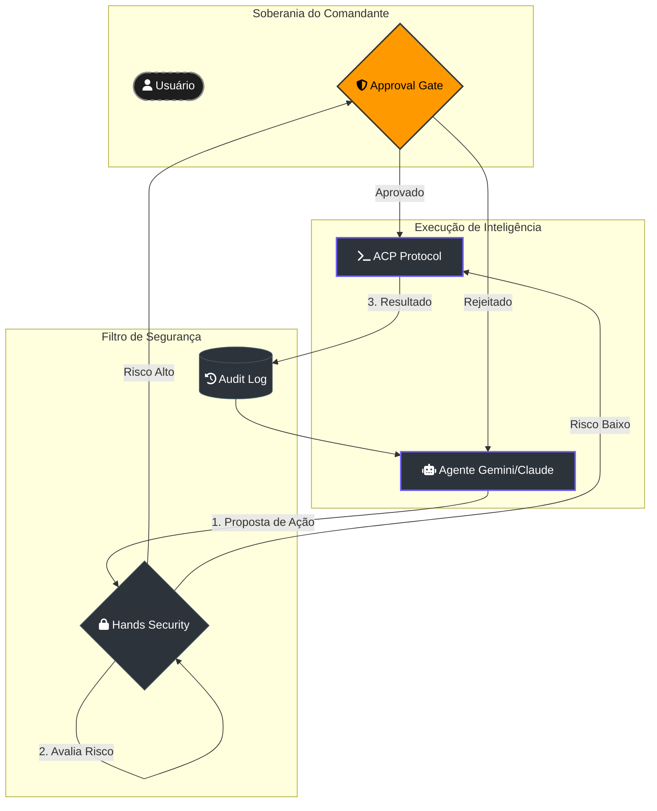

# 🤖 Guia de Agentes (Soberania ACP)

> [!ABSTRACT]
> O Lumaestro utiliza o **Agent Control Protocol (ACP)** para sessões interativas e seguras. Isso permite que a IA execute comandos de terminal, manipule arquivos e realize tarefas complexas no seu workspace sob sua supervisão total.

## 🛡️ Arquitetura de Soberania (Hands Security)

Nenhum agente tem "cheque em branco" no Lumaestro. Toda ação passa por uma camada de validação e aprovação.

---

## 🛠️ Capacidades dos Agentes

Os agentes do Lumaestro não são apenas chatbots; eles possuem "mãos" digitais:

- **📟 Terminal Nativo**: Execução de scripts, builds e testes (com suporte a PowerShell e Bash).
- **📂 Manipulação de Arquivos**: Criação, leitura e edição (patching) de arquivos do projeto.
- **🧠 Consciência de Contexto**: Acesso em tempo real ao grafo neural para fundamentar decisões.
- **🛡️ Hard Stop**: Interrupção automática em caso de detecção de loops infinitos ou gastos excessivos de tokens.

---

## 🔗 Documentos Relacionados

- [[ACP_MODE]] — Detalhamento técnico do protocolo de execução.
- [[NEURAL_BRAIN]] — Como o grafo alimenta a decisão dos agentes.
- [[MULTI_AGENT_SYSTEM]] — Orquestração de múltiplos especialistas (Enxame).
- [[DOCS_INDEX]] — Índice central de documentação.

---
**Lumaestro: Inteligência com Soberania. 🐹🛡️🤖⚙️**
