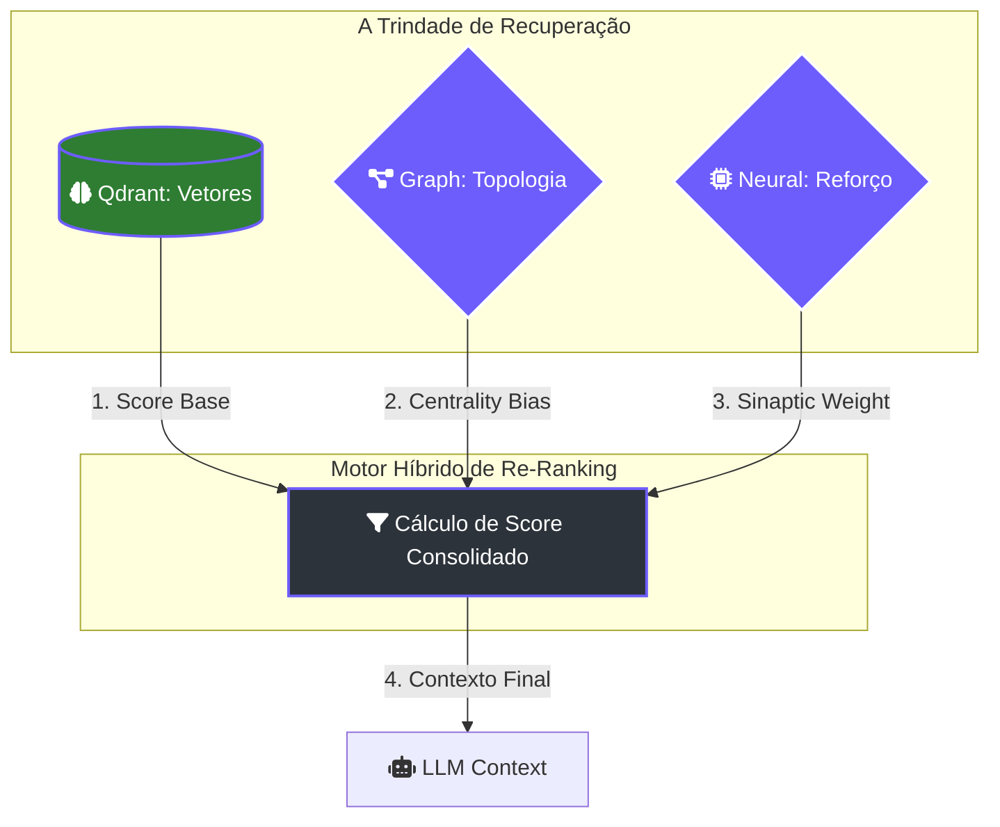
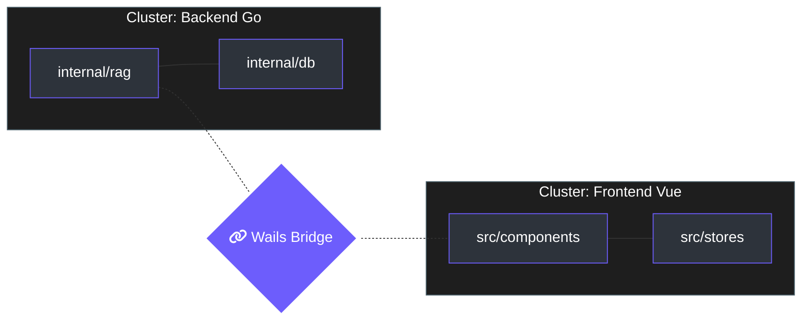

# 🧠 Guia Mestre: Code RAG & Córtex Neural

O Lumaestro não utiliza um RAG (Retrieval-Augmented Generation) convencional. Ele opera através de uma **Trindade de Recuperação**, onde a busca vetorial é apenas a camada base para um sistema muito mais profundo que envolve topologia de grafos e aprendizado por reforço local.

> [!IMPORTANT]
> A filosofia do Lumaestro é: **Conexão é mais importante que Similaridade**. Um documento similar pode ser irrelevante se ele não estiver conectado ao fluxo central do seu raciocínio.

---

## 🏗️ A Trindade de Recuperação

A arquitetura de busca do Lumaestro (localizada em `internal/rag/search.go`) unifica três motores distintos para calcular a relevância final de um trecho de código ou nota.



### 1. Camada Vetorial (Qdrant)
Responsável pela **similaridade semântica**. Ela converte sua pergunta em vetores densos e busca vizinhos em duas coleções:
- `obsidian_knowledge`: Seus arquivos Markdown e código fonte.
- `knowledge_graph`: Memórias de chat e sinapses criadas por agentes.

### 2. Camada de Grafo (GraphEngine)
O `internal/rag/graph_engine.go` utiliza a biblioteca **Gonum** para tratar o conhecimento como uma rede viva.
- **Centrality Bias**: Notas com muitos links recebem um boost automático de até `+0.20`.
- **PageRank**: Documentos "autoritários" (muito citados) sobem no ranking.
- **Betweenness**: Identifica notas que servem de ponte entre diferentes tecnologias.

### 3. Camada Neural (Neural Ranker)
O `internal/rag/neural/ranker.go` é o aprendizado de máquina local.
- **Reforço Sináptico**: Quando você clica em um resultado ou o utiliza, o sistema aplica um `Delta Rule` aumentando o peso neural (`Weights`) desse nó.
- **Esquecimento (Decay)**: Sinapses não utilizadas enfraquecem 1% a cada boot, mantendo o córtex limpo de ruído.

---

## 🔄 O Algoritmo de Busca Híbrida

O fluxo de execução no `SearchService.SearchNote` segue estes passos técnicos:

1.  **Oversampling**: Busca `3x` mais resultados do que o solicitado para permitir o re-ranking.
2.  **Normalização**: Mapeia campos de memórias e arquivos para um formato único.
3.  **Boost de Grafo**: 
    ```go
    // Trecho de internal/rag/search.go
    rawBoost := float64(len(linksRaw)) * 0.03
    if rawBoost > 0.20 { rawBoost = 0.20 }
    graphScore = rawBoost
    ```
4.  **Ativação Neural**: O score final é multiplicado pela raiz quadrada do peso aprendido:
    ```go
    // Trecho de internal/rag/neural/ranker.go
    multiplier := float32(math.Sqrt(float64(weight)))
    finalScore = originalScore * multiplier
    ```

---

## 📊 Topologia e Comunidades

O Lumaestro agrupa seu código automaticamente em **Comunidades Semânticas** usando o algoritmo de **Louvain**. Isso permite que, ao encontrar uma nota, o sistema saiba quais outras pertencem ao mesmo "cluster" mental.



---

## 🛠️ Como Otimizar seu RAG

Para tirar o máximo proveito do motor do Lumaestro:

1.  **Abuse dos [[Wikilinks]]**: Cada link criado no Obsidian é uma aresta real no `GraphEngine`, aumentando a autoridade das notas conectadas.
2.  **Use Propriedades YAML**: Defina `type: source` ou `type: agent` para ajudar o motor a categorizar o conhecimento.
3.  **Interaja com a UI**: Ao clicar em documentos no painel de busca, você está treinando o `neural_weights.json` para priorizar esses termos em buscas futuras.

### 🔍 Comandos de Inspeção
Você pode ver a saúde do seu RAG nos logs do sistema:
- `[GraphEngine] recalculado`: Indica que o PageRank foi atualizado.
- `[Neural] Reforço Sináptico`: Indica que o sistema aprendeu uma nova preferência sua.
- `[QDRANT] SearchWithScores`: Início da fase vetorial.

---
> [!TIP]
> O arquivo de pesos neurais fica em `.context/neural_weights.json`. Se você sentir que o sistema está "viciado" em termos antigos, você pode deletar este arquivo para resetar o aprendizado (Tabula Rasa).

[[INDEX|⬅️ Voltar ao Índice]] | [[LUMAESTRO_CORE|⚙️ Core System]]
