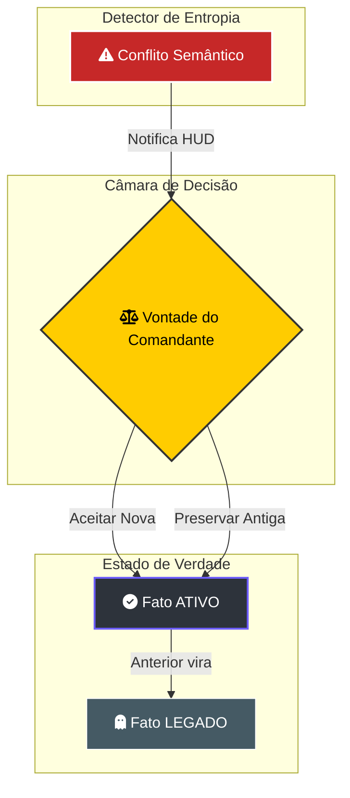

# 🛡️ Resolução de Conflitos: Manual de Verdade Situacional

> [!ABSTRACT]
> O Lumaestro opera em um ambiente de conhecimento volátil. O sistema de **Resolução de Conflitos** é o mecanismo de defesa que garante a integridade da sua rede neural, permitindo que você arbitre entre informações contraditórias e mantenha a saúde semântica do grafo.

## ⚠️ Detecção de Entropia Semântica

O motor de integridade (`AnalyzeGraphHealth`) monitora constantemente a coerência das triplas extraídas. Quando uma contradição é detectada, o sistema entra em estado de alerta.

---

## 🏛️ A Filosofia "Ativo vs Legado"

No Lumaestro, a verdade é soberana, mas o histórico é preservado. Ao resolver um conflito, o sistema aplica o protocolo de **Rebaixamento de Linhagem**:

1.  **Fato ATIVO**: É a informação validada pelo usuário ou pela IA de maior confiança. Ela é usada como fonte primária para o RAG e o raciocínio.
2.  **Fato LEGADO**: A informação contraditória não é deletada. Ela é movida para o estado `status: legacy`, tornando-se um nó "fantasma" cinza no grafo. Isso preserva a evolução do seu pensamento e permite auditorias históricas.

## 📉 Indicadores de Saúde do Grafo

Monitorados via **Health HUD**:
- **Densidade Semântica**: Mede a interconectividade. Valores acima de 70% indicam um ecossistema de ideias maduro onde a IA consegue realizar saltos complexos de raciocínio.
- **Nós Órfãos**: Identifica informações isoladas que precisam de "ancoragem" ou novos links para se tornarem úteis ao enxame.

---

## 🔗 Documentos Relacionados

- [[NEURAL_BRAIN]] — Visualização de nós em conflito (Vermelho Alerta).
- [[PROVENANCE_AND_AUDIT]] — Como verificar a fonte de um conflito.
- [[BACKEND_METHODS]] — API `ResolveConflict` e `AnalyzeGraphHealth`.
- [[DOCS_INDEX]] — Índice central de documentação.

---
**Lumaestro: Orquestrando a verdade em meio ao caos da informação. 🛡️⚖️✨**
