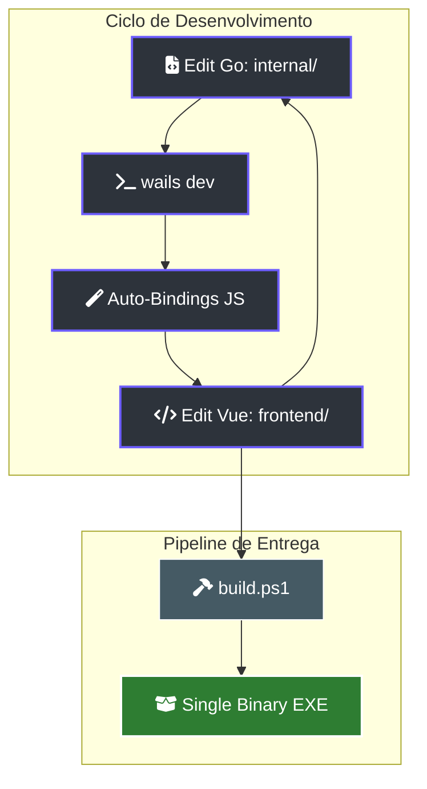

# 💻 Guia do Desenvolvedor: Manual de Engenharia de Elite

> [!ABSTRACT]
> Este guia é o mapa de operações para os engenheiros do enxame. Ele detalha o setup do ambiente, o fluxo de desenvolvimento bi-direcional (Go ↔ Vue) e as diretrizes para manter a soberania técnica do projeto Lumaestro.

## 🏗️ Workflow de Desenvolvimento Sincronizado

O Lumaestro utiliza um ciclo de desenvolvimento ágil onde o backend e o frontend co-evoluem em tempo real.



---

## 🚀 Setup do Ambiente (Grounding)

### Pré-requisitos Mandatórios
- **Go 1.21+**: Motor de performance.
- **Node.js 20+**: Ecossistema de interface.
- **Wails CLI**: `go install github.com/wailsapp/wails/v2/cmd/wails@latest`.
- **DuckDB**: O binário analítico deve estar acessível na pasta `deps/` ou no PATH do sistema.

### Comandos de Poder (PowerShell)
| Comando | Efeito |
| :--- | :--- |
| `./dev.ps1` | Inicia o Hot Reload total (Go + Vite). Ideal para iterações rápidas. |
| `./build.ps1` | Compila a versão de produção, embutindo todos os assets e dependências. |
| `go run scripts/setup_build_env.ps1` | Prepara o ambiente isolado para compilação limpa. |

---

## 🛠️ Extensibilidade: Criando Novas Conexões

### 1. Adicionando Métodos RPC (Go → JS)
- Localize o arquivo apropriado em `internal/core/` (ex: `app_tools.go`).
- Defina o método na struct `App` com a primeira letra maiúscula.
- O Wails detectará a mudança e gerará automaticamente o binding em `frontend/wailsjs/go/`.

### 2. Ciclo de Testes
Sempre valide as alterações no motor de grafos e RAG antes de comitar:
```powershell
go test ./internal/rag/...
```

---

## 🔗 Documentos Relacionados

- [[BACKEND_METHODS]] — Lista completa de funções disponíveis para o frontend.
- [[LUMAESTRO_CORE]] — Entenda a raiz do orquestrador.
- [[FRONTEND_GUIDE]] — Convenções de UI e State Management (Pinia).
- [[DOCS_INDEX]] — Índice central de documentação.

---
**Lumaestro: Código que constrói o futuro da inteligência. 💻⚙️💎**
