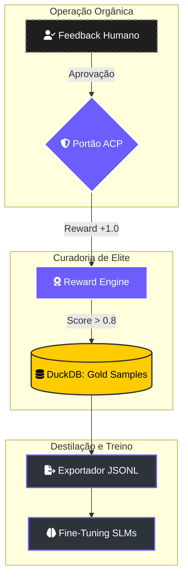

# 🧪 Lightning: Manual de Curadoria de Inteligência (RLHF)

> [!ABSTRACT]
> O sistema de **Fine-Tuning** do Lumaestro não é uma simples exportação de logs. É um processo de **Curadoria de Inteligência** baseado em **RLHF (Reinforcement Learning from Human Feedback)**. Transformamos suas interações diárias em "Amostras de Ouro" (Gold Samples) para treinar modelos locais especializados e soberanos.

## 🔄 O Ciclo da Dopamina Digital (Feedback Loop)

Abaixo, o fluxo técnico que converte a aprovação do Comandante em dados de treinamento de alta fidelidade.

---

## 🏗️ Arquitetura de Curadoria (Lightning Core)

O motor de treinamento reside em `internal/lightning/` e opera sob regras de qualidade estritas:

### 1. Reward Engine (`reward_engine.go`)
Diferente de logs tradicionais, o sistema atribui uma pontuação de recompensa a cada interação. Somente interações com **Recompensa > 0.8** são elegíveis para o dataset de ouro. Isso evita "alucinações" ou caminhos ineficientes no treino.

### 2. Otimização de Prompts (`optimization.go`)
Antes de exportar para treino de pesos (SFT), o Lumaestro realiza um fine-tuning de instruções. O otimizador analisa falhas passadas no DuckDB e refina os prompts dos agentes para garantir que o dataset gerado reflita a melhor versão do raciocínio sistêmico.

---

## 📦 Geração e Destilação do Dataset

O exportador executa queries analíticas no DuckDB para consolidar as conversas curadas no padrão conversacional (`JSONL`).

### Destilação para Modelos Locais (SLMs)
Com o dataset `dataset_lumaestro_rlhf.jsonl`, você pode treinar modelos menores e mais rápidos:
- **Unsloth / Axolotl**: Ideal para **Llama-3-8B** ou **Mistral**, criando especialistas locais no seu codebase.
- **Google Vertex AI**: Fine-tuning do **Gemini 1.5 Flash** para que ele se torne um maestro da sua arquitetura específica.

---

## 🔗 Documentos Relacionados

- [[LIGHTNING_REINFORCEMENT_LEARNING]] — A teoria por trás do motor de recompensas.
- [[DATABASE_SCHEMA]] — Como as Gold Samples são persistidas.
- [[ACP_MODE]] — O papel da soberania humana na coleta de feedback.
- [[DOCS_INDEX]] — Índice central de documentação.

---
**Lumaestro: Transformando experiência em inteligência soberana. 🧪🧪💎**
