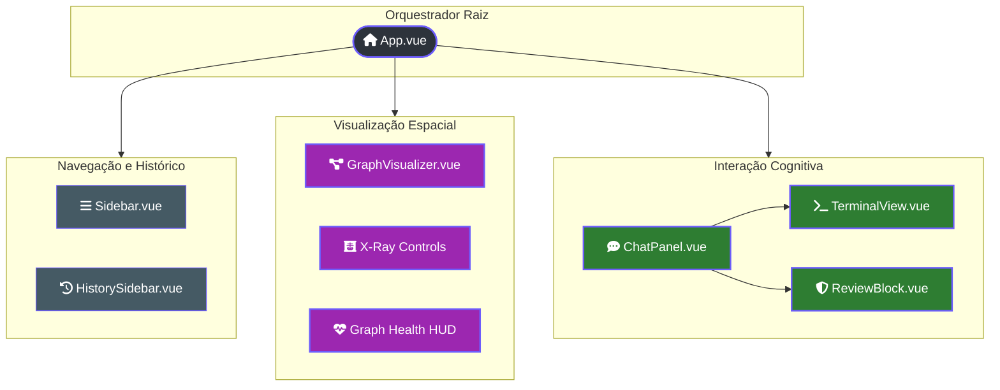
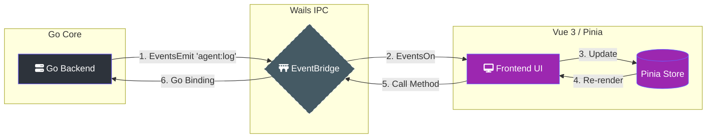

---
tags:
  - frontend
  - vue3
  - architecture
  - wails
  - d3
  - threejs
---

# 🎨 Guia do Maestro Frontend (Interface Neural)

> [!ABSTRACT] Visão Geral
> O frontend do Lumaestro não é apenas uma UI, mas uma **janela de observação neural**. Construído com **Vue 3 (Composition API)** e **Vite**, ele orquestra a visualização de grafos 3D imersivos, terminais de agentes em tempo real e uma ponte de comunicação bi-direcional de alta performance com o backend em Go via **Wails**.

---

## 🏗️ Arquitetura de Componentes

A interface é dividida em três áreas principais: a **Sidebar** (Navegação), a **Graph Area** (Visualização Espacial) e a **Chat Area** (Interação Cognitiva).

---

## 🚀 Stack Tecnológica

| Tecnologia | Função | Por que? |
| :--- | :--- | :--- |
| **Vue 3 + Vite** | Framework & Build | Reatividade ultra-rápida e HMR instantâneo. |
| **Pinia** | Store de Estado | Gerenciamento centralizado de sessões e grafos. |
| **3D-Force-Graph** | Motor do Grafo | Visualização baseada em Three.js para milhares de nós. |
| **Xterm.js** | Terminal | Renderização fiel de logs e comandos ANSI. |
| **Wails Runtime** | Bridge IPC | Comunicação nativa entre Go e JavaScript. |

---

## 📡 Fluxo de Dados (Wails Bridge)

O Lumaestro utiliza eventos assíncronos para manter a interface sincronizada com o "pensamento" da IA no backend.

---

## 🧠 Stores Principais (Pinia)

### 1. orchestratorStore
Gerencia o estado global das interações:
- messages: Histórico de chat.
- 
unningSessions: Agentes ativos no momento.
- pendingReview: Interceptação do ACP (Approval Control Protocol) para segurança.
- isThinking: Estado de processamento da LLM.

### 2. graphStore
Controla a saúde e renderização da base de conhecimento:
- 
odes & edges: Estrutura do grafo Obsidian.
- xRayThreshold: Filtro de densidade semântica.
- graphHealth: Métricas de conflitos e densidade.

---

## 💎 Recursos Premium da Interface

### 🩻 Modo X-Ray
Localizado no GraphVisualizer.vue, permite que o usuário filtre o grafo por relevância.
- **Como funciona:** O slider altera o xRayThreshold na store, que re-renderiza o grafo ocultando nós com baixo peso de PageRank ou conexão.

### 🏛️ Swarm Dashboard
Uma visão executiva (ativa via currentView === 'swarm') para monitorar o orçamento de tokens, tempo de resposta e eficácia de múltiplos agentes operando em paralelo.

### 🛡️ ACP (Review Block)
Sempre que um agente tenta executar um comando sensível no sistema (via internal/agents/acp), o frontend intercepta o fluxo e exibe o ReviewBlock.vue, exigindo aprovação manual do usuário.

---

## 🛠️ Guia de Desenvolvimento

### Rodando o Frontend (Stand-alone para UI/CSS)
`ash
cd frontend
npm install
npm run dev
`

> [!WARNING] Importante
> Rodar apenas o Vite não conectará com o backend Go. Para desenvolvimento completo, use wails dev na raiz do projeto.

### Convenções de Estilo
- **CSS:** Usamos scoped CSS com variáveis customizadas (--primary, --primary-glow).
- **Icons:** Emojis e SVGs inline para evitar dependências pesadas de fontes.
- **Glassmorphism:** Todas as janelas utilizam a classe .glass (backdrop-filter: blur).

---

## 🔗 Documentos Relacionados
- [[LIGHTNING_ENGINE]]: Como os dados chegam ao grafo.
- [[AGENTS_GUIDE]]: Detalhes sobre os terminais dos agentes.
- [[WAILS_BRIDGE]]: Protocolos técnicos de IPC.
