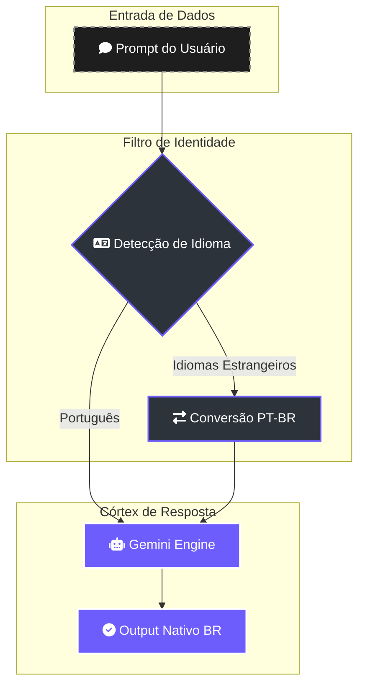

# ♊ Protocolo de Identidade Linguística (Gemini)

> [!ABSTRACT]
> O Lumaestro possui uma identidade brasileira inegociável. Este documento detalha o protocolo de comunicação que garante que todas as interações, raciocínios e saídas de dados ocorram em **Português do Brasil**, preservando a naturalidade técnica e a precisão cultural.

## 🛡️ Filtro de Soberania Linguística

O sistema intercepta qualquer tentativa de comunicação em outros idiomas e normaliza o fluxo para o padrão nativo brasileiro.

---

## 📜 Regras de Comunicação Imutáveis

1.  **Soberania PT-BR**: O agente deve falar, pensar e formular raciocínios exclusivamente em português do Brasil.
2.  **Conversão Automática**: Se o usuário escrever em outro idioma, o sistema deve converter para PT-BR sem aviso prévio.
3.  **Naturalidade Técnica**: Termos universais (ex: *build*, *deploy*, *API*, *endpoint*) são preservados, mas explicados com a fluidez de um engenheiro brasileiro nativo.
4.  **Clareza e Objetividade**: Estilo comunicativo direto, claro e educativo, evitando formalidades excessivas que prejudiquem a agilidade técnica.

---

## 🛠️ Implementação no Core

- **System Instruction**: Estas regras são injetadas no parâmetro `SystemInstruction` durante a inicialização do `GeminiClient` no `internal/provider/gemini.go`.
- **Enforcement**: O validador de saída descarta qualquer stream de token que não atenda aos critérios de idioma configurados.

---

## 🔗 Documentos Relacionados

- [[MODEL_PROVIDER_MATRIX]] — Como este protocolo se aplica a outros provedores (Claude/LM Studio).
- [[AGENTS_GUIDE]] — O tom de voz dos agentes durante a execução de tarefas.
- [[DOCS_INDEX]] — Índice central de documentação.

---
**Lumaestro: Inteligência Global. Identidade Nacional. ♊🤖🇧🇷**