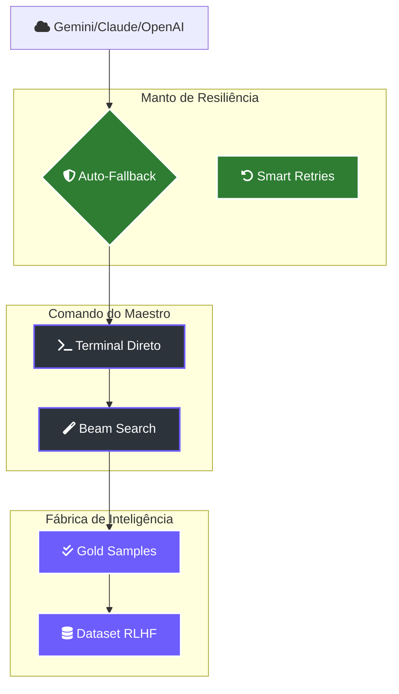

# ⚡ Lightning: Manual de Operações de Elite

> [!ABSTRACT]
> O Lumaestro atingiu o ápice da autonomia industrial como um **Ecossistema Soberano**. Este manual cobre as funcionalidades de elite: resiliência multi-provedor, comando direto do maestro e a produção industrial de inteligência via RLHF.

## 🛡️ Arquitetura de Resiliência e Soberania

O sistema opera sob um manto de proteção que garante que o fluxo de trabalho nunca seja interrompido, independentemente da disponibilidade de provedores externos.

---

## 🕹️ 1. Manto de Resiliência (Self-Healing)
O enxame é imune a falhas de infraestrutura externa:
- **Auto-Fallback**: Em caso de latência excessiva ou erro 500 no Gemini, o motor alterna silenciosamente para Claude (Anthropic) ou OpenAI em milissegundos.
- **Smart Retries**: O roteador Go gerencia retentativas com backoff exponencial para garantir a conclusão de tarefas críticas.

## 📡 2. Console de Comando do Maestro
Você não é apenas um observador; você é a vontade central do sistema:
- **Terminal Direto**: Envie ordens em tempo real para qualquer agente via Dashboard.
- **Beam Search & APO**: Otimização automática de prompts baseada em 3 variantes estratégicas para encontrar o caminho de menor custo e maior precisão.

## 📦 3. Filtro de Confiabilidade GOLD
Cada saída do enxame é validada contra o histórico de sucessos. O selo **GOLD Accuracy** garante:
- 🟢 **90-100%**: Estabilidade Industrial.
- 🔴 **Regressão Detectada**: O sistema bloqueia a variante e solicita intervenção se houver perda de qualidade em relação ao benchmark local.

---

## 📂 4. Fábrica de Inteligência (RLHF)
Transforme a operação do seu enxame em um ativo de dados:
- **Gerar Dataset RLHF**: Exporte os rollouts aprovados em formato `.jsonl` (Standard Conversational).
- **Gold Samples**: Use estas amostras para realizar o fine-tuning de modelos locais (Llama/Gemma), destilando a sabedoria do seu workspace para modelos menores e mais rápidos.

---

## 🔗 Documentos Relacionados

- [[LIGHTNING_REINFORCEMENT_LEARNING]] — O motor de aprendizado por trás da elite.
- [[MULTI_AGENT_SYSTEM]] — Orquestração de enxame.
- [[DOCS_INDEX]] — Índice central de documentação.

---
**Lumaestro: O futuro da inteligência é construído com soberania. ⚡⚙️💎**
