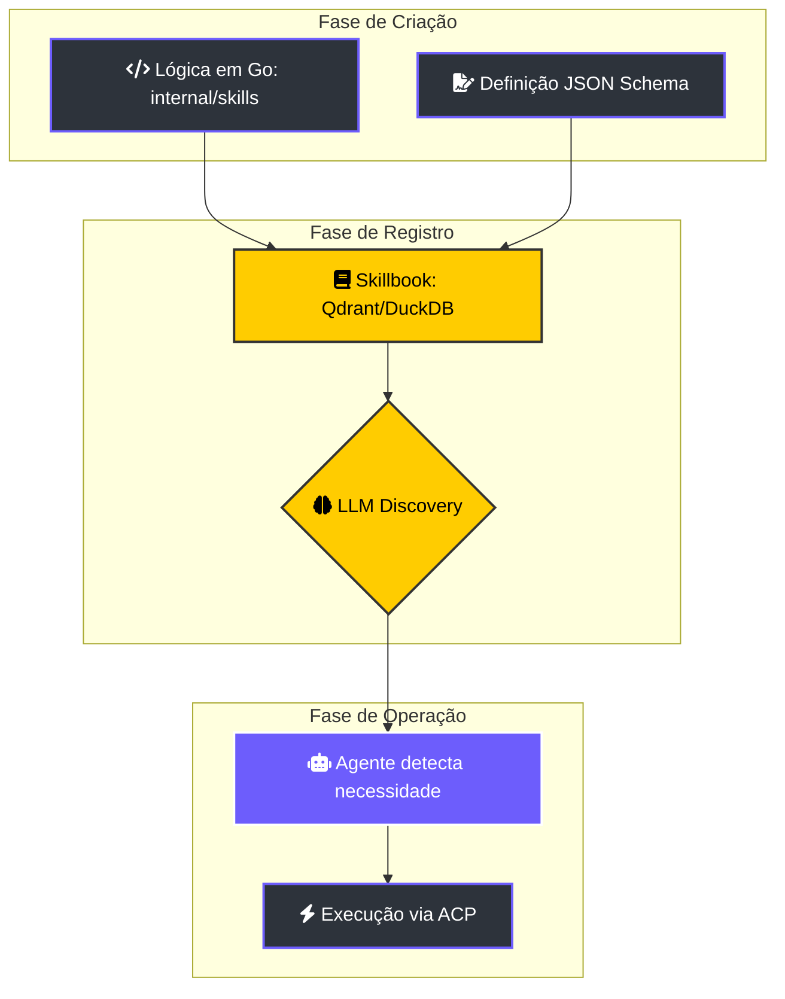

# 🛠️ Desenvolvimento de Skills: Expandindo o Arsenal do Enxame

> [!ABSTRACT]
> As **Skills** são os braços e pernas do Lumaestro. Elas permitem que os agentes interajam com o mundo físico — executando comandos, lendo arquivos e integrando-se a APIs externas. Este guia detalha o processo de injeção de novas capacidades no enxame.

## 🏗️ Ciclo de Injeção e Execução de Habilidades

O nascimento de uma Skill segue um fluxo rigoroso desde a codificação até a descoberta semântica pela IA.

---

## 🧩 Anatomia de uma Skill de Elite

Uma habilidade no Lumaestro é composta por dois pilares fundamentais:

1.  **Definição Semântica (Skillbook)**: Uma descrição clara (em linguagem natural) do "Porquê" e "Quando" usar a ferramenta. Isso é armazenado vetorialmente para que a IA possa "puxar" a habilidade correta no momento da decisão.
2.  **Protocolo de Execução (ACP)**: A implementação lógica real. O agente se comunica com a Skill enviando um payload JSON estruturado, garantindo previsibilidade e segurança.

---

## 🚀 Categorias de Poder

### 🔋 Native Skills
Embutidas diretamente no núcleo Go. Exemplos: `FileRead`, `FileWrite`, `CrawlerExecute`, `SearchWeb`. São ultra-rápidas e seguras.

### 🔌 External Skills
Scripts ou executáveis (Python, Node, Bash) que o enxame pode invocar via Shell interativo. Permitem uma expansão infinita das capacidades sem inchar o binário central.

### 🧠 Learned Skills (Estratégias)
Estratégias de sucesso que o **Agente Reflector** destila e salva após concluir uma tarefa complexa. Elas funcionam como "memórias procedurais" para tarefas futuras semelhantes.

---

## 🛡️ Diretrizes de Soberania (Best Practices)

- **Atomicidade**: Uma skill deve realizar uma única ação com precisão cirúrgica.
- **Validação de Path**: Nunca permita que uma skill de arquivo opere fora do workspace definido pelo Comandante.
- **Feedback Verboso**: Em caso de falha, retorne o erro técnico detalhado. O LLM usará essa informação para tentar uma correção (Self-Healing).

---

## 🔗 Documentos Relacionados

- [[SKILLS_SYSTEM]] — Visão técnica do orquestrador de habilidades.
- [[AGENTS_GUIDE]] — Como delegar tarefas que exigem habilidades específicas.
- [[DEVELOPER_GUIDE]] — Setup para começar a codar novas Skills.
- [[DOCS_INDEX]] — Índice central de documentação.

---
**Lumaestro: Onde a inteligência encontra a ação. 🛠️🦾⚡**
